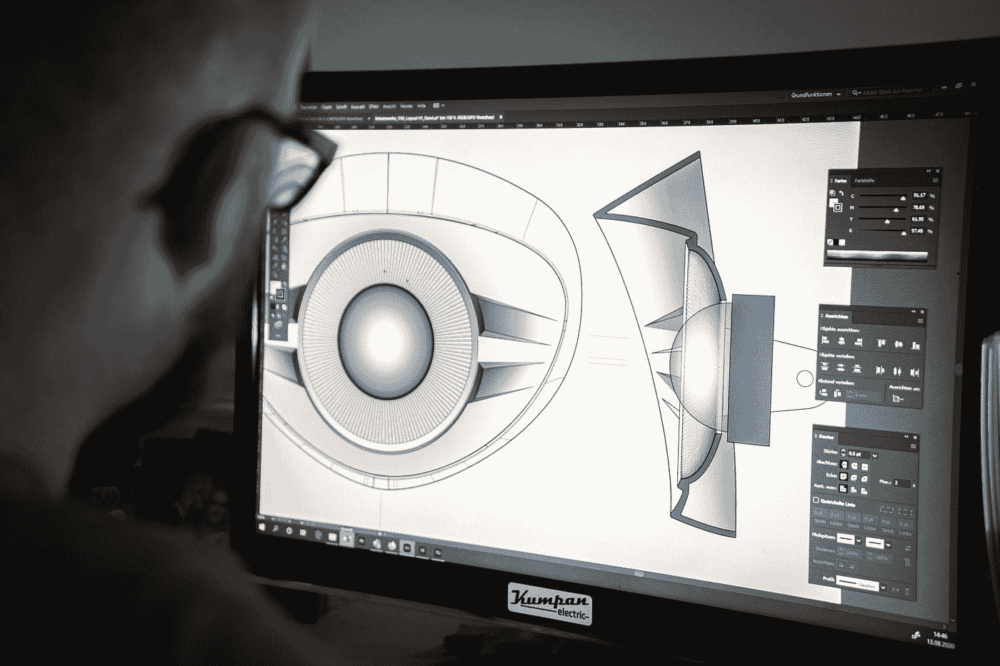

# 网页设计:技巧和概念

> 原文：<https://medium.com/geekculture/designing-for-the-web-tips-and-concepts-50a047ab3fc?source=collection_archive---------20----------------------->

## 学习如何用这些技巧和概念来设计网页。

Photo by [Kumpan Electric](https://unsplash.com/@kumpan_electric?utm_source=medium&utm_medium=referral) on [Unsplash](https://unsplash.com?utm_source=medium&utm_medium=referral)

网页设计是一个需要创造力和专业技能的过程。互联网上竞争如此激烈，确保你的网站脱颖而出至关重要。这里有一些技巧和概念，可以帮助你创建一个美丽而实用的网站开发。