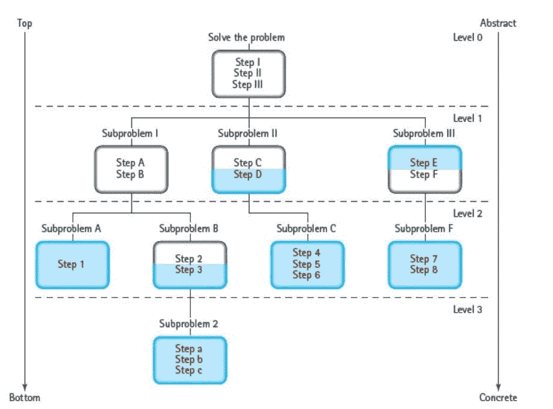

# 设计功能:计算机程序的构建模块

> 原文：<https://medium.com/geekculture/designing-functions-the-building-blocks-of-computer-programs-3721bf731447?source=collection_archive---------60----------------------->

## 回归基础。

Photo by [Magda Ehlers](https://www.pexels.com/@magda-ehlers-pexels?utm_content=attributionCopyText&utm_medium=referral&utm_source=pexels) from [Pexels](https://www.pexels.com/photo/pile-of-white-and-black-boxes-1329318/?utm_content=attributionCopyText&utm_medium=referral&utm_source=pexels)

函数是编程中的基本构造。我们用来在计算机上传达信息的语言，其功能非常类似于一个动词:*“语言的基本要素”* (S. Pinker，2007)。换句话说，函数是在编程语言中表达一组计算过程的主要结构。

最好把问题分解成容易处理的部分。解决问题的一小部分需要一个存储在函数中的计算过程。

本文将介绍在设计和组织函数时要考虑的事情。

函数是处理输入和配置输出的代码块。这样做的好处之一是，它将我们的解决方案分解成一组子例程，我们可以重用这些子例程来解决其他问题。

事实上，简单的算法可以存储在一个函数中，有时，它会分支成两个或更多:**问题是我们何时以及为什么需要间接寻址？**最明显的原因是*代码可重用性*。我们需要有意识地努力使我们的代码库可持续，即可重用。为了实现这一点，我们必须将任务的最简单版本委托给一个函数。我们的目标是最小化*样板代码*(在多个地方重复的代码段，几乎没有变化)**，我们遵循不重复自己的优点**。

功能对于开发复杂的软件系统来说已经足够了。这种技术有时被称为*模块化编程*。这也是我认识的一些开发人员认为 C 语言优雅的原因之一。

模块化编程中有三个主要概念:

*   *模块* —解决问题(或子问题)的功能的自包含集合。
*   *抽象步骤*——未指明某些实现细节的步骤。这个步骤可以定义具体功能发生的路线。换句话说，它是一个代码块，代表解决问题所必需的一组函数。
*   *具体步骤* —抽象步骤的实现，实现了解决独立子问题的逻辑。

# 软件设计过程:自顶向下的方法

`Figure 1.0`。分层解决方案树(戴尔，N. B .，&威姆斯，c .，2014 年)。

在功能中应用设计原则的步骤:

1.  **理解问题**。陈述其输入要求以及预期输出的规格。
2.  **写出解决问题的主要步骤**。制作一个分层的解决方案树(如图 1 所示),并定义您需要解决的主要问题。越往下，问题越具体，越简单。
3.  决定这个问题是否可以被分解成独立的子问题，我们可以分别处理这些子问题。当你能看到如何用一种语言直接实现它时，这通常就足够简单了。如果你觉得用一种语言来写它太难了，你可能绕过了一个或多个抽象层次——你需要后退一步，思考如何通过分解问题来简化它。
4.  **确保每个功能恰好有一个任务**。它们的用途应该在其名称中显而易见(它使您的代码更容易阅读和自我记录，因此我们必须确保函数名称应该清楚地陈述其用途)。
5.  **文件解决流程**。文档有助于使我们的代码库更容易维护。

# 参考资料:

1.  Pinker，S. (2007 年)。史蒂芬·平克:我们的语言习惯揭示了什么。[特德](https://www.youtube.com/watch?v=LjQM8PzCEY0)。
2.  N. B .戴尔和 c .威姆斯(2014 年)。用 C++编程和解决问题。琼斯&巴特利特出版社。
3.  德内罗，j .(未注明)。[编写程序](https://composingprograms.com/pages/14-designing-functions.html)。

*原发布于*[*https://dcode . hash node . dev*](https://dcode.hashnode.dev/designing-functions-the-building-blocks-of-computer-programs)*。*