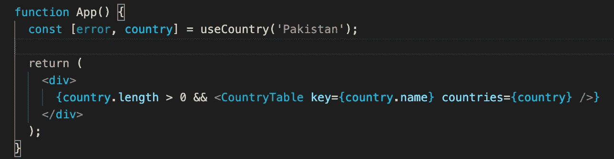
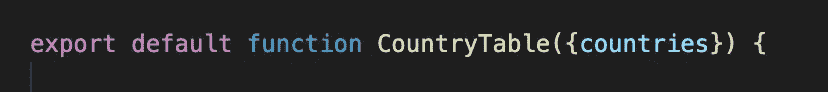
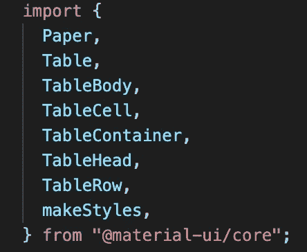
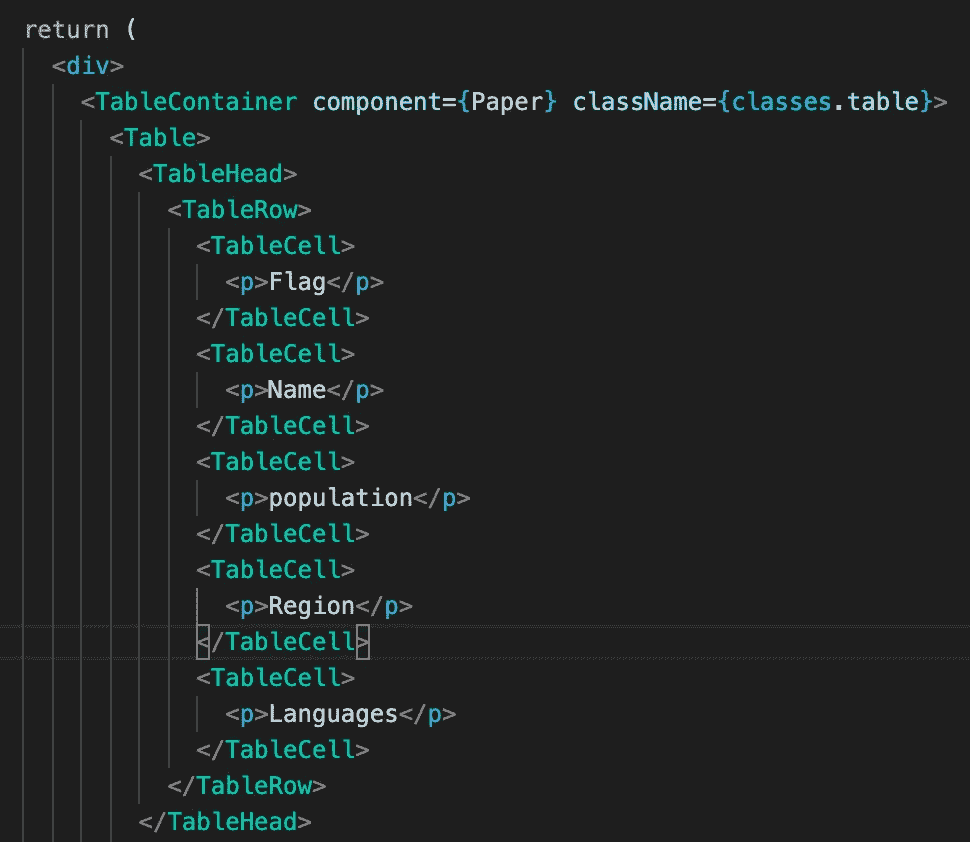
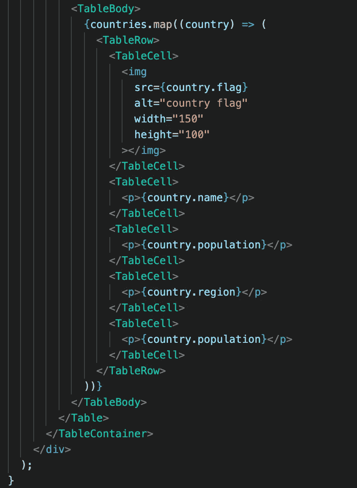
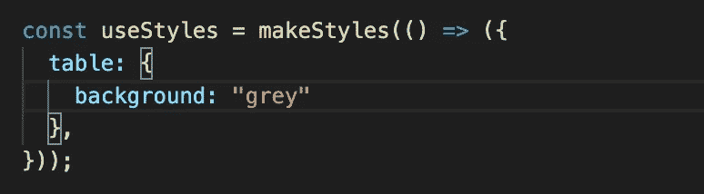
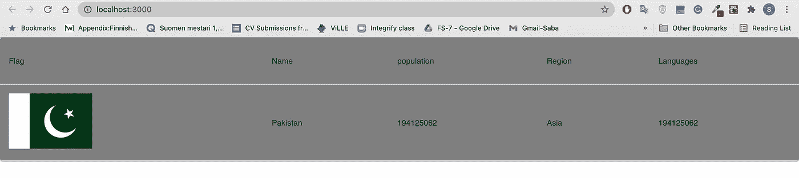

# 在带有材质界面的 React 应用程序中进行设计

> 原文：<https://medium.com/geekculture/designing-in-react-app-with-material-ui-2663be0e43a6?source=collection_archive---------39----------------------->


picture: [Morioh](https://morioh.com/p/5adcdaf61364)

# 我们在创造什么？

在[前一集](https://saba-saif.medium.com/build-your-first-react-custom-hook-5d61a5355510)中，我们创建了一个自定义钩子来从[国家的 API](https://restcountries.eu/) 中获取数据。在本教程中，我们将获取 **API 响应**并将其渲染到 **Material-UI 表**中。在前进之前，什么是 Material-UI？

## [材料界面](https://material-ui.com/getting-started/usage/)

Material-UI 组件独立工作。**它们是自支持的**，只会注入需要显示的样式。它们不依赖于任何全局样式表，比如 [normalize.css](https://github.com/necolas/normalize.css/) 。

# 先决条件:

对于本教程，我们将假设您已经熟悉 Javascript 和 React 的基本概念。

# 教程的设置:

要安装并保存在您的`package.json`依赖项中，请运行:

```
// with npm
npm install @material-ui/core// with yarn
yarn add @material-ui/core
```

请注意 [react](https://www.npmjs.com/package/react) > = 16.8.0 和 [react-dom](https://www.npmjs.com/package/react-dom) > = 16.8.0 是对等依赖。

**步骤 1** :将道具传递给表格组件进行渲染。



**第二步:**创建功能组件“countryTable.js”，重构道具。



注意:您也可以使用[箭头功能](https://developer.mozilla.org/en-US/docs/Web/JavaScript/Reference/Functions/Arrow_functions)。

**第三步**:导入素材-UI 组件。



**第四步:**用 UI 组件渲染表格。



在这里，我们还可以为桌面和桌面创建不同的功能组件。下面是上面使用的样式类“表”,



第五步:运行代码。



恭喜你，你刚刚学会了一个设计 React 应用程序的新工具。有关 Material-UI 的更多文档，请访问以下链接:

> [https://material-ui.com/](https://material-ui.com/)

如有任何疑问或建议，欢迎评论。