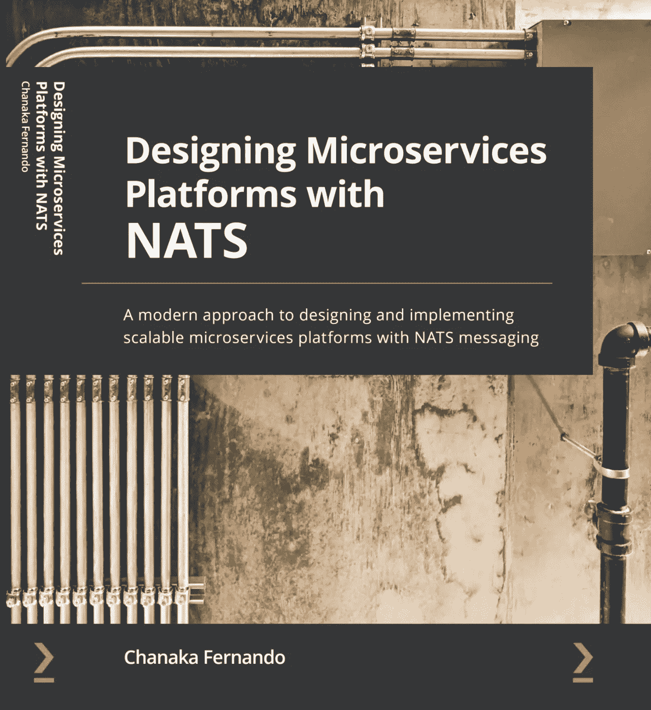

# 设计微服务平台与 NATS[书]发布！

> 原文：<https://medium.com/geekculture/designing-microservices-platforms-with-nats-book-released-d9f9490282b?source=collection_archive---------14----------------------->

让我们使用 NATS 构建包含微服务的企业平台

# 刚发布！

2021 年 11 月 19 日发布我的第一本书《与 NATS 一起设计微服务平台》(第一版)，这是一种伟大而谦卑的感觉。

Cover Image of Designing Microservices Platforms with NATS

你可以通过[亚马逊](https://packt.link/cQhe8)、[巴恩斯和诺博](https://www.barnesandnoble.com/w/designing-microservices-platforms-with-nats-chanaka-fernando/1140020128)、 [Packt](https://www.packtpub.com/product/designing-microservices-platforms-with-nats/9781801072212) 以及全球其他经销商阅读。

# 为什么又是一本微服务的书？

我听到了！为什么有那么多关于微服务的书？有那么复杂吗？为什么有人用？

这些是我在阅读有关野外(互联网)微服务时的一些问题。我越读越觉得少了点什么。这是构建微服务时的首要原则和简单性。

这就是为什么我想写一本关于微服务的书，让人们可以理解并开始用微服务构建应用程序，而不会陷入超复杂的陷阱。这本书首先关注构建应用程序，包括所有关于可伸缩性、安全性、可观察性的必要细节，以及主要用 Go 编程语言编写的实际例子。

*如果你想通过快速浏览概念、历史和实际例子来启动你的微服务之旅，这本书正适合你。*

*如果您想了解如何在微服务架构中利用消息传递技术来扩展到全球范围，而不增加服务网格的复杂性，这本书非常适合您。*

如果你想学习 NATS，并了解它在实际应用程序开发中是如何使用的，这本书为你提供了一个全面的学习 NATS 概念的指南，并附有示例。

*如果你想通过关注微服务来学习企业软件架构，这本书为你提供了微服务如何与集成平台等企业软件工具集成的见解。*

*如果你对微服务或 NATS 一无所知，但作为一个新手渴望学习这些技术，我相信这本书将通过足够的实践练习来介绍这些技术*

# 这一切是从哪里开始的？

我对写作的渴望早在上学的时候就开始了，但真正开始是从我开始在 WSO2 工作开始，WSO2 是一个开源、开放的文化组织，鼓励人们分享他们的知识。在过去 5 年的大部分时间里，我一直在写关于企业软件、API 管理、集成和微服务的文章，有一段时间，我有了将它们以更好的形式放在一起的想法。

这本书的想法来自 Packt 出版社的 Harshal Gundetty，他在那里看到了我在 DZone 上写的一篇文章。引发了写一本关于微服务的书的想法。与此同时，我意识到微服务架构的世界正在经历一个过渡期，在此期间,**服务网**的想法正在经历重大的修改和更多，组织正在采用微服务架构，而没有正确评估它所带来的挑战。这让我有动力花时间写一本关于微服务的书，专注于使用 NATS 的跨服务通信。

# 这本书有什么独特之处？

这是第一本将微服务架构与 NATS 消息传递技术相结合的书(在出版时)。它提供了一个全新的视角，使用 NATS 作为服务间通信层，用微服务架构构建真实世界的应用程序。它提供了一种替代方法来构建具有服务网格的微服务，而不会损失任何功能方面，如安全性、可观察性和可伸缩性。

这本书遵循一种方法，其中它提供了图表和代码示例来详细解释概念，以便读者可以很好地理解这些概念。它还使用一种实用的方法来设计和构建微服务，在整本书中使用一个医院 OPD(门诊部)应用程序来解释概念。

# 从这本书里得到最好的东西

这本书不是一本纯理论的书。它提供了大量的示例命令和源代码，以便在阅读时练习这些概念。您可以在下面的链接中找到书中开发的大部分源代码。

*   [用 NATS 设计微服务平台的源代码](https://github.com/PacktPublishing/Designing-Microservices-Platforms-with-NATS)

阅读本书时，请确保您拥有上述代码库，并且示例应该可以在任何操作系统上运行，包括 Windows、Linux 和 Mac OS。

# 与我们合作

如果您对这本书及其内容有任何意见或反馈，您可以通过图书购买平台或通过创建 GitHub 问题(如果与源代码相关)来分享。你也可以通过 [LinkedIn](https://www.linkedin.com/in/chanakaudaya/) 或 [Medium](https://chanakaudaya.medium.com/) 与我联系，我会确保你得到与这本书相关的必要解释。

# 谢谢大家！

如果没有 Packt 团队的支持和指导，这本书就不会成为现实。感谢哈沙尔、鲁维卡、瓦伊沙里、迪克夏以及团队在旅途中对我的指导。

我还要感谢本书的技术评论家[伊苏鲁·乌达纳·洛库·纳兰戈达](https://medium.com/u/5361177d276d?source=post_page-----d9f9490282b--------------------------------)和内菲法官，他们纠正了我的错误，并为提高本书的质量提供了很好的建议。

最后，感谢我的家人为我提供了一个环境来写一本书，主题是微服务，这不是最简单的。