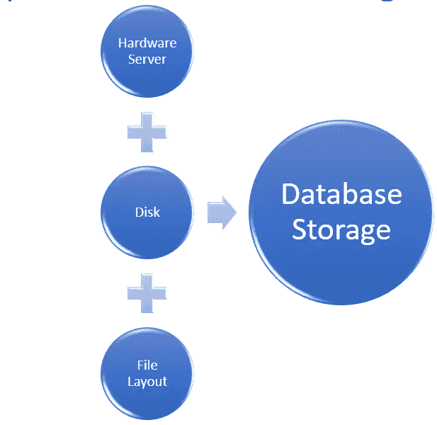

# 使用 SQL Server 为数据库设计存储

> 原文：<https://medium.com/geekculture/designing-storage-for-a-database-using-sql-server-bdc307f7dd06?source=collection_archive---------17----------------------->

数据库的存储包括硬件、磁盘和文件布局。为数据库项目设计存储可能是一项非常繁重的工作，因为需要考虑很多因素。

**Schematic 1.0 Database Storage**

在为数据库设计存储之前，要考虑的最重要的方面是

数据量—初始数据量和数据增长率