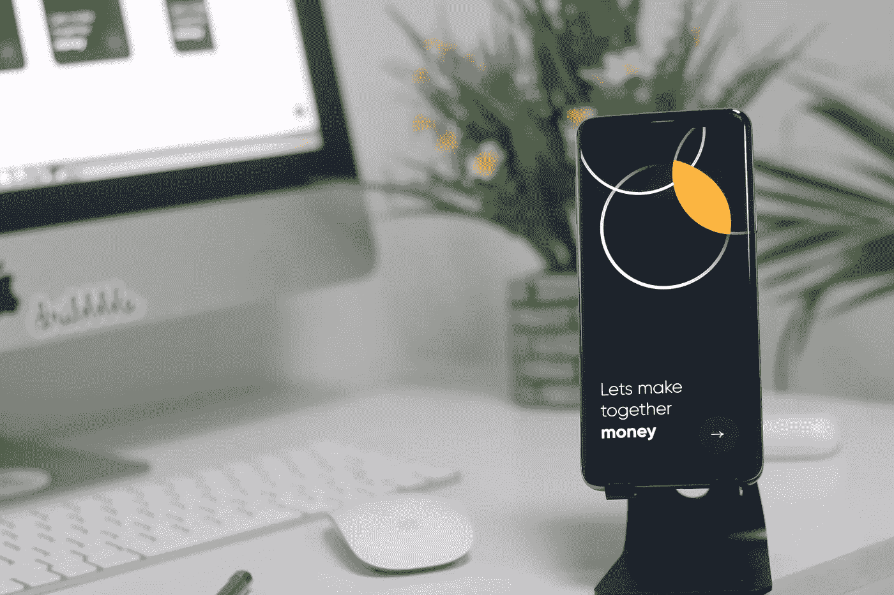

# 设计完美的用户界面

> 原文：<https://medium.com/geekculture/designing-the-perfect-user-interface-56f1a3a51c6d?source=collection_archive---------14----------------------->

## 完美的用户界面是用户需求和设计可用性之间的平衡！

Photo by [Muhammad Salim](https://www.pexels.com/photo/desk-laptop-internet-yellow-10721746/)

设计完美的用户界面并非易事。有许多因素需要考虑，包括用户的需求、应用程序的类型以及使用它的设备。一个设计良好的 UI 可以使应用程序更加…