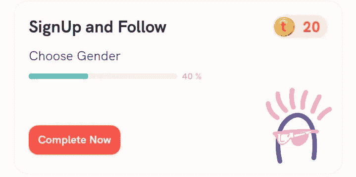
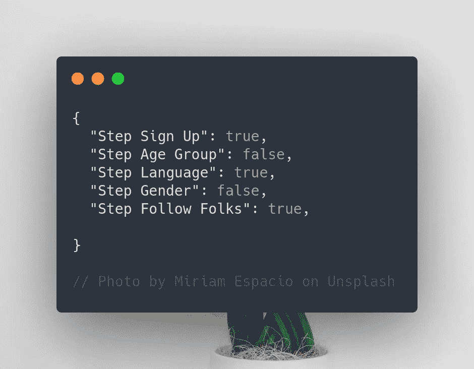
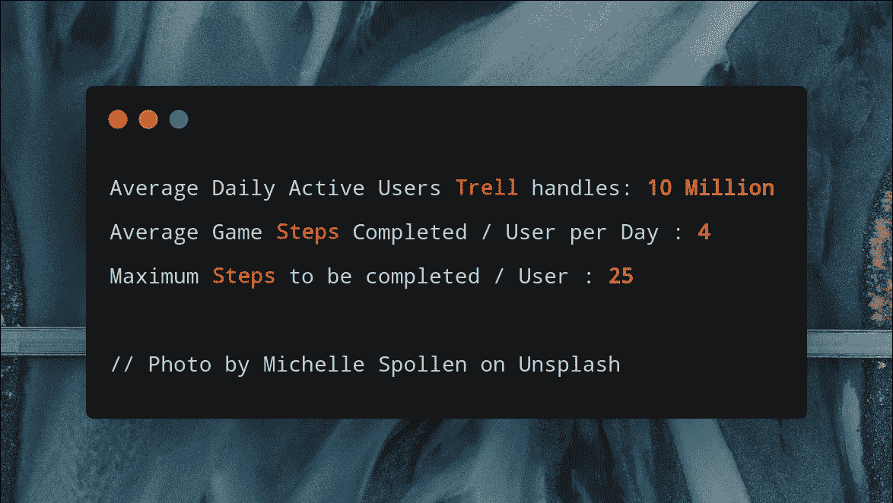
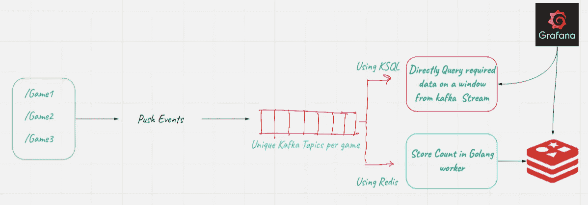
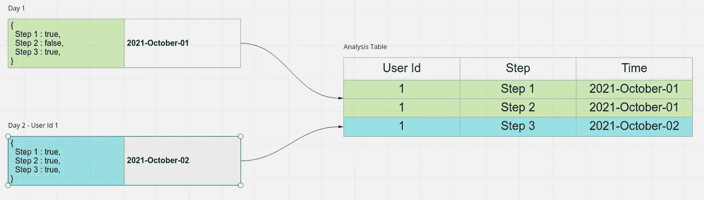

# 使用 Redis 和 Big Query 设计您的分析漏斗

> 原文：<https://medium.com/geekculture/designing-your-analysis-funnel-with-redis-and-big-query-27bd932eb6?source=collection_archive---------13----------------------->

如何在分析漏斗中跟踪事件的简单和复杂方法。

作为一名软件工程师，**你为什么要读这篇文章？**

在任何为满足复杂业务需求而设计的新产品中，总会涉及到参与度分析的细微差别。最近，我有幸参与了一个深度技术项目，从零开始为[特雷尔](https://trell.co/)编写一个游戏化引擎，在这篇博文中，我很乐意向你介绍设计核心设计完成后所需的分析漏斗的快速步骤。

# 语境🔖

Trell 的游戏化是一个简单的想法，通过应用内游戏提高用户参与度，当完成时，将提供应用内可兑换的奖励(在这种情况下，Trell 币！💰).现在，你需要做些什么来赚取这笔钱呢？

最简单的游戏是完成您的个人资料，并赚取 20 特雷尔硬币。大多数游戏都可以围绕“要完成的步骤”来建模，以获得一些奖励。这一个没有什么不同。

The Sign-Up and Follow Game

你注册，插入你的年龄组，你认同的性别，你喜欢的语言，最后在你想看的应用上关注 5 个创作者。就是这样。 **5 个步骤。**

重要的是，我们可以将用户的每个状态存储在一个“活动”表中，并通过它来确定该用户是否应该获得奖励。

现在这种状态以 JSON 格式存储，就像这样

JSON Formatting

对了，**为什么是 JSON** ？因为游戏状态可以是任何东西，你不能为所有东西都创建列，为每个游戏创建一个全新的表是一种数据库设计，我不赞成这种设计(由于潜在的延迟，如果你要在它的基础上构建，你最终将需要所有的连接)。

# **发布后您将需要的洞察力🚀**

有了基本的技术设计，你会发现可以有无数的游戏围绕着它，但这并不是找到你的分析问题的答案的最好方法，

*   **用户** `**@user_23719a**` **什么时候完成验证游戏的步骤 3？**
*   **大部分用户在游戏中的哪些地方滞留超过 1 天？**

这些都是这样一个基本的 JSON 专栏无法立即回答的问题，当然，除非您计划预先在 JSON 中存储精确事件的时间戳，并在需要时读取它。

如果你真的是这样想的，那么我亲爱的无辜的朋友，产品分析真的不是那样工作的。这些问题可以是非常开放的，任何问题都可以问你的系统，你只需要准备好回答它们，不，你不能事先问所有的问题，因为你永远不知道这个引擎在 2-3 个月后会是什么样的！

# 经典的 SQL🎯

存储用户进度历史的一个非常明显的方法是创建一个 SQL 表，然后…转储历史？

它可以简单地有 4 列，比如，`userId`，`gameId`，`stepId`，`completionTimeStamp`，我们就可以完成它了，对吗？

> 我们说的是每天平均有 4000 万次插入到表中。2.5 亿次最终插入。
> 
> 即使在一个非常低规模的用户群中，比如说总共有 1000 万个用户，仅仅出于分析的目的，这就有 2.5 亿行。👀

的确，简单的解决方案是最好的，但不是在这里，除非你确定你要从你的表中读取，比如一天一次，并准备好充足的存储空间，因为相信我，有了适当的索引，如果保存在读取集群中，这个表将成为**一个痛苦的瓶颈或存储开销**。

# Redis + SQL 混合🐗

这个解决方案是在牢记一个问题的情况下创建的:

**如果我们将分析数据实时导出到 Grafana 仪表盘会怎么样？**

Grafana 仪表板引起了您的注意？很好。

## 架构概述

Architectural Flow for Analysis Funnel

如您所见，用户完成的不同步骤有多个端点，然后由游戏化引擎进行验证。现在，所有这些事件端点将会非常繁忙，不是吗？

**那么，为什么不将这些视为事件流，并在队列末尾准备适当的工作，将计数聚合并刷新到 Redis 这样的键值数据存储中呢？**

这些关键字可以有不同的粒度(每小时/ 2 小时/ 6 小时或任何您想要的粒度)，您的分析漏斗可以实时访问和聚合关键字，您想要存储多长时间和多少数据可以通过 Redis 关键字的灵活生存时间轻松决定。

聚合可以通过专门的 golang 工人或**完成，如果你喜欢冒险，使用**[**KSQL**](https://www.confluent.io/product/ksql/)**并完全删除 Redis 层**，这完全是你的选择，如果你考虑一下，这是一个完整的工程设计自助餐😉

## 赞成！💃

*   非常适合实时数据分析用例。
*   粒度方面的各种选项，无论您是使用 Redis 还是 KSQL 来实现。
*   Kafka 队列是持久的，所以即使它关闭了，未处理的数据仍然会在那里。

## 骗局😢

*   这很复杂，对于一个非常基本的问题陈述来说过于复杂。
*   Golang worker to Redis flush 很容易崩溃。**如果您决定更新您的 pod/您的 pod 因任何原因关闭，会发生什么情况？**存储在内存中的聚合值会随着 pod 一起死亡！
*   如果工人倒下了，整体分析就会被打乱。
*   不管你对你的系统有多确定，在实际测量和最终测量之间总会有一个不可预见的差异，而且**你不会真的存储任何关于这些计数是否正确的事实来源**？你有的只是一个基本的 JSON！

# **游戏规则改变者 BigQuery🏀**

在印度有一句谚语:

> 我的天啊，我的天啊，我的天啊！

基本上，当什么都没想到时，就用你能想到的最明显的东西，这将为系统提供稳定性。

**最明显的解决方法？—游戏每步一行！**

但不是在生产数据库集群中，而是分解当前的 JSON 行，并将它们存储在一个以 **(UserId，step name)** 为惟一键的大查询表中，我们每天根据`updatedAt`时间戳将这个 JSON 数据(其中值为 **True** )从生产活动表导出到这个大查询表中。

Data Dumping in Analysis table in BQ

唯一键将确保任何**真**值不会在表中重复，并保持这些条目的原子性。

## 赞成的意见💸

这个解决了漏斗的基本需求，没有给我们的生产带来过多的数据处理负担，我们也不需要过度设计一个基本的产品需求来实现它…

## 澄清

在实现阶段，发现 Bigquery 表中没有惟一键。因此，为了解决这个用例，我们开始以固定的时间间隔将数据从生产数据库迁移到 BigQuery 表，并在使用完毕后删除现有条目，以检查表的大小。

# 结论😁

因此，在这篇博客文章中，我们介绍了分析漏斗的多种设计，以及解决方案如何从实时分析到直观而强大的 SQL 数据输入，并见证了我们如何在经典关系数据库模型和更快的键-值对存储之间交替，以分别利用速度和一致性！

# 资源🔗

*   [KSQL 引物](https://ksqldb.io/quickstart.html)
*   [卡夫卡初级读本](https://kafka.apache.org/intro)
*   [Redis Hashmaps(T1)](https://redis.io/commands/hset)
*   [Kubernetes 中的 Pod 生命周期 (T3)](https://kubernetes.io/docs/concepts/workloads/pods/pod-lifecycle/#:~:text=Pods%20follow%20a%20defined%20lifecycle,the%20Pod%20terminated%20in%20failure.)