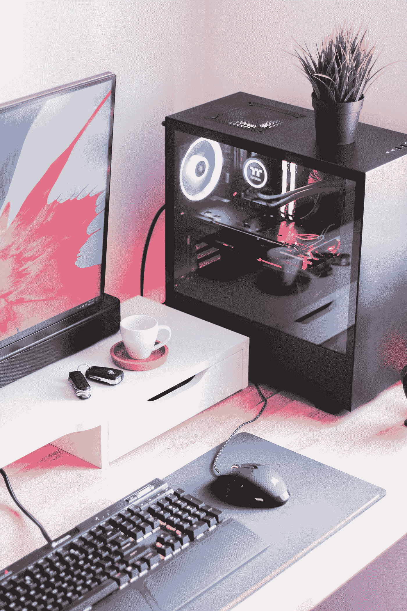

# 台式电脑作为家庭计算的“一环主宰一切”

> 原文：<https://medium.com/geekculture/desktop-pc-as-one-ring-to-rule-them-all-of-home-computing-8d22972292f8?source=collection_archive---------7----------------------->

## 使用 9 个月后的视角

台式机是一切开始的地方，但在某个阶段，它们变成了“服务器”，我们都转向了笔记本电脑。去年，我偶然发现了台式个人电脑的想法，并激起了我的兴趣——那种只有在实验性设备上的可疑花费才会引起的兴趣。

当我还心存疑虑的时候，我做了一个，我很高兴我做了，因为我认为台式电脑，以及围绕它们的生态系统，是很棒的。我认为对于程序员、数据科学家、游戏玩家和修补者来说，没有任何其他设备像它一样有趣。是的，我还带着我的旧笔记本电脑。

Photo by [Andrew M](https://unsplash.com/@andymant?utm_source=medium&utm_medium=referral) on [Unsplash](https://unsplash.com?utm_source=medium&utm_medium=referral)

## 原地不动

在我看来，这是一个功能，而不是一个缺陷。它呆在同一个地方，你可以在上面工作或玩耍。一旦你的事情结束，你回到生活，它不会来找你。你不能把它带到你的卧室。几天后，你的身体开始让你在它面前工作。

你可能偶尔需要一台笔记本电脑来完成与工作相关的工作，但遗憾的是，没有简单的方法来避免它。这是我仍然保留我的旧笔记本电脑的唯一原因。

## 工作速度快，成本低

如今的笔记本电脑拥有强大的处理能力，但物理性能无可匹敌。计算机部件有热量和功率的限制，它们倾向于在更大的设备中做得更好。把它们做得小也会使它们变得昂贵。

这样看；这款 [~1000 美元的台式机](https://pcpartpicker.com/list/LrjJJb)拥有 8 个内核、16 个线程和 32 GB RAM，它可以与 AWS 上的 [C5.2xlarge](https://www.apptio.com/blog/aws-ec2-c5-instances/) 实例相媲美，但这不是一个精确的比较。以目前云上 0.34 美元/小时的价格，这款台式机大约 4 个月就能收回全部成本。云不仅仅是 CPU 和内存，但你会明白。

我正在我的桌面上为我的初创公司运行一个 Apache Beam pipeline。上个月它为我们节省了将近 300 美元。不多，但每一分钱都有助于一个自举的早期初创企业。我可以让它 24x7 全天候运行，而且，就我们目前的目的而言，它和在云上运行一样有效。

即使用了 8 个月，我也很兴奋能在桌面上做点有用的事。我觉得这就像如果你有一辆更好的车，或者在 iPad 上尝试那些触摸应用程序，你会开得更多。一个缓慢的设备会慢慢消磨你的热情，但是一个伟大的设备会让你做得更多。最初的热情可能会在几个月内消退，但考虑到我每天在电脑屏幕前花费的时间，我认为由于快速而强大的机器带来的收益是值得投资的。

## 继续活着

我们生活在这样一个时代，人们不得不为修理设备的权利而斗争，设备似乎在设计时就有了计划淘汰的 T2。然而，台式机是你能真正拥有、定制、修复、升级和长期运行的最后一样东西。

台式机的升级途径是无止境的，而且相对便宜。您可以永远升级内存、存储和显卡，并击败最新的产品。

Photo by [Egor Vikhrev](https://unsplash.com/@egor_vikhrev?utm_source=medium&utm_medium=referral) on [Unsplash](https://unsplash.com?utm_source=medium&utm_medium=referral)

## 玩

我可以继续在这里闲聊，但你应该去 Reddit 上的[个人电脑大师赛看看。总的来说，没有一个控制台能与配置良好的桌面相匹配。而且你绝对可以用一台 PC 比一台主机长得多的时间。](https://www.reddit.com/r/pcmasterrace/)

你的主机能在后台运行网站吗？😏更不用说，还有很多其他适合做但不容易做的事情，比如照片编辑、图形和数学编程。

最后，您可以在裸机上体验 Linux。也许 iMac 很接近——我没有这方面的经验——但我不能夸大普通 Linux 对我这个程序员的快乐。对了，你甚至可以在你的桌面上运行 [Mac OS。](https://www.reddit.com/r/hackintosh/)

## 学习

Photo by [JESHOOTS.COM](https://unsplash.com/@jeshoots?utm_source=medium&utm_medium=referral) on [Unsplash](https://unsplash.com?utm_source=medium&utm_medium=referral)

当你开始花时间研究它的内部结构时，你倾向于与你的机器建立联系。这类似于调试和修复棘手的代码，但是从物理角度来看。

> 在摩托车上工作，工作得好，有爱心，是成为一个过程的一部分，达到内心的平静。摩托车主要是一种精神现象。——罗伯特·m·皮尔西格论禅与摩托车维修艺术。

没有，我还没有看完*那本*书。

我们可以读到它，并在“生产”中看到它，但是摆弄你的设备会让你从内心感受到硬件对系统性能的影响。构建、运行和维护一台台式机——或任何其他机器——在某种程度上也是一种性格培养练习。

## 最后

一年前，当我开始为我的下一台笔记本电脑做研究时，我遇到了台式机的想法，我感到不确定。又一个“小玩意”要买？我会用它来证明投资的合理性吗？我讨厌买家反悔。

经过 8 个月的广泛使用，我可以自信地说，台式机是程序员和数据科学家的终极玩具。这无疑提高了我的效率，并诱使我尝试我不会尝试的技术和项目。台式机的乐趣和无限可能性给我留下了深刻的印象，自从我上次在 2000 年代末体验它们以来，它们已经走了多远。来吧，探索，看看你是否想尝试一个！