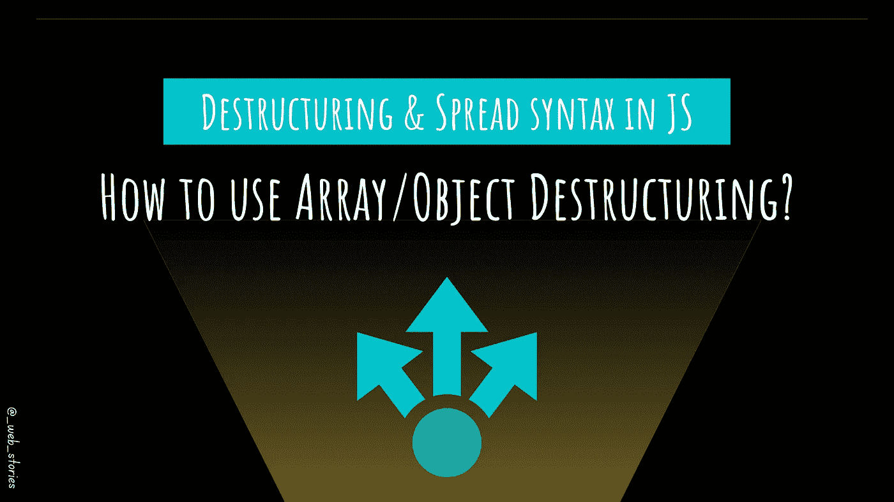

# JS 中的析构和展开语法

> 原文：<https://medium.com/geekculture/destructuring-spread-syntax-in-js-d9260a725c99?source=collection_archive---------11----------------------->

## 如何使用数组/对象析构

By FAM

## 你好👋

至此，你已经了解了[**对象**](https://famzil.medium.com/objects-in-javascript-64fa3e82765f?source=your_stories_page-------------------------------------) 和 [**数组**](https://javascript.plainenglish.io/data-structures-in-js-9a13f7aa82b3?source=your_stories_page-------------------------------------) 。是时候学习一些实用的语法/操作符了，您将在 JS 代码中看到并经常使用它们来处理对象和数组。

让故事开始！

# 对象析构