# 面板数据的详细解释——如何识别平衡和不平衡的面板数据。

> 原文：<https://medium.com/geekculture/detailed-explanation-of-panel-data-how-to-identify-balanced-and-unbalanced-panel-data-fd973fa788ae?source=collection_archive---------1----------------------->

Photo by [ThisIsEngineering](https://www.pexels.com/@thisisengineering?utm_content=attributionCopyText&utm_medium=referral&utm_source=pexels) from [Pexels](https://www.pexels.com/photo/woman-coding-on-computer-3861958/?utm_content=attributionCopyText&utm_medium=referral&utm_source=pexels)

**panel dataset**被称为纵向数据或横截面时间序列数据集，理想情况下，它在一段时间内对观察单位(如个人、家庭、企业、城市和州)的某些变量进行重复测量。

时间序列和横截面数据可以被认为是面板数据的特殊情况，只有一个维度。时间序列可以描述为单个实体在不同时间间隔的观察值的集合，横截面数据可以描述为多个实体在单个时间点的观察值的集合。

识别数据集属于哪个类别(即面板数据、时间序列或横截面)就是找出一个唯一区分一个数据记录和其他记录的标识符。如果标识符是时间数据字段，则数据集属于时间序列。然而，如果数据记录可以用时间数据字段以及与时间无关的标识符(如员工 id、学生 id、航空公司代码、公司代码、国家代码等)唯一标识，则数据集是面板数据。如果数据记录可以用非时间标识符唯一标识，那么数据集就是横截面数据。

在一个面板数据集中，对同一总体或样本的相同变量的重复测量的次数可以是**小至两个**。面板数据很容易被概念化为每个变量的三维结构:垂直维度为时间，水平维度为每个变量的多个观察值。

在这里，我采用了一个用于预测美国航空公司成本的面板数据集，该数据集包含 5 个预测因素和 1 个响应，数据集可从 [**此处**](https://www.kaggle.com/sandhyakrishnan02/paneldata) **下载。它在 15 年的时间里(1970-1984)对 6 家航空公司进行了总共 90 次观察。**

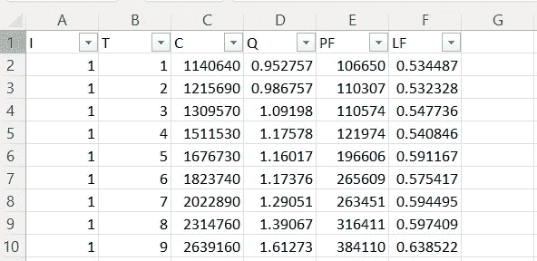

The snippet of the first 9 records of DataSet

# **预测器**

我(航空公司):我指出了不同的航空公司，这里我们有 6 家航空公司，从 1 到 6。

我们可以通过使用 unique()函数来验证航空公司的唯一值。这里的观测值是 90，从第 2 行开始到第 91 行结束。所以我们可以使用下面的函数

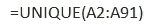

To identify the unique value of the airline firms

结果包含从 1 到 6 的值，因此我们确认航空公司的数据集只有从 1 到 6 的值。

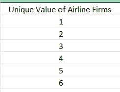

T(年份):T 表示观察截面数据的年份。这里 T 的持续时间是从 1970 年到 1984 年，即 15 年。

数据集的年数也可以验证为航空公司，即

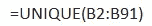

To identify the unique value of years of observations

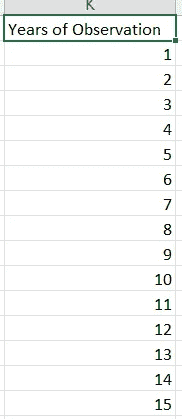

这里的结果包含从 1 到 15 的值，因此我们可以确认数据集包含 15 年的观测值。

PF(燃料价格):指数和价格数据显示报告日期在炼油厂支付的航空喷气燃料的全球平均价格。燃油价格总是由航空公司和航空燃油供应商之间谈判的合同决定。这通常是一份多年期合同，其条款和条件决定价格，不受市场波动的影响。

LF(载客率):这是一个衡量一家航空公司的载客能力被利用了多少的指标。这通常取决于航班座位容量、航线、需求等。,

q(收入乘客英里数):收入乘客英里数(RPM)是一个运输行业指标，显示付费乘客旅行的英里数，通常是一个航空交通统计数据。

# 反应

成本(1000，数据):取决于各种因素，包括燃油价格、载客率、租赁和折旧、飞机维护、劳动力和机场装卸费。

# 数据集分析

对于这个数据集，我们有一个该年的时间数据字段，但是在这个标识符的帮助下，我们不能唯一地从其他数据记录中识别出一个数据记录。这里我们还需要一个与时间无关的标识符，即航空公司编号。因此，我们可以确认我们的数据集是面板数据。

## 平衡和不平衡面板数据

面板数据可以是**平衡**或**不平衡**。在一个平衡的面板中，所有的面板成员(横截面数据)在所有时期都有测量值，或者每年都观察每个面板成员。如果一个平衡面板包含 N 个面板成员和 T 个周期，那么数据集中的观察数(N)必然是 **n = N×T** 。而对于一个不平衡的面板，数据集中的每个面板成员都有不同数量的观察值，或者至少有一个面板成员在每个时期都没有被观察到。如果一个非平衡面板包含 N 个面板成员和 T 个周期，那么下面的严格不等式适用于数据集中的观察数量(N):**N<N×T**。

对于我们的数据集，观察次数 n = 90，数字面板 N = 6，时间段 T = 15。

which is the same as n, dataset number of observation

这里 **n = N×T，**所以我们的数据集是一个**平衡面板数据。**我们也可以使用**列联表**或交叉表来确认。如果表中的任何单元格的频率低于观察到的频率，则表明数据集是不平衡的，对于我们的情况，我们应该为所有 6 家航空公司获得相同的频率。

要创建一个列联表，在 CSV 或 excel 文件中进入插入表并选择数据透视表。一旦它被选中，创建数据透视表窗口将弹出，它将自动选择整个数据，如果它没有被选中，通过点击表/范围的向上箭头选择整个数据。

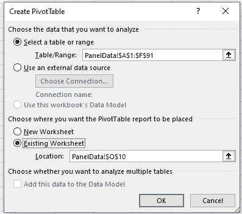

可以选择一个新的工作表或现有的工作表来放置数据透视表，这里我已经选择了现有的工作表，对于位置，您可以选择一个空的单元格。

按下 OK 后，将在单元格 O10 处创建一个空数据透视表，并在工作表的右侧创建一个数据透视表字段，其中包含所有列和空筛选器。

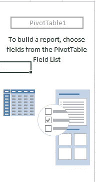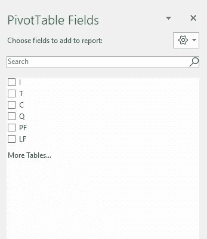

**这里我们有代表航空公司的“I”作为非时间相关的标识符，所以把它拖到行上，选择代表年份的时间标识符“T”。完成后，你会得到如下结果**

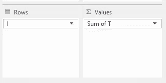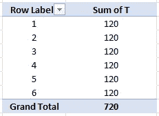

现在双击数据透视表中的“T 的总和”,将弹出如下窗口。

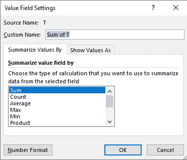

选择 Count 而不是 Sum，然后您可以看到数据透视表更新如下。

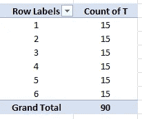

由此我们可以得出结论，每家航空公司总共有 15 个观察值，即每年一个，我们的数据集是**平衡面板数据**。

# 面板数据的优势

面板数据可以模拟群体的共同行为和个体行为。它比纯粹的时间序列数据或横截面数据包含更多的信息、更多的可变性和更高的效率，并且可以检测和测量其他数据集所不能检测和测量的统计效果。

**感谢阅读！！！！如果这篇文章对你有帮助，欢迎鼓掌，分享和回复。**

如果你有兴趣查看面板数据的详细计量经济分析，可以从[这里查看](https://www.kaggle.com/sandhyakrishnan02/econometric-analysis-of-panel-data-using-r)。