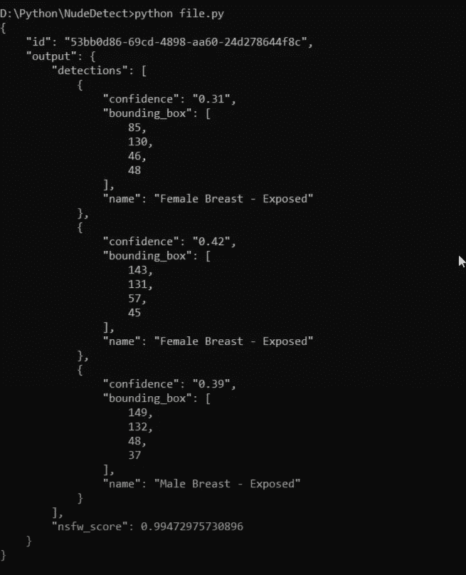

# 使用 Python 编程和深度人工智能检测裸体

> 原文：<https://medium.com/geekculture/detect-nudes-using-python-programming-and-deep-ai-a9be69b2e9af?source=collection_archive---------5----------------------->

## 我们可以使用 Python 和深度 AI 检测图像中的裸体吗？让我们检查一下


Nudity detection using python and deep ai

你好，Python 开发人员..！！

我叫 Rohit Kumar Thakur。昨晚我在网上冲浪，试图下载一部电影。但是那个电影网站充斥着个性化的裸体广告。我想，有没有可能用 python 来检测裸体？我必须使用任何图书馆吗？经过大量的研究，我偶然发现了一个叫做 [Deep AI](https://deepai.org/) 的网站。这个网站提供了检测裸体图像的 API。他们训练了男性和女性的裸体图像数据集，并使用 API 提供了检测裸体图像的功能。所以，不浪费任何时间。我们开始吧..！！

如果您正在寻找视频教程，那么它就在这里:

Nudes Detection using Deep AI and Python

# 密码

创建一个 python 文件，并在您喜欢的代码编辑器中打开它。哦！VS 代码？很好。

***file . py***

```
import requestsurl = '[https://api.deepai.org/api/nsfw-detector'](https://api.deepai.org/api/nsfw-detector')headers = {
    'api-key': 'quickstart-QUdJIGlzIGNvbWluZy4uLi4K'
}response = requests.post(
    url,
    files={
        'image': open('img2.png', 'rb'),
    },
    headers=headers
)print(response.text)
```

*   用您的测试图像更改图像文件名。确保正确写入图像的路径。我将图像“img2.png”放在与 python 文件相同的目录中。
*   这个 API 密匙可以免费使用。但是当你发出几个获取请求后，深度人工智能的人会阻止你，并要求你创建一个帐户并获取你的 API 密匙。
*   代码部分非常简单，容易理解。

现在运行项目。如果您用裸体图片测试这段代码，那么输出将是这样的:



Nude images detection using python

你可以看到 NSFW 得分是 99.4729%，这意味着图像是裸体的。在这里，我们可以看到输出显示男性和女性的胸部都暴露在外。那是不可能的，对吗？我用了一张平胸女孩的随机照片。别问我为什么？

同样，您可以在非裸体图像上测试这段代码。您将获得期望的输出。

本文到此为止。

如果这篇文章听起来对你有帮助，那么一定要跟着鼓掌。分享给你的极客社区。

感谢阅读。

# 这里有更多的 Python 项目供练习！

[***使用 Python 编程制作您的 PDF 有声读物***](https://ninza7.medium.com/make-your-pdf-an-audiobook-using-python-programming-610b59cc4a92)

[***随机密码生成器使用 Python 编程***](https://python.plainenglish.io/random-password-generator-using-python-programming-1e65fc058540)

[***用 Python 和 Tkinter 制作计算器***](https://ninza7.medium.com/make-a-calculator-using-python-and-tkinter-dc24a2d17d4)

[***YouTube 视频下载器使用 Python 和 Tkinter***](https://python.plainenglish.io/youtube-video-downloader-using-python-and-tkinter-b97462542300)

[***使用 Python 进行文本到语音的转换***](https://ninza7.medium.com/text-to-speech-conversion-using-python-with-gtts-eb4aa0f6dfb7)

[***使用 OpenCV Python***](/nerd-for-tech/capture-and-process-video-footage-from-a-webcam-using-opencv-python-9e3c5585da0c) 从网络摄像头捕捉并处理视频素材

[***石头剪子布游戏使用 Python 编程***](https://ninza7.medium.com/make-rock-paper-and-scissors-game-using-python-programming-da277b51182c)

快乐编码..！！

你好，我是 Rohit Kumar Thakur。我对自由职业持开放态度。我构建的 ***react 原生项目*** *和目前正在做的****Python Django****。随时联系我(*[*freelance.rohit7@gmail.com*](mailto:freelance.rohit7@gmail.com)*)*