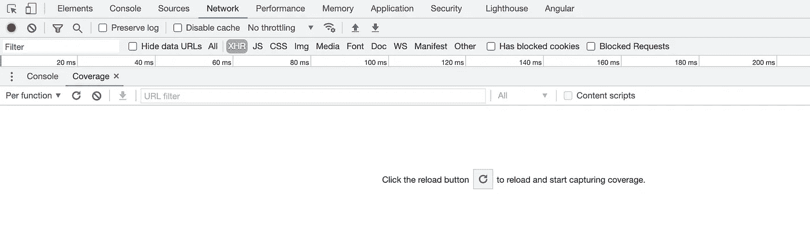
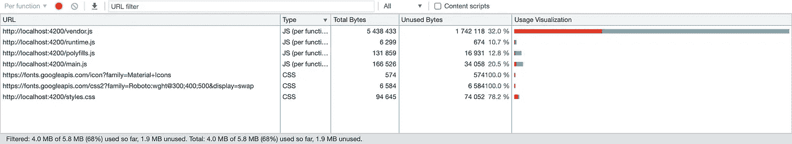
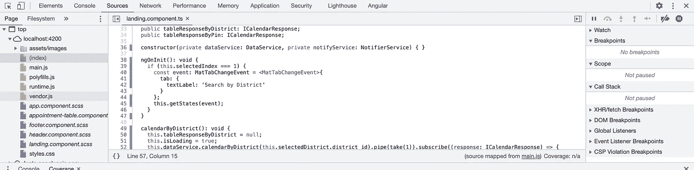
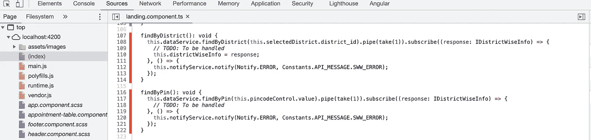
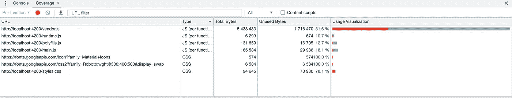

# 如何检测代码中未使用的 CSS 或 JavaScript

> 原文：<https://medium.com/geekculture/detect-unused-css-or-javascript-in-your-code-8d200ef07e50?source=collection_archive---------1----------------------->

Photo by [Christopher Robin Ebbinghaus](https://unsplash.com/@cebbbinghaus?utm_source=medium&utm_medium=referral) on [Unsplash](https://unsplash.com?utm_source=medium&utm_medium=referral)

我们有多少次遇到这样的情况，你的项目有很多代码可能在早期阶段被用来构建一个 [MVP](https://en.wikipedia.org/wiki/Minimum_viable_product) ，但是几年后它就躺在那里，因为有人没有做适当的重构工作？

“经常”是显而易见的答案。

由于现实世界中的应用程序有不同的开发人员在不同的地点工作，因此对于已经在相同的代码库上工作了相当长时间的开发人员或者团队中的新手来说，这项任务可能同样单调乏味。这听起来像是一项艰巨的工作，不是吗，尤其是当它是一个包含几个模块的非常大的代码库时。

在这里，你可以使用谷歌提供的一个非常强大的工具——[Chrome DevTools](https://developer.chrome.com/docs/devtools/)轻松呼吸。

**在你的 Chrome 标签**上打开 DevTools，右击并使用‘Inspect’或按键盘上的 F12 键进行检查。

Windows 上按 Ctrl+Shift+P*(Mac 用户按 Command+Shift+P)*

**输入“Show Coverage”**，将打开新的 Coverage 选项卡，如下图所示:

Coverage tab of Chrome DevTools

单击上面文本中显示的重新加载图标。

将计算代码(JavaScript 和 CSS)的覆盖率。下面附上我一直在做的一个 Angular app 的样本截图。

Code coverage analysis in the coverage tab

coverage 选项卡将为您提供按文件类型分类的**总字节数**、未使用的**字节数**和**使用可视化数据**。

使用可视化进度条中以红色突出显示的进度条是未使用的代码。32%属于 vendor.js 文件中尚未执行的函数(或者如果这是应用程序中未使用的代码，可能永远不会执行)。

以蓝绿色突出显示的进度条已经执行了大约 68%。如果你看看左下方的图片，它向你展示了这一点。

由于在 Angular 应用程序中，ts 文件被捆绑在一起，然后分裂成 JS 文件，所以我将尝试向您展示当前的 TS 文件和它包含的未使用(死)代码。使用“源”选项卡打开当前文件。在我的例子中，它是一个 **landing.component.ts** 文件:

Executed code highlighted in bluish green

Unexecuted code highlighted in red

第一个截图显示了已经在蓝绿色背景中执行的代码行。第二行显示了可能还没有执行的代码行(或者可能永远不会执行，这可能对应于应用程序中的死代码)。

在我的情况下，这些方法是额外的，我不需要它们，因此我将删除它们。 **vendor.js** 文件的未使用代码覆盖率下降到 31.6%。因此，其背后的想法是减少未使用的**字节**的数量，以便优化您的代码包并包含所需的最少代码。对项目中的所有 CSS 文件也可以这样做。

Improved code coverage in the usage utilisation

你被分配的压倒性的工作现在看起来很容易解决，对吗？

## 结论

现在我们有了。我希望这篇文章对你有用。感谢您的阅读。请随时提供您的意见、建议和任何其他可能有帮助的反馈。

*更多内容尽在*[***plain English . io***](http://plainenglish.io)