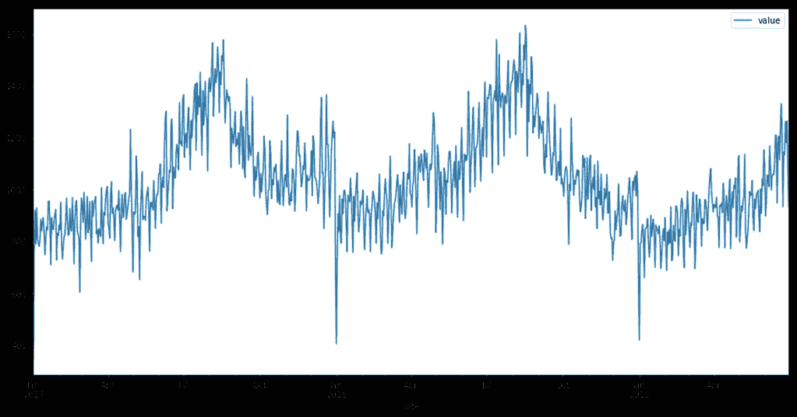
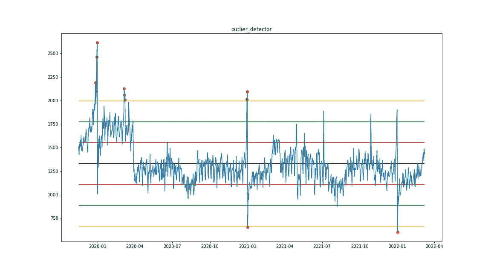
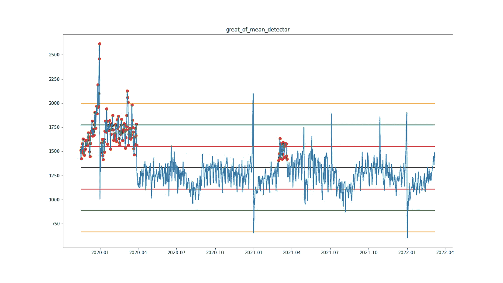
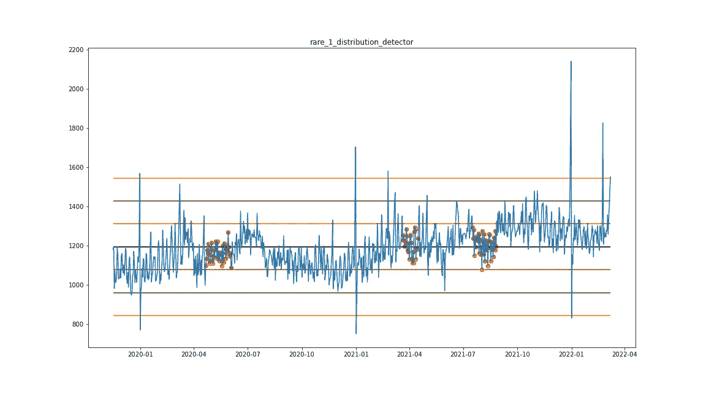
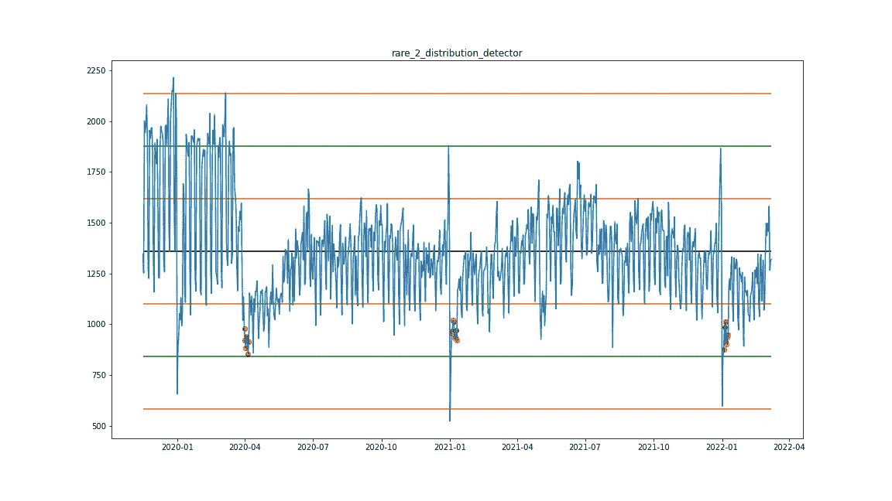
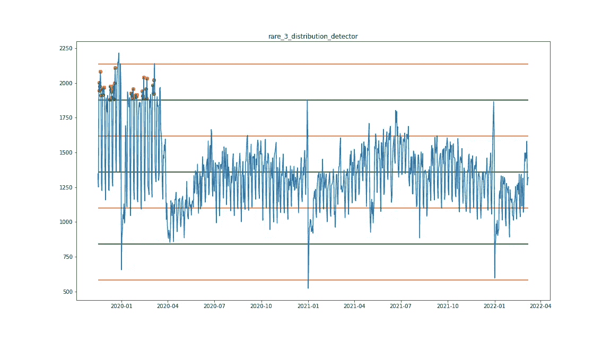
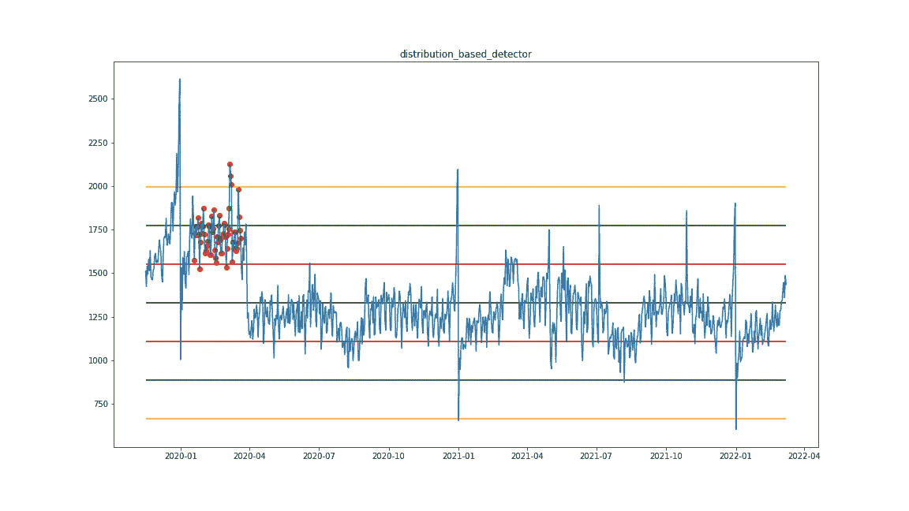

# 基于正态分布的时间序列异常检测

> 原文：<https://medium.com/geekculture/detecting-anomalies-in-time-series-based-on-the-normal-distribution-e2dc4dd9cf15?source=collection_archive---------5----------------------->

大家好，在这篇文章中我想谈谈基于正态分布的时间序列异常检测的基本方法。

时间序列是描述一段时间内发生的过程的一系列值。这些值应该以固定的时间间隔出现，这是处理时间序列的强制性要求。

Here is an example of a time series describing the number of cars entering a gas station.

## 为什么要寻找异常点？

与时间序列相关的主要问题是分析和预测。

*   可能需要时间序列分析来监控和响应系统行为的某些变化。
*   时间序列预测在许多领域都很有趣，例如预测股票市场的汇率或零售商店的顾客流量和产品需求。

作为时间序列分析任务的一个例子，我们可以设想这样一个任务:监控网站的负载，以便在出现异常负载时向管理员发送通知。

预测时间序列时，我们必须建立时间序列的模型，通常使用过去的统计信息。根据合适的策略，在建立模型时减少负面影响正是寻找异常、将它们从训练样本中清除或替换它们所需要的。

## 使用统计分析发现异常

让我们考虑一个异常，一个概率小于 0.1%的事件，即在 99.9%的情况下这不应该发生。

为了进行搜索，我们需要关于数据分布的信息，即平均值和标准差。我们还将使用公式来计算两个独立事件发生的概率，它等于这两个事件概率的乘积。

**P(AB) = P(A)*P(B)**

我们将假设在我们的系列中，每个事件都不依赖于前一个事件，我们将通过同时乘以这些事件的概率来计算几个连续事件发生的概率。

我们可以通过知道数据分布的信息来获得事件发生的概率。该图显示了对时间序列应用正态分布的示例。知道了这个值属于哪个范围，我们就可以说这种情况发生的概率有多大。

Normal distribution overlay to time series

## 异常检测器

因此，第一个异常检测器是异常检测器。这是最常见的检测器之一，它将所有超出 3 个标准偏差的单个值视为异常。

## 平均值的异常偏差

第二个检测器是均值的偏差异常。我们从正态分布中知道，一半的点位于平均值的右边，另一半位于平均值的左边。因此，在图表的一边找到一个值的概率是 50%。

如果一行中有 14 个或更多的值位于图表的同一侧，那么这是一个异常，这种事件的概率小于 0.007%

anomaly subsequence is large of mean

## 基于概率区间的异常

现在让我们看看标准偏差值之间的不同范围。下图显示了落入这些范围的概率。

(正态分布且概率落入区间的图片)

因此，我们可以讨论每个区间序列的异常部分，如果:

*   分成 1 sigma 区间—一行 25 个值。这种匹配的概率小于 0.008%
*   1–2 sigma—连续 7 个值，这种匹配的概率小于 0.01%
*   2–3 西格玛— 3 种价值观。这种匹配的概率小于 0.008%

## 底层数据分布的变化

此外，数据结构中的突然变化可以被认为是异常，即概率密度函数本身发生变化。为此，有必要测量窗口中的平均值和标准差，并将它们与之前整个系列的数据进行比较。

该图显示了一个示例，其中平均值和标准偏差相对于整个周期的偏差为 30%或更多，固定在宽度为 50 的窗口中。

## 摘要

因此，在本文中，我们研究了使用统计分析发现异常的方法。上述所有检测器都可以应用于普通、微分和平滑系列。应用预转换的决定取决于主题领域和数据的性质。

 [## GitHub-stepanovD/ts _ anomaly _ detection _ course:时间序列异常检测示例…

### 这个库包括笔记本，上面有关于时间序列异常检测的例子。

github.com](https://github.com/stepanovD/ts_anomaly_detection_course)