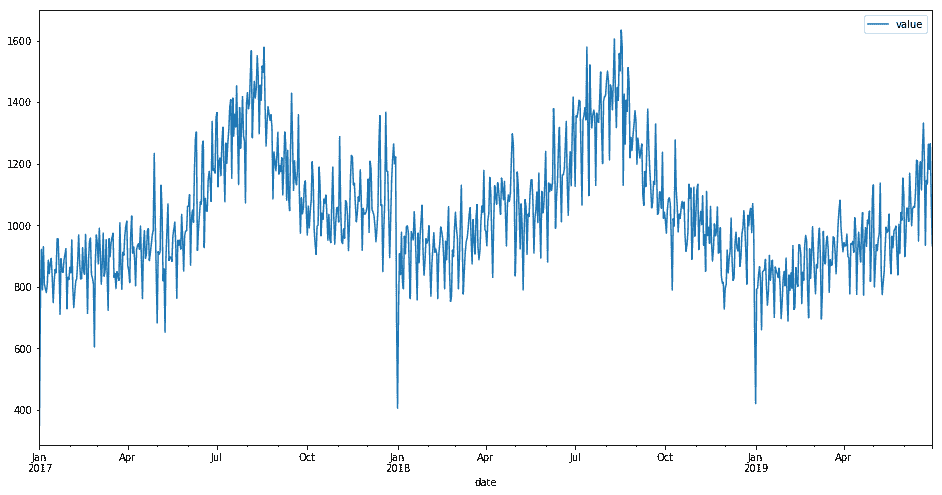
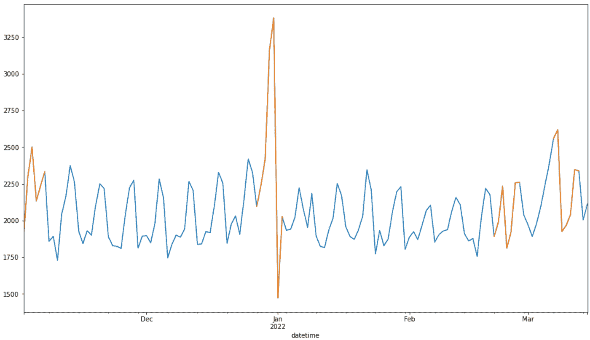

# 基于季节模式检测时间序列中的异常

> 原文：<https://medium.com/geekculture/detecting-anomalies-in-time-series-based-on-the-seasonal-pattern-bc4734a2c45e?source=collection_archive---------7----------------------->

# 介绍

大家好，在这篇文章中我想谈谈时间序列的季节性异常的检测。时间序列是描述一段时间内发生的过程的一系列值。这些值应该有固定的间隔，这是处理时间序列的强制性要求。



Here is an example of a time series describing the number of cars entering a gas station.

# 为什么要寻找异常点？

与时间序列相关的主要任务是分析和预测。
可能需要时间序列分析来监控和响应系统行为的某些变化。

时间序列预测在许多领域都很有趣，例如预测股票市场的汇率或零售商店的顾客流量和产品需求。

异常搜索方法可用于及时响应指标变化或提高预测模型的质量。

# 季节性

异常是数据的一个实例不同于其余实例时的点，或者是相关实例的序列不同于其余数据时的组。
每个时间序列都有三个组成部分:趋势、季节性和残差。季节性是序列的周期性组成部分，它假设序列在一定时期内具有相同的动态。一个例子是杂货店的顾客数量，这样的序列具有明显的每周季节性。
(图为顾客流动)
如果事先知道序列的季节性，那么寻找该季节性的偏差并单独处理异常周期是有意义的。这类异常属于群体异常。

# 搜索序列的季节性异常

季节性根据时期有固定的轮廓。有可能测量与这一季节剖面的偏差，并接受整个周期为异常。

下图显示了俄罗斯一家杂货店销售的商品数量示例。我们知道有一个明显的周季节性，并希望找到异常周。

为此，我们需要将每个配置文件表示为一个向量，在我们的例子中，它是一周中每一天的 7 个值的向量。

作为一种距离度量，您可以采用特定一周的向量与季节性轮廓之间的角度。

剩下的只是确定距离阈值，在我们的例子中，我们将通过第 90 百分位设置它。那些。超过 90%的所有值将被视为异常。



the number of items sold in a grocery store in Russia

结果，我们看到包含新年假期的那一周和包含 11 月 4 日和 2 月 23 日的公共假期的那几周被证明是异常的。3 月份的第二周也出现下跌，因为需求的增加与乌克兰冲突的开始有关。

检测器的实现如下所示。

```
**'''****df - dataframe with datetime column and values
column - is column name for search anomalies**'''**def** anomaly_week_detector(df, column, outliers_fraction**=**0.1):
    _df **=** df**.**copy()# compute average pattern of week
    dfw **=** _df**.**groupby(_df**.**index**.**weekday)**.**mean()
    dfw **=** dfw**/**dfw**.**sum()
    dfw **=** dfw**.**reset_index()**.**rename(columns**=**{'datetime':'dw', column:'tmpl'})

    _df['dw'] **=** _df**.**index**.**weekday #weekday number
    _df['w'] **=** _df**.**index**.**year*****100 **+** _df**.**index**.**week #index of week# calculate sum of each week d1 **=** _df**.**groupby('w')[column]**.**sum()**.**reset_index()
    d1**.**rename(columns**=**{column: 'v_sum'}, inplace**=True**) ddf **=** _df**.**merge(d1) #compute normalize pattern of each week
    ddf['v_norm'] **=** ddf[column] **/** ddf['v_sum'] ddf['v_norm_sqr'] **=** ddf['v_norm']*****ddf['v_norm']

    ddf **=** ddf**.**merge(dfw) ddf['tmpl_sqr'] **=** ddf['tmpl']*****ddf['tmpl']
    ddf['n_tmpl'] **=** ddf['tmpl']*****ddf['v_norm']

    ddf **=** ddf**.**groupby('w')[['v_norm_sqr', 'tmpl_sqr', 'n_tmpl']]**.**sum()**.**reset_index()

    ddf['tmpl'] **=** np**.**sqrt(ddf['tmpl_sqr'])
    ddf['v_norm'] **=** np**.**sqrt(ddf['v_norm_sqr'])

    ddf['cos'] **=** (ddf['n_tmpl'] **/** (ddf['tmpl']*****ddf['v_norm']))
    #angle between each week and average pattern
    ddf['angle'] **=** ddf['cos']**.**apply(**lambda** x: math**.**acos(x))    # detect anomalies
    ddf['is_anomaly'] **=** ddf['angle'] **>=** ddf['angle']**.**quantile(q**=**1**-**outliers_fraction)

    df_out **=** _df**.**reset_index()**.**merge(ddf[['w', 'is_anomaly']])**.**set_index('datetime')
    df_out['anomaly'] **=** df_out[df_out['is_anomaly']][column]

    **return** df_out
```

# 摘要

因此，在本文中，我们考虑了在时间序列的季节性中寻找异常的方法。您可以在[这个库](https://github.com/stepanovD/ts_anomaly_detection_course)中找到使用这个和其他异常检测器的例子。