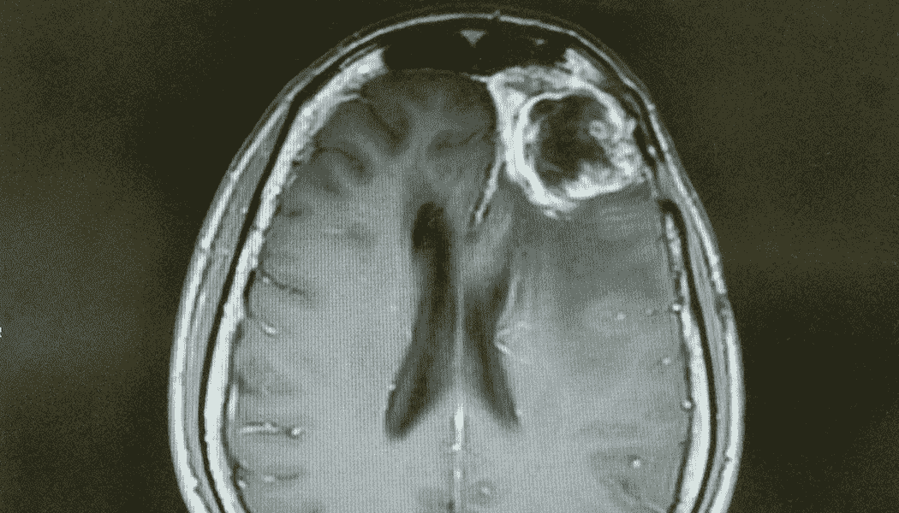
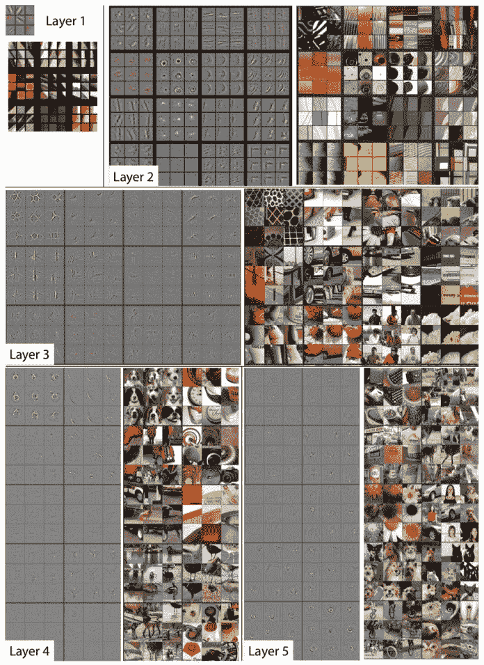
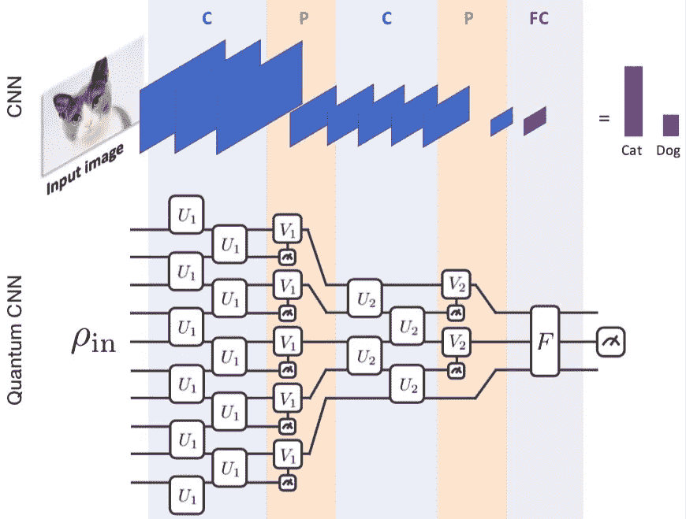

# 用量子神经网络检测脑肿瘤

> 原文：<https://medium.com/geekculture/detecting-brain-tumours-using-qnns-48f0e385db0?source=collection_archive---------36----------------------->

你的身体有超过 724 万亿个细胞，每分钟有 9600 万个细胞死亡和再生。

当我第一次知道这个的时候，我有点担心。

如果我们每分钟有 9600 万个细胞通过 5 个步骤再生*，那么你的基因很有可能会突变，并很快产生更多的突变细胞。*

*事实是——没有人有完美的基因，每个人都有基因突变。这些基因突变大多数是无害的。*

*另一方面，也有许多突变可能是致命的。*

# *胶质母细胞瘤——世界上最致命的脑肿瘤*

**

*CT Scan of Glioblastoma. Source: [NFCR](https://www.nfcr.org/blog/origin-cells-of-glioblastoma-may-have-been-identified/)*

*胶质母细胞瘤是由**胶质干**或**祖细胞**中基因突变的积累引起的，这些细胞负责产生支持和保护神经元的特化细胞(星形胶质细胞、少突胶质细胞、小胶质细胞、室管膜细胞)。*

**

*SOURCE: [Nature.com](https://www.google.com/url?sa=i&url=https%3A%2F%2Fwww.nature.com%2Farticles%2Fcddis2017504&psig=AOvVaw3xbiptY-MLVWrhcF1eWIN8&ust=1621959179949000&source=images&cd=vfe&ved=0CAIQjRxqFwoTCKCEivja4vACFQAAAAAdAAAAABAH)*

*引起胶质母细胞瘤的基因突变通常由以下基因引起:*

*   ****TP53*** 和 ***PTEN*** :肿瘤抑制基因*
*   ***:*重塑染色质**
*   *****TERT****:*端粒酶的亚单位，它负责确保细胞不会无限分裂**
*   ****:*细胞生长***
*   *****id h1****:*细胞代谢**

**当你看到基因功能时，就不难理解为什么这些突变的组合会导致增长最快和最危险的脑肿瘤之一。**

# **现状**

**对于美国 1050 万胶质母细胞瘤患者来说，平均存活时间只有 12-18 个月。**

**但问题是，肿瘤不会立即发展成胶质母细胞瘤。**

**它们最初是一种不同的(也更容易治疗的)肿瘤，叫做神经胶质瘤。神经胶质瘤有四个阶段，第四阶段的神经胶质瘤被称为胶质母细胞瘤。**

**就像所有的癌症一样，如果我们能够更早地检测到这些肿瘤，当它们变小而不是恶性的时候，我们就可以大大提高存活率。**

**如今，诊断神经胶质瘤需要检查大量的患者病史、神经病学检查和磁共振成像等医学成像技术。最终的诊断和治疗方案只能在分析一块肿瘤组织后才能制定。**

**为什么我们还没有找到一种在更短的时间和更低的成本下检测危险脑瘤的方法？**

# **用于图像检测的卷积神经网络**

**在过去的几年里，卷积神经网络(或 CNN)在图像检测和分类方面变得非常流行。有了 CNN，我们可以比人类更快更准确地识别肿瘤。**

****

**This diagram shows how a CNN works. [Source](https://towardsdatascience.com/a-comprehensive-guide-to-convolutional-neural-networks-the-eli5-way-3bd2b1164a53)**

**如果我们想看这张图片，并确定它是哪种车辆，我们将从学习特征开始。每个卷积层识别不同类型的要素，然后将这些要素放入池层，从而减小要素地图的大小。**

> **点击这里了解更多关于 CNN 及其工作原理的信息[。](https://machinelearningmastery.com/convolutional-layers-for-deep-learning-neural-networks/)**

****

**[Source](https://bdtechtalks.com/2020/01/06/convolutional-neural-networks-cnn-convnets/)**

**这个过程在它们被放入神经网络分类和标记图像之前会发生多次。**

> **了解如何使用经典人工智能识别脑瘤[点击这里](https://ai.plainenglish.io/detecting-brain-tumors-from-mri-scans-using-a-cnn-ae3c2913bde7)。**

**截至今天，CNN 出现在我们使用的许多应用程序中——从 snapchat 过滤器中的增强现实到自动驾驶汽车中的计算机视觉。它们已经在许多行业中被证明是可靠的，甚至在检测疾病方面超过了人类。**

**CNN 最大的缺点是，随着图像尺寸的增加，运行 CNN 的时间也会增加。虽然我们还没有遇到大图像的主要问题，但是随着我们的用例变得更加复杂，这可能会成为一个大问题。**

**但是我们不仅仅局限于 CNN 进行图像检测。**

**随着时间的推移，我们的量子计算机变得越来越强大，**量子卷积神经网络**，或量子进化神经网络(QNNs)也可能成为图像检测的基础技术。**

# **用于图像检测的量子神经网络**

**与 CNN 类似，我们仍然有相同类型的卷积层、池层和全连接层，只是它们被映射到量子位电路上。**

****

**Source: [Phys.org](https://phys.org/news/2019-09-quantum-convolutional-neural-networks.html)**

**量子神经网络的两个最大优势是它们更快更准确。**

**经典的卷积神经网络需要大约 **O(n )** 的时间来运行(n= [内核大小](https://stats.stackexchange.com/questions/296679/what-does-kernel-size-mean/339265#:~:text=Deep%20neural%20networks%2C%20more%20concretely,filters%20are%20usually%20called%20kernels.&text=The%20kernel%20size%20here%20refers%20to%20the%20widthxheight%20of%20the%20filter%20mask.)，而 QNNs 将需要**O(log(n))**，这明显更快。**

**尽管目前的量子进化神经网络模型并不总是像 CNN 一样准确，但随着量子硬件变得更强大、更稳定，最终量子机器学习和 qnn 将在人工智能革命中发挥巨大作用，并帮助我们解决我们世界中的一些最大问题，包括早期肿瘤检测。**

# **我们连线吧！**

> ***如果你喜欢阅读这篇文章或学习新的东西，我很乐意在* [*LinkedIn*](https://www.linkedin.com/in/richa-pandya/) *上联系。如果你想了解我的新文章或项目，你可以订阅我的每月简讯* [*这里*](https://landing.mailerlite.com/webforms/landing/m1f7h3) *！***