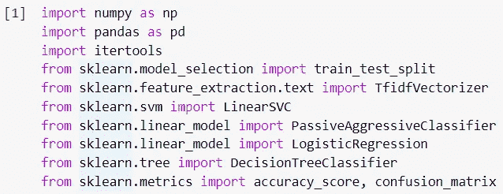
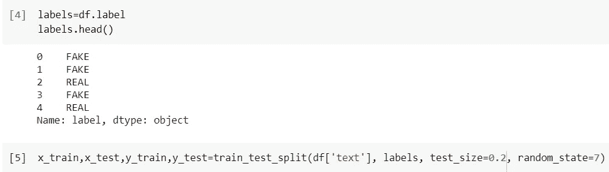
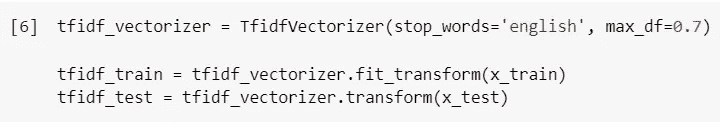
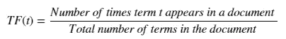
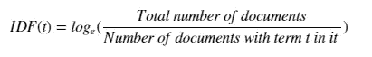
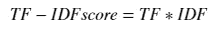
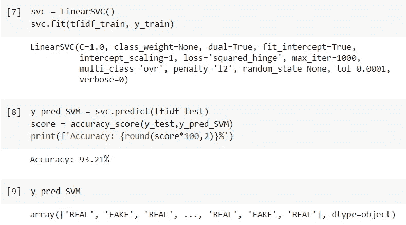
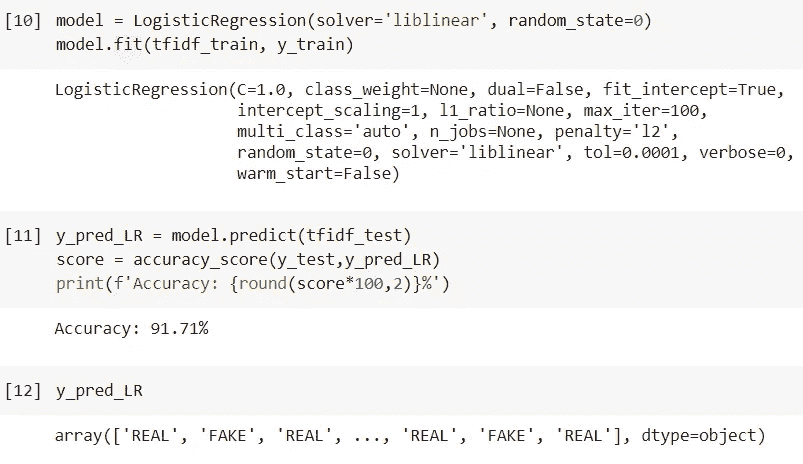
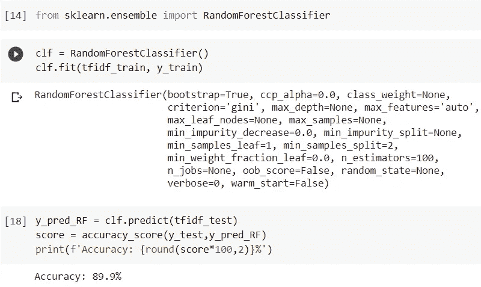

# 使用监督学习检测假新闻

> 原文：<https://medium.com/geekculture/detecting-fake-news-using-supervised-learning-8abf09b9bf1d?source=collection_archive---------7----------------------->

虚假新闻的流通是现代民主国家的一个基本问题。假新闻在网上广泛传播。这在公众中引起了普遍的恐慌和恐惧。因此，确定信息的完整性至关重要。随着自然语言处理和机器学习的如此多的改进，我们可以构建 ML 模型来识别一条新闻是合法的还是虚假的。

这个用于识别虚假新闻的 python 项目既关注虚假新闻，也关注真实新闻。在我们的数据集上，我们用 sklearn 创建了一个 TfidfVectorizer。然后使用已经初始化的各种模型来拟合该模型。最后，准确度分数和混淆矩阵表明我们的模型表现如何。

你可以在这里下载数据集[。](https://drive.google.com/file/d/1er9NJTLUA3qnRuyhfzuN0XUsoIC4a-_q/view)

1.  **导入库**

2.**读取数据集**

**3。将数据分为训练集和测试集**

**4。初始化 TF-IDF 矢量器并转换文本数据**

***TF-IDF 矢量器***

TF-IDF 是术语频率-逆文档频率的缩写。TF-IDF 权重是一种统计度量，用于评估单词在文档集合或语料库中的重要性。单词的相关性根据它在文本中出现的次数而增长，但被该术语在语料库中的频率所减轻。

**词频(TF):** 基于在当前文档中出现的频率的分数。因为每个文档的长度都不一样，所以一个短语在较长的文章中出现的频率可能要比在较短的文章中出现的频率高得多。为了标准化，词频除以文本的长度。

**逆文档频率(IDF):** 是一个度量标准，用于衡量一个术语在文本中的不常见程度。IDF 得分越高，该短语越罕见。

因此，

**5。使用监督 ML 算法训练数据并验证结果**

## a.支持向量机

支持向量机或 SVM 是一种机器学习算法，它分析数据并将其分为两组。SVM 算法的目的是找到对 n 维空间进行分类的最佳线或决策边界，以便在将来将新的数据点简单地放置在适当的类别中。超平面是最佳选择边界。

考虑下图，该图显示了由决策边界或超平面分隔的两个不同类别:

[Image credit: [https://www.researchgate.net/figure/Schematic-of-the-one-dimensional-support-vector-regression-SVR-model-Only-the-points_fig5_320916953]](https://www.researchgate.net/figure/Schematic-of-the-one-dimensional-support-vector-regression-SVR-model-Only-the-points_fig5_320916953])

SVM 选择帮助创建超平面的极值点/向量。这些极端的例子被称为支持向量，因此该技术被称为支持向量机。让我们执行 SVM:

SVM

## b.逻辑回归

逻辑回归是机器学习从统计学中采用的另一种方法。这是用于二进制分类问题(具有两个类值的问题)选择的常用算法。逻辑回归以逻辑函数命名，这是该方法的核心。

逻辑函数，也称为 sigmoid 函数，由统计学家设计，用于描述生态学中人口增长的特征，如超过生态系统承载能力的快速扩张。这是一条 S 形曲线，可以将任何实值整数转换为介于 0 和 1 之间的值，但决不会严格介于这两个界限之间。

> 1 / (1 + e^-value)

Logistic Regression

## c.被动攻击分类器

被动攻击算法(Passive-Aggressive algorithms)是一类在初学者甚至中级机器学习爱好者中很少被认可的机器学习算法。然而，在某些情况下，它们会非常有用和有效。

被动攻击算法与感知器模型类似，因为它们不需要学习率。然而，它们有一个正则化参数。术语“被动-主动算法”是指这样的算法:

**被动**:如果预测正确，不去管模型，不做调整。换句话说，例子中的数据不足以引起模型的任何修改。
**积极进取:如果预测不准确，积极进取地对模型进行调整。也就是说，对模型的修改可能会纠正它。**

****

**PAC**

## **d.随机森林**

**众所周知，随机森林分类器是一种集成分类技术，用于各种应用领域中的机器学习和数据科学领域。这种方法采用“并行集成”，涉及在各种数据集子样本上并行拟合许多决策树分类器，并使用多数投票或平均值来确定结论或最终结果。因此，它减少了过度拟合问题，同时提高了预测的准确性和控制。因此，具有几个决策树的 RF 学习模型比基于单个决策树的模型更准确。为了建立一系列具有受控变化的决策树，它结合了引导聚集(bagging)和随机特征选择。它适用于分类和回归问题，并且非常适合分类值和连续值。**

****

**Random Forest**

## **e.决策图表**

**决策树 ML 技术用于拆分学习任务，通过将数据集划分为更小的组来构建该树，直到每个划分都是干净和纯粹的，并且数据分类由数据的种类来确定。为了从数据集中去除噪声，修剪方法过程用于树完全生长时的最终构造。在决策树方法中，从根开始的每条路径代表一系列数据分割，直到在叶节点达到布尔结果。在现实生活中，决策树中的每条路径都是一个决策规则，可以很容易地翻译成人类语言或编程语言。决策支持能力在数据挖掘和机器学习的研究中并不新鲜。从技术上讲，有多种方法能够支持决策。尽管如此，决策树可能更受青睐，因为它清晰易懂。**

****

**Decision Tree**

****6。结论****

**看完这篇博客后，我希望你能更好地了解将 NLP 和机器学习结合起来打击假新闻这一重大问题的可能性。此外，我邀请您探索并构建您的假新闻检测器，因为在不同的数据集上修改代码是微不足道的。感谢阅读！♥**

****7。参考文献****

**【https://www.irjet.net/archives/V8/i8/IRJET-V8I8123.pdf **