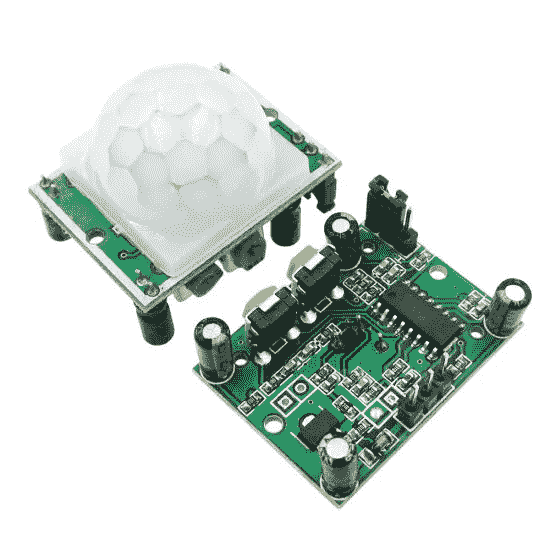
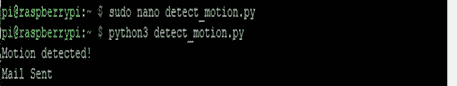
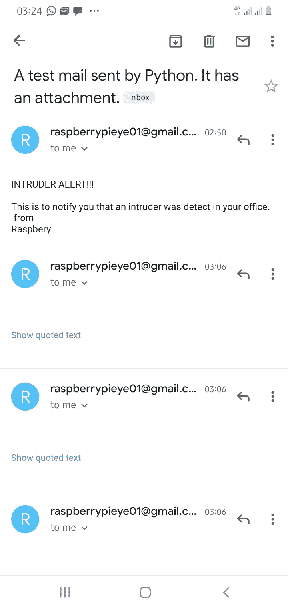

# 使用具有 Raspberry PI 的 PIR 运动传感器检测运动

> 原文：<https://medium.com/geekculture/detecting-motions-using-pir-motion-sensor-with-raspberry-pi-98f88f9d5ffe?source=collection_archive---------13----------------------->

> 哇！欢迎回到我的第四个树莓派系列。如果你没看过前面的，可以随意[查](/geekculture/how-to-connect-to-the-raspberry-pi-using-mobile-hotspot-2362a6b02efc)。我在每篇文章的结尾都链接了一些文章。

本文将使用具有 Raspberry Pi 的 PIR(被动红外)传感器构建一个简单的运动检测。PIR 传感器用于感应人、动物或其他物体的运动。基本上任何散发红外线热量的物体。温度高于绝对零度的物体以辐射的形式放出热能。通常，这种辐射对人眼来说是不可见的，因为它以红外波长辐射，但它可以被电子设备检测到，如为此目的设计的 PIR 传感器。

[image from image.made-in-china.com](https://image.made-in-china.com/202f0j00gqBRrtwGYIkK/High-Quality-Hc-Sr501-Adjust-Infrared-PIR-Motion-Sensor-Detector-Module-for-Raspberry-Pi-or-Arduino.jpg)

## 实用解释:

当检测到运动时，其中一个 led 打开，如果没有检测到运动，另一个 led 打开。此外，如果检测到运动，将发送一封邮件。

## 所需硬件:

1.  发光二极管
2.  220 欧姆电阻
3.  跳线
4.  PIR 运动传感器
5.  试验板
6.  树莓 Pi 3 型号 B+
7.  一个 5V 2A 微型 USB 电源适配器。

以下是对 PIR 运动传感器的简要说明。

Image from ifuturetech.org

**PIR 运动传感器:** PIR 代表被动红外，由红外探测器、菲涅尔透镜和支持检测电路组成。这种镜头可以探测到任何散发红外线热量的物体，比如人类、动物。热量被运动传感器吸收。

PIR 运动传感器有两个电位计，用于设置**延迟时间**和**灵敏度**。

*   延迟时间调整用于设置检测到运动后输出应保持高电平多长时间；它可以从 5 秒到 5 分钟不等
*   灵敏度调整用于设置检测范围，范围可以是 3 到 7 米。

PIR 运动传感器有三个连接引脚，分别用于电源(VCC)、信号(输出)和接地(GND)。

PIR 运动传感器体积小，价格便宜，功耗低，易于使用，不会磨损。因此，它们通常出现在家用或商用的电器和小工具中。

**所需软件:**

1.  油灰
2.  拉斯比安操作系统

让我们开始实际的部分。

**步骤 1:** 设置电路

所以我假设你已经成功地做了一些基本的项目。如果没有，可以随意查看我之前的文章[**这里**](/geekculture/how-to-blink-led-using-raspberry-pi-8351b06348d7)

**连接发光二极管和电阻**

*   将 led(分别为红色和黄色)连接到试验板。
*   选择负极，使用电阻器，将其连接到 GND ( **引脚 39** )
*   将另一端分别连接到 GPIO(引脚 20 和 19)

**连接 PIR 运动传感器**

*   将 VCC 引脚连接到树莓 GPIO 的 5v 电压
*   将 GND 引脚连接到 Raspberry GPIO 的 GND。
*   将输出引脚连接到 GPIO 引脚 4。

我们应该有这样的联系。如果没有，请随意使用图片。

**第二步** : python 代码

*   使用树莓 PI 的 **IP** 地址和端口 **22** 对其进行 SSH
*   输入**用户名**和**密码**
*   升级和更新 Pi。每次我们使用 pi 时，总是更新和升级它是一个好习惯。输入 **sudo apt-get 更新**和 **sudo apt-get 升级**
*   创建一个新的 python 文件**sudo nano detect _ motion . py**
*   输入以下代码

*   使用'**python 3 detect _ motion . py**'在终端中运行 python 文件

**结果:**

还差一步！

让我们添加以下 python 代码，以便在检测到运动时发送邮件

现在，我们的代码应该是这样的

*   最后，在终端中使用**python 3 detect _ motion . py**运行 python 文件

让我们来看看结果-

注:确保 PIR 运动传感器连接正确。

在 处查看完整代码 [**。**](https://github.com/funmi-cod/motionSensor)

我将在下一篇文章中分享树莓派的另一个有趣模块— [**Pi 相机**](/geekculture/how-to-interface-the-picamera-module-with-raspberry-pi-using-python-1570e499cc) 🙂！

谢谢你坚持到最后。