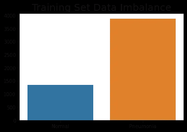
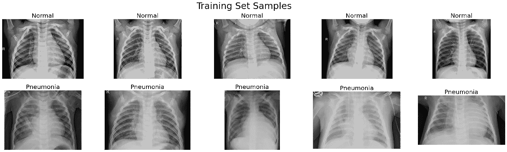
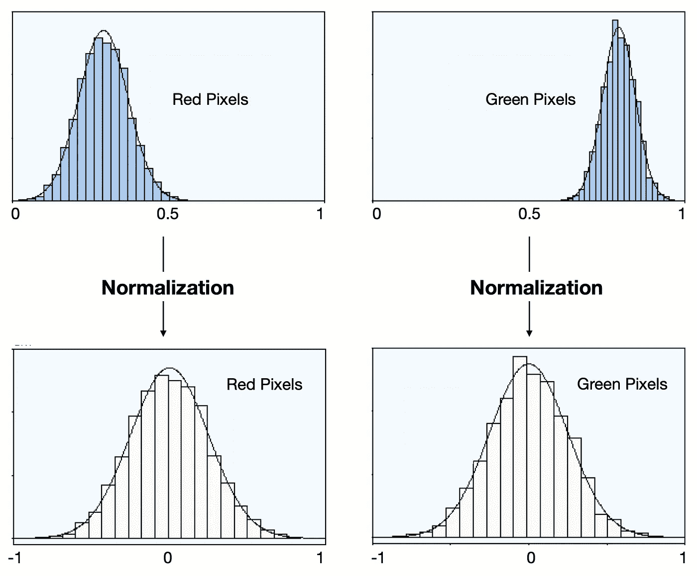
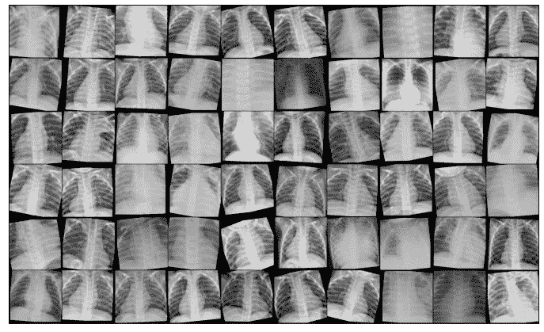
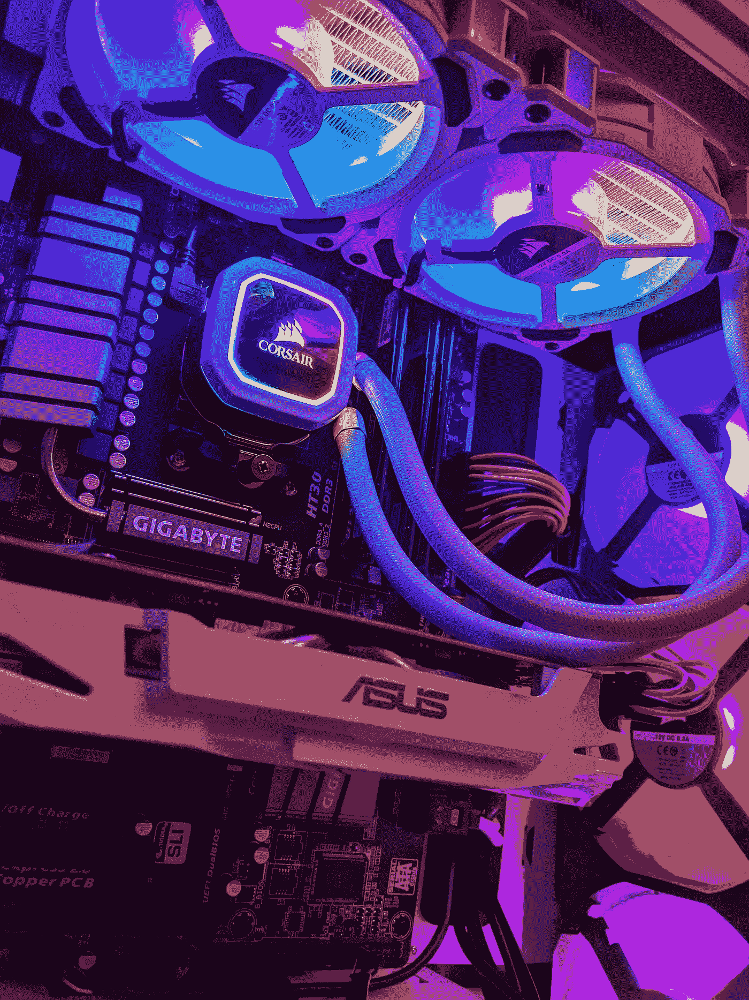
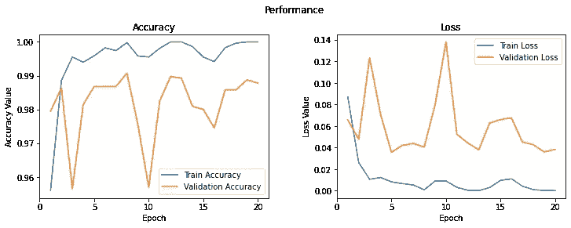

# 从胸部 x 光图像中检测肺炎

> 原文：<https://medium.com/geekculture/detection-of-pneumonia-from-chest-x-ray-images-aa36e096c51a?source=collection_archive---------10----------------------->

发现深度学习的真正力量，因为它预测一个人是否患有肺炎的准确率为 93%

Photo by [CDC](https://unsplash.com/@cdc?utm_source=medium&utm_medium=referral) on [Unsplash](https://unsplash.com?utm_source=medium&utm_medium=referral)

> 要查看完整代码，请点击[此处](https://jovian.ai/herambhd03/chest-x-ray-pneumonia)

# 什么是肺炎？

肺炎是一种由细菌、病毒或真菌引起的感染，它使一个或两个肺部的气囊(肺泡)发炎。气囊充满液体或脓，导致咳嗽带痰和呼吸困难。

患有肺炎的人的胸部 x 光片具有不正常的混浊区域，这对于人眼来说并不总是清晰可见的。这使得准确预测和拯救生命变得困难。这就是我们可以看到深度学习的美妙之处。

# 什么是深度学习？

深度学习是人工智能的一个子集，它使用 [**神经网络**](https://www.investopedia.com/terms/n/neuralnetwork.asp#:~:text=A%20neural%20network%20is%20a,organic%20or%20artificial%20in%20nature.) ，模仿人脑在处理数据和创建模式以做出决策方面的工作。

神经网络由许多层组成，这些层相互连接并捕捉某些非线性和线性关系。每一层负责学习特定的特征，并且随着层数的增加，模型变得越来越好。

# 方法

这个项目使用了一个 Python 原生包 [**PyTorch**](https://pytorch.org/) ，它很容易与其他 Python 包集成，这使得它成为一个简单易学的选择。

这里我使用的是 [**残差网络**](https://en.wikipedia.org/wiki/Residual_neural_network) (ResNets) via [**迁移学习**](https://en.wikipedia.org/wiki/Transfer_learning) ，一种流行的深度学习神经网络模型。

以下是涉及的步骤:

1.  下载数据集
2.  导入所需的库
3.  数据分析和可视化
4.  数据扩充和标准化
5.  准备训练和验证数据集
6.  设置 GPU
7.  创建模型类
8.  训练和评估模型
9.  精确度和损耗图
10.  根据实际标签绘制预测
11.  结论

# 下载数据集

第一步是下载我们打算使用的数据。该数据集可在[https://www . ka ggle . com/paultimothymooney/chest-x ray-pneumonia](https://www.kaggle.com/paultimothymooney/chest-xray-pneumonia)获得。使用 Jovian 的 [opendatasets](https://github.com/JovianML/opendatasets) 库，我从 [Kaggle](https://www.kaggle.com/stanford-open-policing/stanford-open-policing-project-bundle-2) 下载了数据。

# 导入所需的库

Photo by [Zaini Izzuddin](https://unsplash.com/@izzuddindanial?utm_source=medium&utm_medium=referral) on [Unsplash](https://unsplash.com?utm_source=medium&utm_medium=referral)

我们将需要一些库，如 *Pandas、Matplotlib、Numpy 和其他 PyTorch* 实用程序来简化我们的工作流程。

# 数据分析和可视化

Photo by [Carlos Muza](https://unsplash.com/@kmuza?utm_source=medium&utm_medium=referral) on [Unsplash](https://unsplash.com?utm_source=medium&utm_medium=referral)

为了使用我们的数据集，我们必须首先检查它，并采取必要的措施使它最适合我们的模型。

在研究这些数据时，我发现了一些重要的东西。肺炎组的图像数量多于正常组。这可能会产生错误的结果，因为我们的模型可能会给肺炎类别更多的权重。为了解决这个问题，我们应用了数据增强。

这是我们的模型被训练的图像样本的样子！

可以看出，仅仅从 x 光片上很难准确判断一个人是否患有肺炎。

# 数据扩充和标准化

by Shubham Goyal from Towards Data Science

我们希望我们的模型学习它特别针对的特征，而不是背景中存在的任何东西。这就是我们应用[数据增强](https://en.wikipedia.org/wiki/Data_augmentation)的原因。这有助于我们归纳数据，并防止它学习任何不需要的特征。

标准化数据可以防止来自任何一个通道的值在训练时不成比例地影响损耗和梯度，只需比其他通道具有更高或更宽的值范围。

# 准备训练和验证数据集

现在是时候准备我们的训练和验证数据集了。这里，我们将训练数据集分为 75%训练和 25%验证。

**训练集** —用于训练模型，即使用梯度下降计算损失并调整模型的权重。

**验证集** —用于在训练时评估模型，调整超参数(学习率等)。)并挑选模型的最佳版本。

我们现在可以创建数据加载器来帮助我们批量加载数据。我们混洗训练数据加载器，以确保每个时期中生成的批次是不同的。这种随机化有助于概括和加速训练过程。

A batch of Training Data from the DataLoader

# 设置 GPU

Photo by [Andy Holmes](https://unsplash.com/@andyjh07?utm_source=medium&utm_medium=referral) on [Unsplash](https://unsplash.com?utm_source=medium&utm_medium=referral)

图形处理单元(GPU)包含数百个内核，这些内核针对在短时间内对浮点数执行昂贵的矩阵运算进行了优化，这使得它们非常适合训练具有许多层的深度神经网络。

为了无缝地使用 GPU，如果有可用的话，我们定义了两个助手函数(get_default_device & to_device)和一个助手类 DeviceDataLoader，以便根据需要将模型和数据移动到 GPU。

# 创建模型类

我们将在模型中使用剩余网络。残差网络将残差块添加到 CNN，CNN 将原始输入添加回通过使输入通过一个或多个卷积层而获得的输出特征图。这一小小的改变带来了性能上的巨大提高。它允许在不损害性能的情况下训练更深层次的网络，因为可以跳过一些层。

你可以参考这篇博文来更好地了解 ResNet 是如何工作的:[https://towardsdatascience . com/residual-blocks-building-blocks-of-ResNet-FD 90 ca 15d 6 EC](https://towardsdatascience.com/residual-blocks-building-blocks-of-resnet-fd90ca15d6ec)

Representation of ResNet50

# 训练和评估模型

Negotiation Experts

最后，是时候在整个训练和验证集上训练和评估我们的模型了。

像批量大小、学习率等配置。需要在训练模型时预先挑选，称为**超参数**。挑选正确的超参数是让一个好的模型从优秀的模型中脱颖而出的关键。

# 精确度和损耗图

我们的模型在训练集上的准确率为 100%，在验证集上的准确率为 98.88%，这是一个相当不错的结果。

# 根据实际标签绘制预测

让我们看看几个图像，它们各自的标签以及我们的模型预测了什么。

我们的模型具有 93%的测试准确度，这远远好于人类的预测。因此，我们可以更加确定我们的预测，拯救更多的生命。

# 结论

我希望这篇文章揭示了深度学习的潜在力量。随着技术的快速发展，我们很快就会拥有足够强大的处理器，能够以令人难以置信的高精度在几分之一秒内完成这项工作。

> 要查看完整的代码，请点击[这里](https://jovian.ai/herambhd03/chest-x-ray-pneumonia)