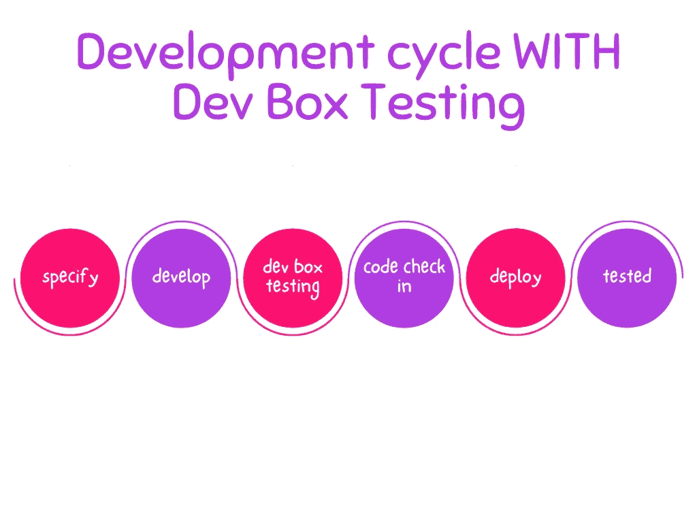

# 开发箱测试

> 原文：<https://medium.com/geekculture/dev-box-testing-9c78d41e5765?source=collection_archive---------5----------------------->

## 确保特性质量的基本方法。

[two women talking while looking at laptop computer (unsplash.com)](https://unsplash.com/photos/7okkFhxrxNw)

如果你的目标是从开发人员完成的任务中获得更快的反馈，那么我认为 Dev Box 测试是一个非常有趣的实践，你应该采用。

## **开发盒测试？这是什么🤔**

开发盒测试是在将代码发送到存储库进行审查之前，在开发引擎上执行的第一组测试。

也就是说，QA 在开发人员的机器上验证、测试和检验范围内的特性。就这么简单，但是非常有效。

反馈是当场提供的，因此将大大降低修复错误的成本。

当 Dev Box 测试完成并且没有反馈时，您就可以继续您的工作了。如果没有，就要回到开发阶段。

## **开发箱测试的流程是什么？🧵**

"人和交互，而不是过程和工具."

就这一次，让我们把心爱的过程和工具放在一边。当然是暂时的😅

没有正式的流程说明应该如何做，所以最好留给团队来做。

但在开始之前，请确保您具备以下要素:

*   验收准则
*   范围内和范围外的功能
*   前提条件，如果有的话

这项工作应该由质量工程师完成，而利益相关者(产品、开发、QA 团队)讨论功能。

当您拥有所有这些元素并且代码仍然在开发人员的机器上时:

*   开发者邀请 QA 一起做开发箱测试。
*   基于验收标准，开发人员执行工作流以确保功能得以实现。
*   QA 反过来做同样的事情，并运行某些场景。
*   如果在会话期间发现了 bug，监控测试的开发人员会做笔记。
*   完成会话后，QA 将机器留给开发人员进行修改。

**注意📝**

*   作为一名 QA，如果你有编码技能，不要犹豫去做单元测试，功能测试和集成测试
*   问很多问题
*   如果您远程工作，您可以使用远程访问工具来运行不同的测试场景。[比如 TeamViewer](https://www.teamviewer.com/fr/telecharger/windows/) 。

## 这种做法的好处🎯

1 —改进的风险管理

2 —更快地向团队反馈

3—QA 对产品有更好的理解

4 —开发过程更加敏捷

QA 团队不会消除风险，但他们将能够更全面地确定在哪里集中精力来减少风险。

Dev Box testing 鼓励团队内部的协作，特别是 BA、QA 和 Developer，并且旨在减少提交给源代码库的 bug，并且通过构建高质量的产品来协作实现交付商业价值的相同目标。

🌍请随时通过 Twitter 联系我— [@heisjolive](https://twitter.com/heisjolive)

**敬请期待下一篇文章。祝测试安全愉快！**