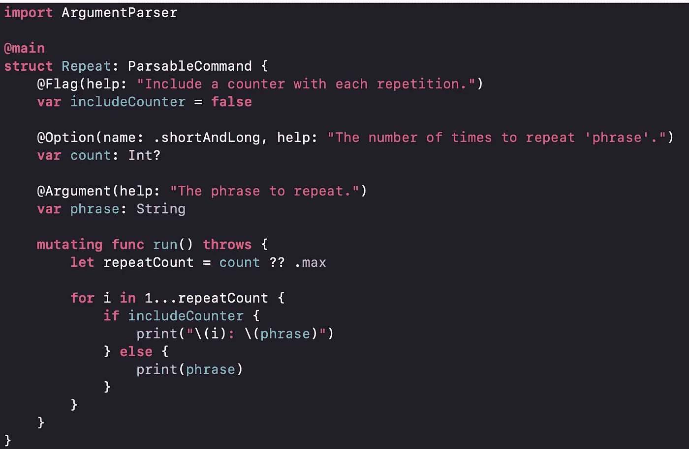
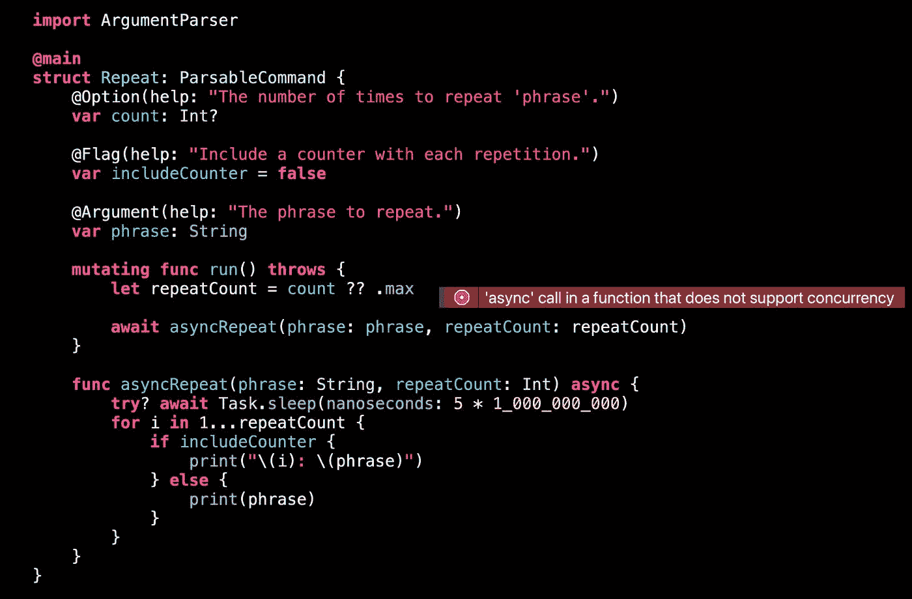
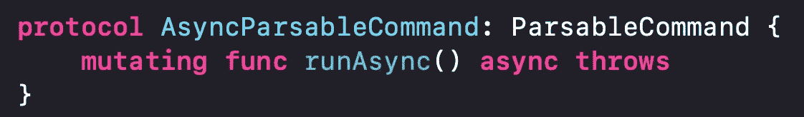
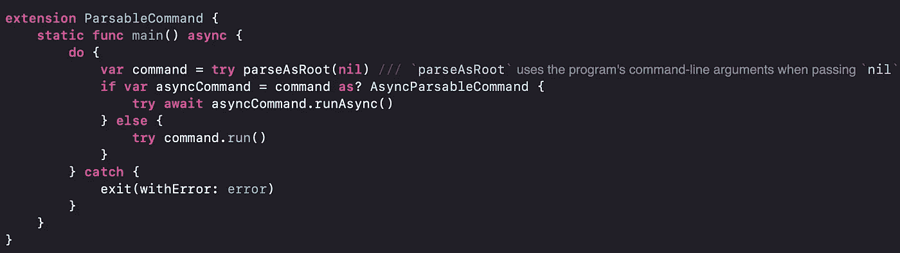
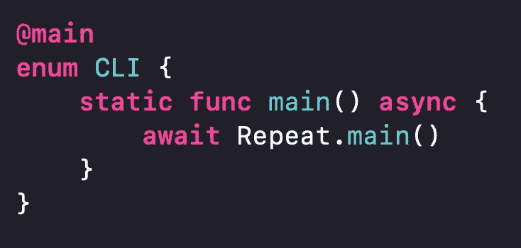
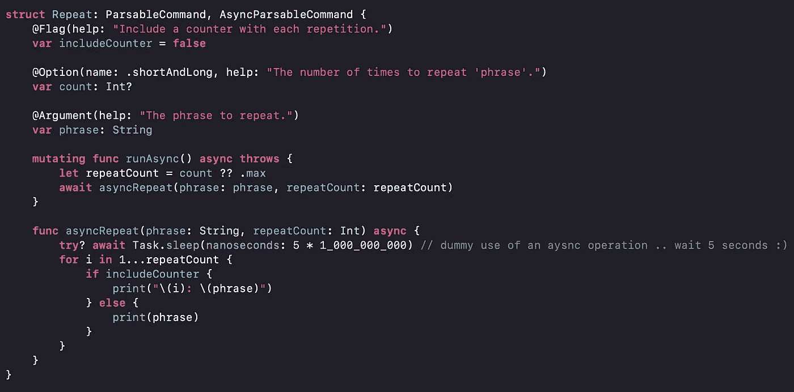

# 使用 Swift 并发开发命令行工具

> 原文：<https://medium.com/geekculture/develop-a-command-line-tool-using-swift-concurrency-e16d254361cb?source=collection_archive---------3----------------------->

苹果的`ArgumentParser`库使得在 Swift 中开发命令行工具变得非常容易。该库解析命令行参数，实例化您的命令类型，然后执行 run()方法或用有用的消息退出。

> *针对 Swift 的简单、类型安全的参数解析*

您可能想要使用现代的 Swift 并发性，并在您的命令行程序中等待异步函数。这样做会导致编译错误。

也许改变`run`函数的定义来添加`async`关键字？

不，因为根据它的`ParsableCommand`协议要求，这个特定的函数在结构中是“原样”需要的。

ArgumentParser 框架支持 async/await 的其他函数吗？

不，在我写这篇博文的时候(2022 年 1 月初)，ArgumentParser 框架还没有现成的支持。

 [## 添加对异步/等待的支持，问题# 326 apple/swift-argument-parser

### async/await 有助于编写简洁明了的代码来构建小型 CLI 工具，尤其是那些交互…

github.com](https://github.com/apple/swift-argument-parser/issues/326) 

幸运的是，这一期包含了 Sergio Campamá的代码片段[如何自己添加对 async/await 的支持！](https://github.com/sergiocampama)

我正在使用这种模式，并采用苹果官方的重复例子，分享我学到的经验教训和避免哪些陷阱。

首先，在我的程序中，我定义了一个新的协议来指示执行异步工作所需的命令。

每个符合`AsyncParsableCommand`的命令都需要实现名为`runAsync`的异步函数。

与 ArgumentParser 调用`ParsableCommand`的`run`函数类似，我在 ParsableCommand 上创建了一个扩展，并定义了一个静态的 *async* main()函数。

在实现中，我重用了 ArgumentParser 框架中的公共函数`parseAsRoot`。它将返回主命令(这里是:示例中的重复结构)。

如果命令实现了`AsyncParsableCommand`协议，那么让我们等待`runAsync`函数。否则只需调用命令的`run`函数。

顺便说一句:尽管 Swift Concurrency 只从特定的平台版本开始提供，但您看不到任何条件语句。原因是我在 Swift 包清单中将平台限制为 macOS 10.15 及更高版本。

如果你还没有重命名你的`main.swift`文件，你必须这样做。否则你会在错误中运行

> *“main”属性不能在包含顶级代码的模块中使用*

这与 Swift 并发性无关，而是因为使用了`@main`属性。说起来...我将`@main`属性移动到一个新的枚举中，该枚举具有一个*异步*静态函数，该函数将等待`ParsableCommand`的新*异步*主函数，以指示程序的顶级入口点。

现在我终于可以采用这个例子了

最后，我可以等待`asyncRepeat`函数，它在重复作为参数传递给程序的短语之前等待 5 秒钟:)

所有共享的代码都存储在下面的 GitHub 存储库中:

 [## GitHub - MarcoEidinger/Repeat:使用 Swift 参数解析器和 await/async 的演示

### 使用 Swift 参数解析器和 await/async Commit be39f86 的演示:我用 swift package init 创建了一个新包…

github.com](https://github.com/MarcoEidinger/Repeat) 

除了这篇博文，我还制作了一个 YouTube 视频。看看吧！

# 额外小费

当你在 Xcode 中运行命令行工具时，你会纠结于错误`dyld: Library not loaded: @rpath/libswift_Concurrency.dylib`吗？

在 GitHub 上分享的我的实现中，检查`Package.swift`文件并取消注释行`// hookInternalSwiftConcurrency()`应该可以解决问题。如果命令行工具不是从终端(= Xcode)执行的，那么会向目标添加额外的链接器设置。特别是设置了[运行路径搜索路径](https://blog.krzyzanowskim.com/2018/12/05/rpath-what/)，以便动态链接器能够在您安装的工具链中找到`libswift_Concurrency.dylib`。

*最初发布于*[*https://blog . ei dinger . info*](https://blog.eidinger.info/develop-a-command-line-tool-using-swift-concurrency)*。*