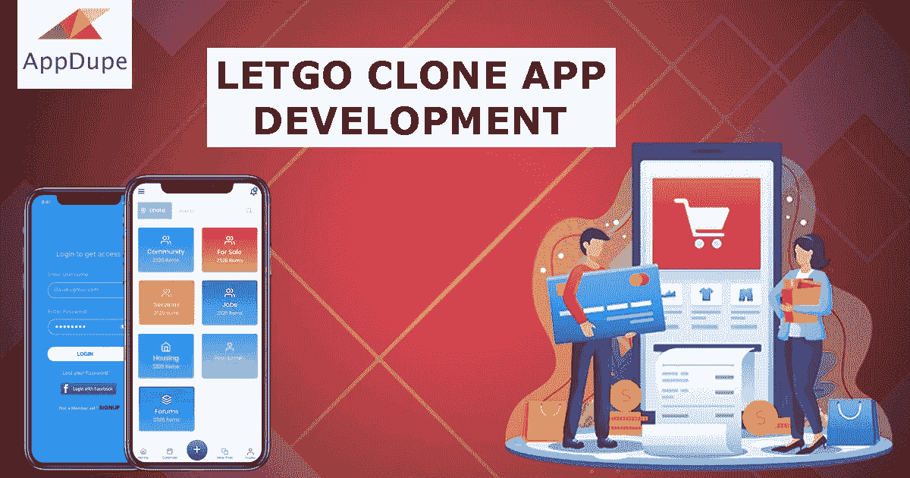

# 用像 Letgo 这样的应用程序启动你的在线分类广告业务

> 原文：<https://medium.com/geekculture/develop-an-app-like-letgo-cf5ccfbcdca6?source=collection_archive---------54----------------------->

在早期，分类业务和广告更有可能是相同的。分类广告都出现在报纸上，人们过去常常在报纸上为他们的二手商品做广告。有兴趣的人会联系他们，协商价格。

在这个数字时代，报纸也变得数字化了。也就是 Letgo 和 Olx 这样的 app 进入市场的时候。这些应用程序促使人们直接销售或购买他们的产品，而无需中介。因此，使应用程序遵循 C2C 商业模式。

# **let go clone——开创自己在线分类业务的绝佳选择**

C2C 在线市场应用类似于电子商务应用。但唯一的主要区别是，他们向人们出售二手产品。Letgo 是一个领先的 C2C 在线市场，供人们出售他们的二手产品。

对于计划启动自己的分类应用程序的企业家，我们建议使用 Letgo 克隆版。Letgo 克隆是现有标准模型的复制版本。

Letgo 令人印象深刻的商业模式和功能让我们建议你复制这款应用。白色标签的 Letgo 克隆版将允许你根据自己的想法定制应用程序。有了一个开发良好的 Letgo 克隆，你可以迅速进入市场。

## **我们的 Letgo 克隆应用有哪些迷人的功能？**

Appdupe 的 Letgo 克隆应用有三个模块——买家应用、卖家应用和管理面板。

## **买家 app —功能**

*   **简易登录工具**

希望通过该应用程序购买产品的买家可以通过他们的电子邮件地址、电话号码或社交媒体帐户进行注册。

*   **高级搜索选项**

高级搜索选项将帮助用户通过在搜索栏中输入他们的产品名称来轻松搜索他们的产品。该应用程序将分析所有的产品，并列出最佳结果。

*   **Swift 支付选项**

当用户用你的 app 购买时，你为用户提供可行的选择是非常重要的。因此，我们提供了多种选择，如卡支付、移动钱包、网上银行等..

## **卖家应用—功能**

*   **库存管理**

该应用程序的这一功能允许卖家准确跟踪他们的产品。这将帮助他们从应用程序中管理产品和服务的状态。

*   **上传图片**

卖家应用程序有一个单独的条款，让卖家上传他们的产品图片和描述。卖家也可以随时从列表中删除产品。

*   **个人资料页面**

该应用程序还允许卖家管理他们的独立个人资料页面，在那里他们可以营销他们的产品。这也将有助于他们提高知名度来推销他们的产品。

## **Letgo 克隆应用的货币化模式**

创收是企业家的首要考虑因素之一。是的，这就是我们向您指出通过应用程序创收的基本方式的主要原因。

**买卖双方的佣金**

你可以向你的买家和卖家收取佣金。每当他们通过你的应用程序销售或购买他们的产品，你都可以从他们那里获得你的那部分佣金。

**促销活动**

这是另一种创收方式。在这种方法中，你可以邀请希望在应用程序中推广其产品的卖家。他们还会向你的应用支付推广费，以开展推广活动。费用支付的周期由你决定。

**广告**

当第三方零售商或卖家或其他人接近你，在你的应用程序中投放广告时。但是，你可以向他们收取广告费。

**订阅**

推出不同的订阅计划，让人们享受他们的优质服务。对优质功能感兴趣的应用程序用户将支付每月订阅费。通过这种方式，你也可以创造收入。

## **包装完毕，**

在线分类市场因销售其产品而获得了人们的广泛认可。对于创业者来说，这将是你推出他们的分类应用的最佳时机。在 Appdupe，我们提供了一个 [**白色标签的 Letgo 克隆应用**](https://www.appdupe.com/letgo-clone?utm_source=Medium&utm_medium=Blog&utm_campaign=James) ，带有预建的特性。给我们打电话或预约，讨论您的个性化应用。