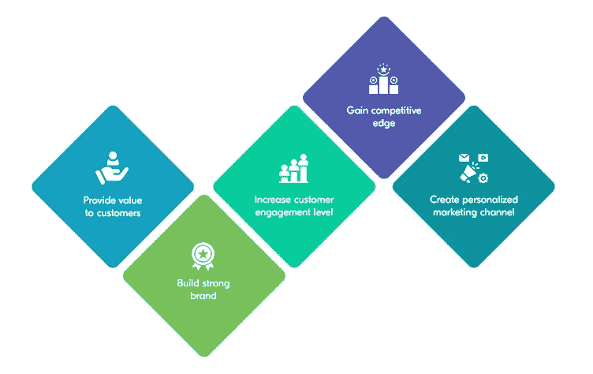
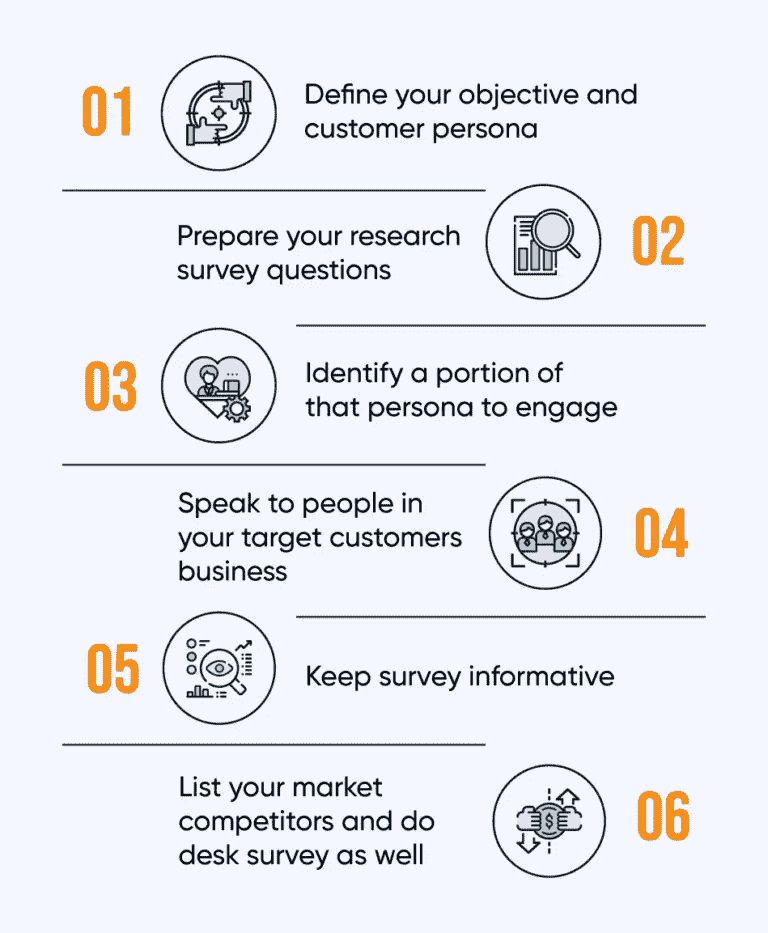

# 如何开发一款提升商业利润的手机 App？

> 原文：<https://medium.com/geekculture/develop-mobile-app-to-boosts-business-profits-2c159d4e92ec?source=collection_archive---------11----------------------->

## 开发移动应用程序对用户和企业都有好处，本文将向您详细介绍如何构建一个提高企业收入的移动应用程序。

你是一个具有前瞻性思维的企业家吗？你相信利用正确的时机可以建立一个成功的帝国吗？什么事？这篇文章是给你的。

随着企业将注意力转向数字解决方案，与之相关的成功前景是巨大的。

一个数字解决方案是移动应用程序，它的重要性日益增加。这有助于企业提高知名度，让全球更多的人了解其服务。

然而，当开始踏上成为价值**十亿美元的移动应用市场**的一部分的旅程时，它要求谨慎地坚持一些行业制胜的策略。这同样适用于执行移动应用程序开发，从而分别提高收入和价值。

在本指南中，我们详细阐述了这些步骤，以便您可以在合理的短时间内为盈利业务奠定基础。

所以二话没说；我们开始吧。

## 关于移动应用市场的诱人事实和数据

这些关于全球移动应用市场的吸引人的事实和数据将让你对其受欢迎程度和整体盈利性质有一个总体的了解。

*   根据 Statista 的数据，移动应用市场目前产生的收入在 2022 年达到**4339 亿美元。**
*   据 Statista 统计，2022 年至 2026 年间，to occur 的利润增长将达到 9.27%。
*   据 Statista 预测，到 2026 年，市场规模将达到**6144 亿美元。**
*   2022 年应用下载量为 **235，261.9 万，由 Statista** 统计。
*   预计到 2023 年，移动应用程序将带来 9350 亿美元的收入。

## 这些数字描述了什么？

这些数字证明了全球移动应用市场的整体盈利性质，从而表明为什么投资 [**移动应用开发服务**](https://www.xongolab.com/mobile-app-development-services/) 是一个好主意。

以下是一些原因，让您深入了解为什么值得关注该产品。

## 你为什么要投资开发一款适合你企业的移动应用？

看一下下面的图片，你就会明白为什么构建一个商业应用程序如此重要。

1.  **为客户提供价值** -通过投资移动应用程序开发，您为客户提供了支持，让他们能够轻松购物，毫无阻碍地满足他们的需求。
2.  **建立一个强大的品牌** -应用程序是提升企业品牌价值的来源。尤其是通过数据收集这样的媒介，你可以更好地了解你的目标受众。这最终将有助于提升整体品牌营销策略。
3.  **提高客户参与度** -通过创建多个用户类别并控制交付给不同用户的内容类型，提高客户参与度变得非常容易。
4.  **获得竞争优势**——移动应用程序可以轻松增强业务流程的执行方式。接下来是增强客户体验和获得竞争优势。
5.  **创建个性化营销渠道** -当企业开发移动应用程序时，数字营销团队可以访问用户信息。这极大地增强了营销工作和活动等任务的创建方式。

现在，您已经了解了投资移动应用程序开发服务的不同原因。让我们来大致了解一下移动应用程序的开发流程。

## 移动应用程序开发流程——包括哪些内容？

[**手机 app 开发流程**](https://www.xongolab.com/mobile-app-development/) 从创意确认开始，到上线及上线后活动，有不同的阶段。让我们了解其中的每一个阶段。

**想法确认**

在您开始移动应用程序开发之旅之前，了解您的想法是否值得投入时间和精力是一个好主意。因此，问自己一些问题，例如:

*   为什么要 [**为自己的企业打造一个 app**](https://www.xongolab.com/blog/top-5-reasons-to-build-an-app-for-business/)？
*   该应用程序的用途是什么？
*   你的应用的目标受众是谁？
*   你的应用的 USP 是多少？
*   与市场上的其他应用相比，你的应用有何独特之处？
*   你足够了解你的竞争对手吗？

一旦你有了所有这些问题的答案，你就可以开始第二阶段——进行市场调查。

**进行市场调研**

Image source: mindbrowser.com

在你确认你的想法值得投入时间和精力之后，进行市场调查。定义应用目标，然后创建调查问题。最后，列出你的竞争对手并研究他们。

通过执行这些步骤，您可以获得以下优势:

*   更好地了解你的客户。
*   了解你的竞争对手。
*   确定更好地接触受众的方法。
*   了解不同的商业机会。

**构建应用程序线框**

也被称为应用蓝图，同样突出了你的应用 的 [**设计以及应用将呈现给你的目标受众的方式。**](https://www.uxmatters.com/mt/archives/2022/04/10-elements-to-consider-when-designing-a-mobile-app.php)

简而言之，就开发人员必须采用的方法来提供他们要创建的解决方案的形状而言，这是一个指南。

**选择你的平台**

一旦你创建了你的应用蓝图或线框，第四个阶段需要选择你将执行应用启动的平台。

这里有不同种类的应用程序。

*   **仅兼容 iOS、Android 等特定平台的原生应用**。
*   **跨平台应用**也被称为混合应用，使用单一代码库构建，兼容 Android 和 iOS。
*   **Web 应用**不需要任何安装，可以在移动浏览器上轻松运行，没有任何障碍。

**决定特性**

接下来，您最好选择希望包含在手机应用程序中的功能。这将确保最大程度的用户参与。

因此，专注于简单是一个好主意。这样做将确保你不会随着时间的推移失去客户。

**选择人性化的&交互 UI/UX 设计**

UI 指的是手机 app 展示给用户的方式。另一方面，UX 是用户与应用程序进行交互并解决特定查询的方式。

因此，我们建议用户界面/UX 设计要简单、吸引人、直观，这样用户就可以完美地在应用上执行不同的活动。

**联系离岸移动应用开发公司**

作为企业所有者，您在开始移动应用程序开发之旅的同时，还需要处理其他不同的业务流程。所以建议将手机 app 开发服务外包给靠谱的应用开发公司。

评估他们的投资组合、客户评论等。详细地说。一旦你确定他们适合处理你的项目，就和他们联系吧。分享你的应用需求，并证实他们的理解。

## 手机 App 开发要花多少钱？

这可能是应用程序开发过程中最重要的一个方面，构建一个应用程序的成本对于获得洞察力非常重要。

因此，当我们想要深入了解 [**移动应用程序开发成本**](https://www.xongolab.com/blog/mobile-app-development-cost/) 时，根据您的要求，总额将在 20，000 美元到 150，000 美元之间或以上。

看着这个图，你一定想知道，我们如何着手计算这个方面？这个问题的答案是——功能、UI/UX 设计、应用平台(Android、iOS 或两者都有)、应用复杂性、你选择的公司所在地等。

## 总结

移动应用程序开发是一个令人不知所措的乏味过程。然而，如果方法正确，你将确保你的企业在回报和收入方面获得正确的收益。为了确定这是可以实现的，联系一家知名的 [**移动应用开发公司**](https://www.xongolab.com/) 。分享你的应用需求，并向他们概述你的想法。这将确保你的回报前所未有地上升，你开始获得有利可图的投资回报率。