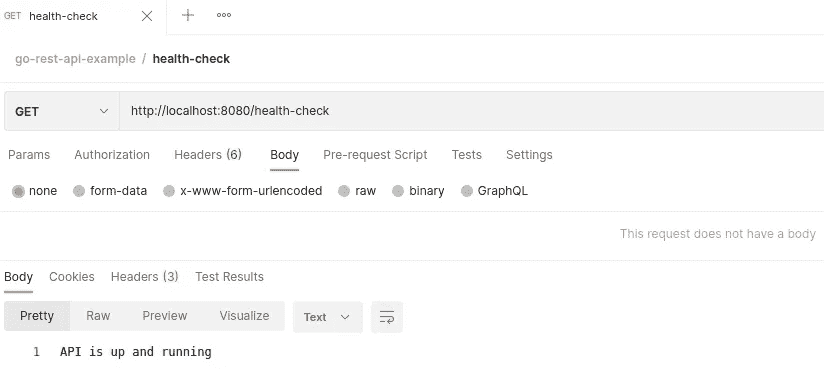
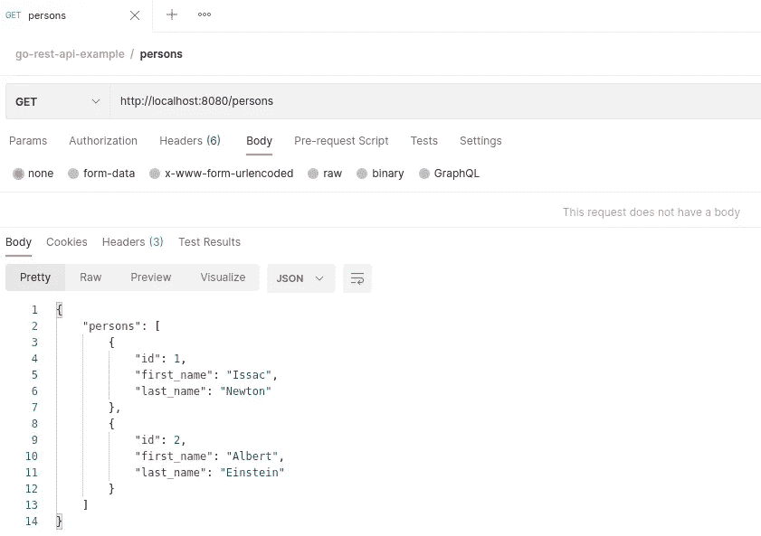
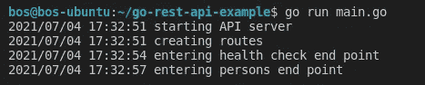

# 使用 Gorilla Mux 在 Go 中开发 REST APIs

> 原文：<https://medium.com/geekculture/develop-rest-apis-in-go-using-gorilla-mux-5869b2179a18?source=collection_archive---------6----------------------->

介绍如何使用 Gorilla Mux 在 Go 中开发 REST APIs


Photo by [Markus Spiske](https://unsplash.com/@markusspiske?utm_source=unsplash&utm_medium=referral&utm_content=creditCopyText) on [Unsplash](https://unsplash.com/?utm_source=unsplash&utm_medium=referral&utm_content=creditCopyText)

# 介绍

REST APIs 是当今程序员生活中不可或缺的一部分。如今，各种软件组件之间的大多数通信都是通过 REST APIs 进行的。著名的编程语言有各种各样的库和框架，帮助程序员减少从零开始构建 API 服务的时间。

在本文中，我们将探讨如何使用 Gorilla Mux 在 Go 语言中开发 REST APIs。

# 什么是大猩猩 Mux

Gorilla Mux 是 Gorilla Web Toolkit 中的一个包。它提供了创建 HTTP 路由器的简单方法。使用这个包，我们可以将程序流重定向到各自的 HTTP 处理函数。

为什么叫 Mux？名字来源于 *HTTP 请求多路复用器。*

**大猩猩网络工具包**

Gorilla 是一个用于 Go 编程语言的 web 工具包，由多个包组成。Gorilla Mux 是 Gorilla Web Toolkit 中的一个包。其他包包括[大猩猩 RPC](https://github.com/gorilla/rpc) 和[大猩猩 WebSocket](https://github.com/gorilla/websocket) 。更多详情，请参考[此处](https://www.gorillatoolkit.org/)。

# **项目**

让我们首先从创建项目结构开始。

为项目创建一个目录(我们将其命名为 *go-rest-api-example* )。现在，执行下面的代码来初始化 Go 模块。

```
go mod init get *go-rest-api-example*
```

这将初始化 Go 模块并创建一个名为 *go.mod* 的文件来跟踪依赖关系。

# 安装

Gorilla Mux 的安装非常简单。从项目目录中执行以下命令:

```
go get -u github.com/gorilla/mux
```

一旦执行，这将下载 Gorilla Mux 并配置为依赖项。(在撰写本文时，Gorilla Mux 的最新版本是 *v1.8.0* )

现在，让我们继续构建简单的 API 端点。

# 我们在开发什么？

出于本文的目的，让我们挑选一个简单的例子。我们将创建两个 API 端点:

*   **GET /health-check** :这将返回一条消息，说明 API 服务器正在运行。如果我们没有得到任何响应，我们可以假设 API 服务器没有启动。
*   GET /persons :这将返回一个 JSON 消息，其中包含人员详细信息的数组。

# 响应结构

让我们将响应结构定义如下:

REST API Response Structure

在这里，我们将一个人的详细信息和响应定义为一组人。因为我们希望响应是 JSON，所以我们也将为每个字段添加 JSON 映射。

# 路线

现在，是时候指定 API 端点、处理函数和 HTTP 方法了。

我们可以这样做:

Configure REST API routes

API 服务器位于本地主机和端口 8080。

# 处理函数

现在，我们需要为上面定义的各个端点定义处理函数。

**健康检查**

处理函数接受请求和响应参数。我们将设置一个状态头和一个简单的响应，如下所示。

Health Check handler function

**人物**

在 persons API 端点的处理函数中，我们将响应类型设置为 JSON。一旦从 helper 函数中检索到人员的详细信息，我们将把该结构转换成 JSON 并将其作为响应添加。

通常，我们会从数据库中获取这些细节。目前，让我们使用一种简单的方法来获取人员详细信息，如下所示:

就是这样。我们的代码已经准备好了。

> 你可以在这里找到代码[的完整工作版本](https://github.com/bijeshos/go-rest-api-example)。

# 执行

让我们按如下方式执行程序:

```
go run main.go
```

您将能够看到如下日志:


现在，我们的 API 服务器正在运行，并准备接受请求。

# 测试

为了测试 API 端点，让我们使用 Postman。如果你还没有，你可以从[这里](https://www.postman.com/)获取。

**健康检查**

让我们使用以下 URL 访问运行状况检查端点:

[http://localhost:8080/health-check](http://localhost:8080/health-check)

结果如下:



**人**

现在，让我们使用以下 URL 访问 persons 端点:A

[http://localhost:8080/persons](http://localhost:8080/persons)

结果如下:



**日志**

您还可以在终端上看到如下日志:



# 摘要

在本文中，我们使用 Gorilla Mux 在 Go 中创建了两个简单的 REST API 端点。

> 项目的工作版本可以在下面的 GitHub repo 中找到:
> 
> [https://github.com/bijeshos/go-rest-api-example](https://github.com/bijeshos/go-rest-api-example)

今天到此为止。直到我们再次见面，快乐编码！

# 参考

*   [https://github.com/gorilla/mux](https://github.com/gorilla/mux)
*   [https://www.gorillatoolkit.org/](https://www.gorillatoolkit.org/)
*   [https://github.com/bijeshos/go-rest-api-example](https://github.com/bijeshos/go-rest-api-example)