# 开发者日记:Linux 中的进程、文件和文件描述符

> 原文：<https://medium.com/geekculture/developer-diaries-processes-files-and-file-descriptors-in-linux-ebf007fb78f8?source=collection_archive---------1----------------------->


# 什么是过程？

在我们深入研究文件之前，让我们首先考虑什么是进程。

我一直觉得 Linux 中的*进程*这个词我可能在某种程度上理解，但无法用技术的方式真正解释。这似乎是一个如此抽象的概念，以至于很难用几句话来完全解释它，像“进程是执行中的程序”这样的定义打开了另一个混乱的罐子，现在什么是*程序*？你如何区分一个程序或一个过程？进程也可以是死的，这意味着它们*不在执行中*但仍然被称为进程，这怎么可能呢？在我们深入到它的技术方面之前，让我试着用一种简单得多的方式来解释过程的含义。

把一个过程想象成一系列的指令。指令可以并行执行，也可以同步或异步执行，或者以其他方式执行，但这仍然是一个过程。指令可以用 Java、Python、bash、二进制或任何其他语言编写，它仍然是一个过程。所以任何操作系统可以读取并开始执行某种工作的东西都是一个进程。想象一个从输入中读取并打印斐波那契数列的 Python 脚本，这是一个过程。返回响应的复杂 REST API 也是一个进程。GUI web 浏览器，如 Google Chrome，也是一个进程。

所有这些都需要操作系统做大量的工作，这意味着操作系统需要加载位于磁盘某个角落的一系列指令并开始执行它们。如果进程需要打印机，操作系统需要将进程连接到打印机，如果进程需要某种键盘输入，操作系统也需要这样做，等等。所有这些开销和工作意味着操作系统也必须管理所有这些…


Your OS when managing processes

肯定有很多数据需要处理，但是现在，我想解释关于过程的两个关键点，

第一个是整数进程 ID，简称 PID。请将此视为操作系统中任何进程的唯一标识符。你总是可以用它的 PID 来识别一个进程，每个进程，只要它一启动，操作系统就会给它这个 ID。例如，如果你运行的是谷歌浏览器，它会有自己的 PID，比如 43712。

接下来是`proc`文件系统。您可能听说过它，但是如果您还没有听说过，那么现在就把`/proc`看作是您的根目录(`/`)中的一个目录。这个目录包含许多子目录。

这是`/proc`在我的系统中的样子

```
sanil@sanil:/proc$ ls | head
1
10
100002
100035
100042
100908
100938
100949
100950
100954
```

所有这些号码实际上都是目录。事实上，这些是我的系统中每个正在运行的进程的 PID。每个进程在第一次被创建时都会得到一个 PID *和/proc 文件系统中的一个目录*。当它停止时，它在/proc 文件系统中的目录将被删除。给进程指定的目录只是进程的 PID(因此，对于 PID 为 1532 的进程，其存储数据的目录是/proc/1532)。可以把这个目录想象成进程的家。这是进程将要存储其所有数据的地方(稍后让我们想想*的*构成了*的*数据)。

# 一切都是一个文件

如果你已经研究或阅读了一段时间的 Linux，你一定会在 Linux 中遇到这样一句话，“一切都是一个文件”。这到底意味着什么呢？

假设您是一个进程，您想通过网络发送一些数据(现在在哪里并不重要)。您运行的笔记本电脑/PC/服务器可能有一些网络适配器，向这些网络适配器发送一个字节流将通过网络发送您的文件。然而，网络接口卡可能由某个特定的制造商制造，或者遵循某个协议，并且它可能已经定义了自己的标准输入方式。作为一个过程，你可能不应该关心这个。如果你不得不这样做，你可能要做大量的工作来支持英特尔网络接口卡，AMD 网络接口卡等。如果你想存储数据呢？到那时，您需要支持多少种不同的固态硬盘？如果系统有硬盘而不是固态硬盘会怎样？想象一下，在你自己编写的程序中编写所有这些代码，一个函数处理在固态硬盘中存储数据，一个函数在三星硬盘中存储数据，一个函数在其他制造商的硬盘中存储数据，等等。

所有这些看起来像是大量的工作，而你作为一个过程已经有很多事情要做了。因此，Linux 使用文件的概念来实现互操作性。简而言之，当你需要写数据的时候，你把数据写到网络接口或者硬盘，或者其他任何地方*，就好像它是一个文件*。你的操作系统将接收这个字节流，并把它提供给任何人。负责接收这个字节流的进程将读取它们，就像它们是一个文件一样。所以文件就像一个中间人，因为它是一个单一的标准，每个进程只需要学习读写文件。即使当你需要从键盘或鼠标读取数据时，它实际上是通过文件发送的。因此，当你按下键盘上的一个键时，Linux 会将该文本存储在某个文件中。其他进程可以读取这个文件，因此可以找到你输入的内容。这确保了如果你切换到一个不同的键盘，只要操作系统支持该键盘，它将继续发送数据到同一个文件，你的程序甚至永远不会发现它是一个不同的键盘，它只是继续读取相同的文件。

你们中的一些人可能想知道，如果从键盘读取和从文件读取是不同的，为什么我们使用不同的功能来打开文件和读取输入？比如 Python 中的`open`打开文件，`input`从终端读取键盘输入。答案是，在引擎盖下，这些函数的内部实现非常相似。例如，检查出[代码为](https://github.com/python/cpython/blob/2.7/Python/bltinmodule.c#L2033) `[raw_input](https://github.com/python/cpython/blob/2.7/Python/bltinmodule.c#L2033)` [](https://github.com/python/cpython/blob/2.7/Python/bltinmodule.c#L2033)。有许多关于是否有输入或输出、它们是否在终端中等等的检查。但是读取输入的代码的关键是

```
s = PyOS_Readline(PyFile_AsFile(fin), PyFile_AsFile(fout),                          prompt);
```

因此，将所有东西都视为一个文件可以确保不同进程之间的互操作性。每个进程都可以从文件中读取和写入文件，在内部，操作系统会将字节流映射到正确的进程。因此，如果我是一个进程，我想打印一个文档，我所要做的就是将文档写成一个文件，Linux 将确保打印机的驱动程序(也作为进程运行)从该文件中读取。


## 伪终端

伪终端通常用于描述终端模拟器，例如 gnome-shell。伪终端可以连接到进程，并且可以在进程中写入或读取数据。这些伪终端可以提供一种方式向流程发送输入，并从流程获取输出或错误。

因此，当您运行一个命令时，比如`ls -la`，命令的输出会打印在您的终端上。这是因为默认情况下，标准输出、标准错误和标准输入都指向启动该进程的终端。

像 Linux 中的其他东西一样，伪终端也是文件。这意味着您可以写入或读取该文件。这些文件一般存储在`/dev/pts/*N*`目录下。这里的 *N* 是*只是伪终端的一个顺序标识符。您打开的每个终端模拟器都会在`/dev/pts`目录下创建一个新文件。*

我们来看看`/dev/pts/`中写入一个文件会发生什么(截图中运行的终端其实包含了两个终端模拟器。最下面的是`/dev/pts/4`。

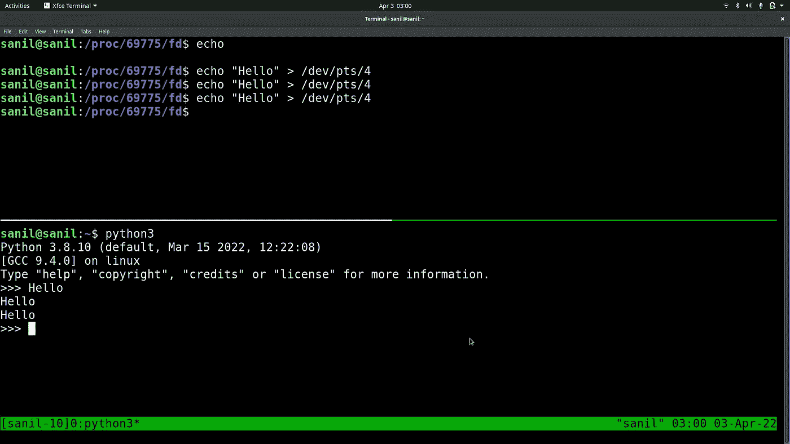

你可以看到运行`echo "Hello" > /dev/pts4`如何输出到下面运行的终端。所以，文件`/dev/pts4`是向下面的终端发送数据的中间人。

所以，TLDR；就算是我们开的伪终端，技术上也是文件。如果需要写到终端，只需要写到`/dev/pts/*N*` 文件即可

## 设备

设备也被视为文件。例如，当我将我的 USB 鼠标连接到我的笔记本电脑时，一些新文件出现在我的`/dev/`目录中-

```
sanil@sanil:/dev$ ls -lart | grep -e "hidraw" -e "usb"
crw-------   1 root root    240,     0 Mar 31 09:04 hidraw0
drwxr-xr-x   2 root root            60 Apr  2 19:30 usb
crw-------   1 root root    240,     2 Apr  2 19:30 hidraw2
crw-------   1 root root    240,     1 Apr  2 19:30 hidraw1
crw-------   1 root root    240,     3 Apr  2 19:30 hidraw3
```

进一步查看这些文件告诉我，它们属于`character special`类型

```
sanil@sanil:/dev$ file hidraw1
hidraw1: character special (240/1)
```

本质上，这是一个特殊的文件，我们可以使用它从物理设备(即我的鼠标)发送或接收数据。

# 文件描述符

现在我们知道了什么是进程，以及我们如何将 Linux 中的一切表示为文件，让我们看看文件描述符。

文件描述符由访问文件的进程保存。因此，如果你是一个进程，你想访问一个文件(同样，这个文件可以是一个套接字，或一个硬件设备，或其他任何东西)，你需要做的就是为它请求一个文件描述符，一旦你有了它，你就可以用它来访问文件。

一个进程包含的所有文件描述符都存储在目录`/proc/PID/fd/`中。我们已经谈了一些关于`/proc`文件系统的内容。该目录保存有关进程的信息。每个进程在这个文件系统中都有一个目录，并将相关数据存储在该目录中。

简而言之，进程请求文件的文件描述符。一旦他们有了文件描述符，他们就可以用它来读写文件。它们将文件描述符存储在它们的`fd`目录中，即`/proc/PID/fd/`。

让我们试着看看这是什么样子的。

## 标准输入、标准输出和标准错误

让我们启动一个进程，`python3`，看看是否有它的默认文件描述符。

我可以通过运行命令`ps aux | grep COMMAND_NAME`找到任何进程的 PID，因此，要找到进程`python3`的 PID，我只需运行`ps aux | grep python3`。这看起来是这样的

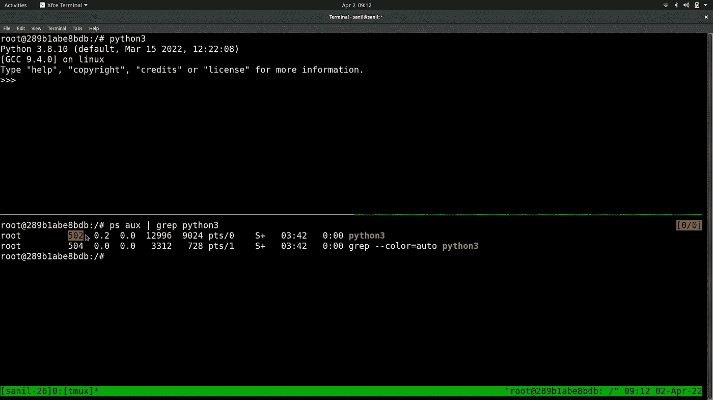

突出显示的数字，即`502`是过程`python3`的 PID。为了找到这个进程的文件描述符，我需要做的就是转到`/proc/502/fd`。

这是它看起来的样子

```
root@289b1abe8bdb:/# ls -la /proc/502/fd
total 0
dr-x------ 2 root root  0 Apr  2 03:44 .
dr-xr-xr-x 9 root root  0 Apr  2 03:42 ..
lrwx------ 1 root root 64 Apr  2 03:44 0 -> /dev/pts/0
lrwx------ 1 root root 64 Apr  2 03:44 1 -> /dev/pts/0
lrwx------ 1 root root 64 Apr  2 03:44 2 -> /dev/pts/0
```

所以，它有三个文件描述符，`0`、`1`和`2`。这些文件描述符似乎是符号链接(把它们想象成其他文件的简单快捷方式)，似乎指向文件`/dev/pts/0`。这些实际上是标准输入、标准输出和标准错误的文件描述符。`/dev/pts/0`只是我们用来运行 python3 的伪终端。如果我在任何终端中运行`echo "Hello world" > /dev/pts/0`，我会在运行 python3 的终端中看到输出。

让我们看看使用输出重定向时会发生什么。

不跑`python3`，我们跑`python3 > output.txt`。

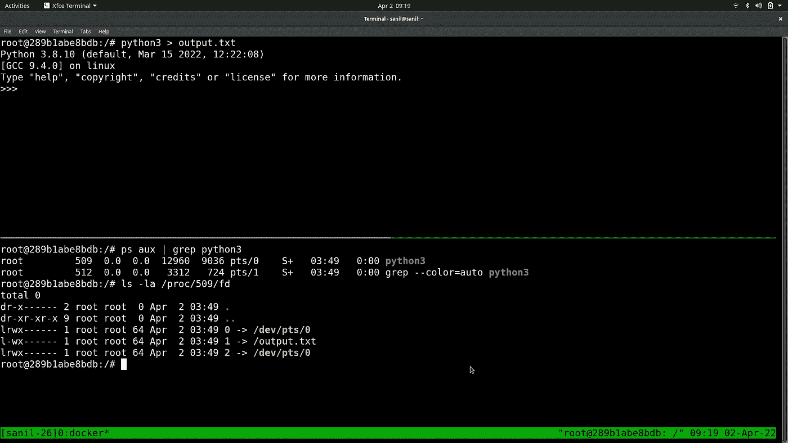

您可以看到这是如何影响我们的文件描述符的。现在我的输出被重定向到文件`output.txt`，而不是指向终端。

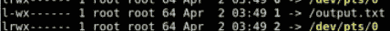

看一下上面的截图。从进程的角度来看，当向标准输出写入内容时，它仍然在向文件`1`写入内容，但是因为符号链接现在指向文件`output.txt`，所以它被写入该文件而不是终端。通过这种方式，进程不需要关心我们将输出存储在文件中的事实，它所需要做的只是写入`fd` 1。

## 实际文件

如果我们使用 Python 的`open`函数打开一个实际的文件会怎么样？让我们看看会发生什么！

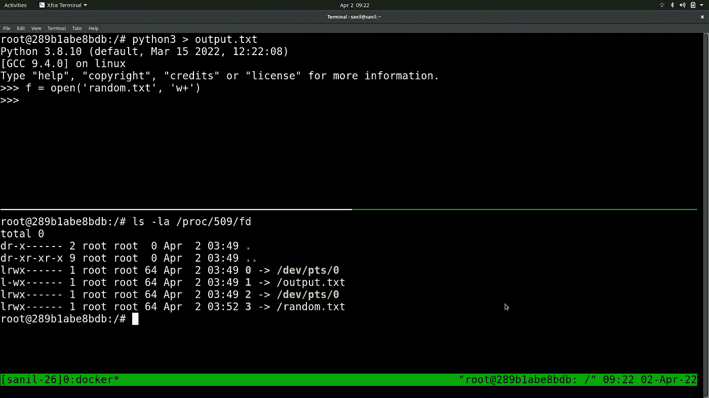

你可以看到它现在有了一个新的文件描述符`3`，它指向我刚刚打开的文件。

关闭文件也会释放文件描述符

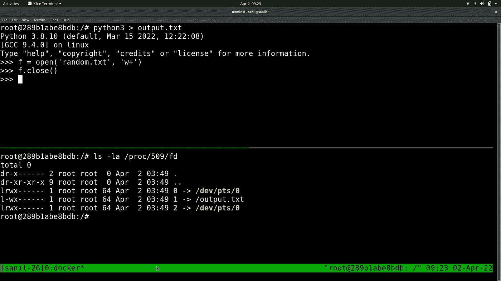

这就是为什么关闭文件很重要，特别是当以迭代或递归方式打开文件时。每个进程最多只能打开一定数量的文件描述符，所以不关闭文件会耗尽可以打开的文件描述符的数量。

# 所有东西都不是文件吗？

## 有些不对劲…

打开文件并连接到 STDIN、STDERR 或 STDOUT 似乎很简单。让我们试着看看当我们试图通过管道连接两个进程时会发生什么。

执行这个命令应该可以完成这项工作

```
sleep 1000000 | python3
```

找到这两个过程的 PID 应该相当简单-

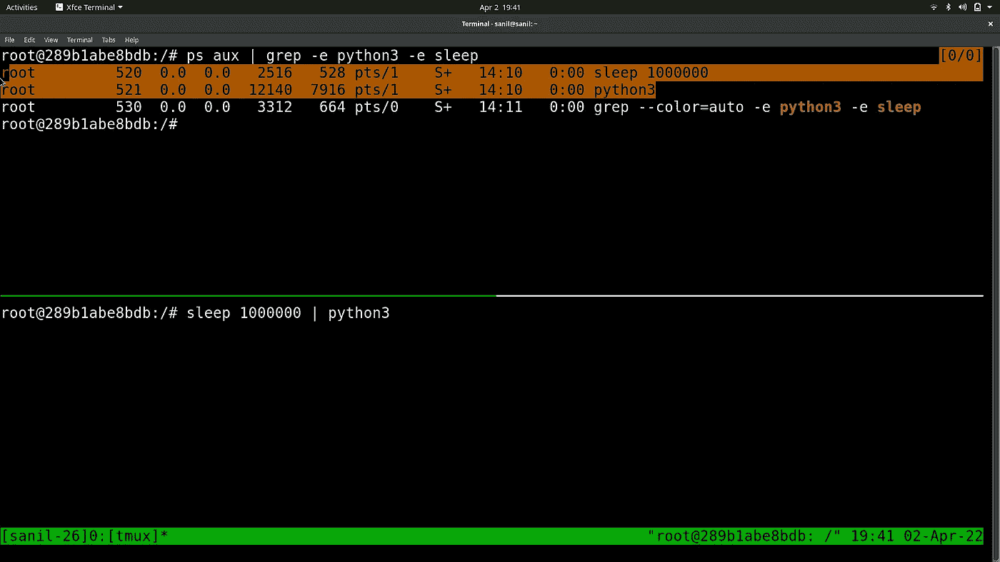

让我们看看`/proc/520/fd`和`/proc/521/fd`是什么样子的

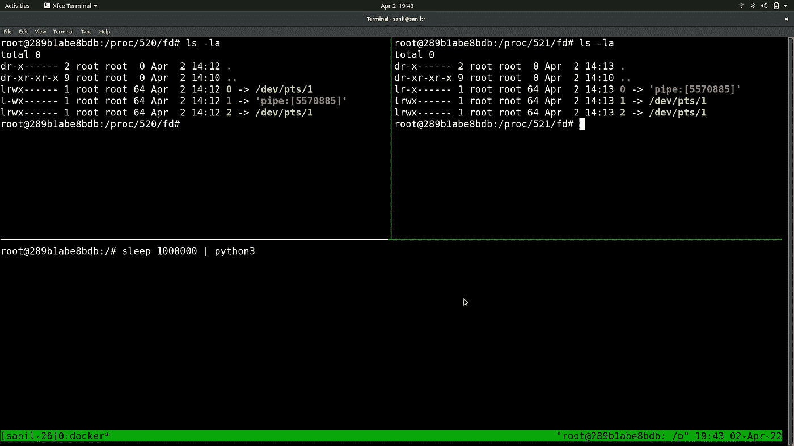

乍一看，这似乎很好。当然，具有 PID 520 的进程，即`sleep 1000000`确实将其输出重定向到管道，并且具有 PID 521 的进程，即`python3`确实将其输入来自管道，这看起来很正常。但是奇怪的符号链接呢？PID 为 520 的进程中的文件`1`和 PID 为 521 的进程中的文件`0`都指向一个管道但是这些文件是符号链接，应该指向另一个文件(比如我们之前看到的/dev/pts/0)，但是它们好像指向某个字符串，

```
'pipe:[5570885]'
```

这个字符串肯定不是有效的文件名，因为它甚至没有路径。

运行`python3 -m http.server`并检查它的文件描述符也揭示了类似的东西

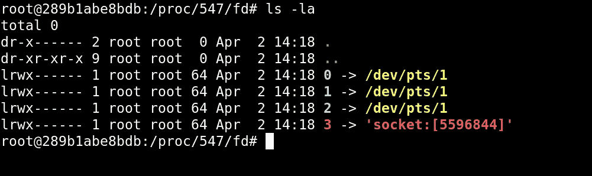

这里的区别是，我们看到的不是管道，而是一个套接字，但它仍然是一个指向无效文件名的符号链接。这里发生了什么？

谷歌符号链接，维基百科还说，符号链接应该指向一个文件或目录，“在计算中，符号链接(也称为符号链接或软链接)是任何文件的术语，它包含对另一个文件或目录的绝对或相对路径的引用，并影响路径名解析。”。所以，这似乎是一个无效的链接…

## 管道和插座的魔力

简单的回答是，符号链接应该指向文件，而不要太深入。所以，这看起来确实不正确，而且…确实是这样。让我先解释一下这些奇怪的字符串。

`socket:[SOME_NUMBER]`和`pipe:[SOME_NUMBER]`是简单的字符串，它们唯一地标识了系统中的特定插座或特定管道。通过检查符号链接指向哪里，任何人都可以很容易地读取进程指向哪个套接字或管道(就像我们一分钟前所做的那样)。因此，即使它不是一个有效的文件，它仍然包含关于管道或插座的可读信息。内核在处理管道和套接字时变了一点魔法，只是找到符号链接的目标(是套接字或管道 ID)，并直接使用它，而不是将数据发送到文件。

让我们看看当试图将一些文本回显到这些符号链接中时，它们是如何工作的。让我们看看这个我们之前看到的例子-

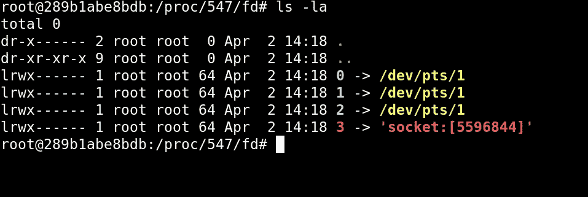

我们有四个文件描述符，其中三个是 STDIN、STDOUT 和 STDERR，它们都指向进程运行的终端。

运行命令`echo "Hello world" > 2`在进程运行的终端上打印消息“Hello world”

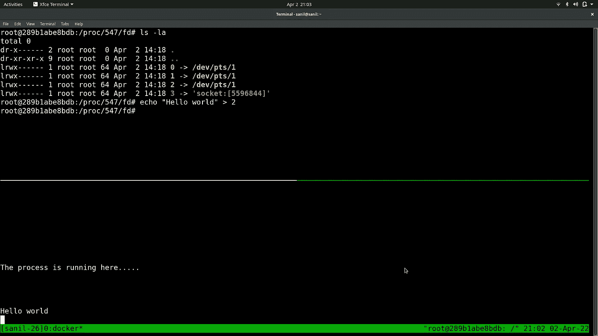

这是有意义的，因为 2 只是一个符号链接，数据实际上被写入链接的目标，即/dev/pts/1，这只是我们的终端。但是如果我做了会发生什么呢？尽管文件 3 是一个链接，但它似乎不是一个有效的链接。它指向一个随机的字符串！

这是我尝试运行命令时得到的结果

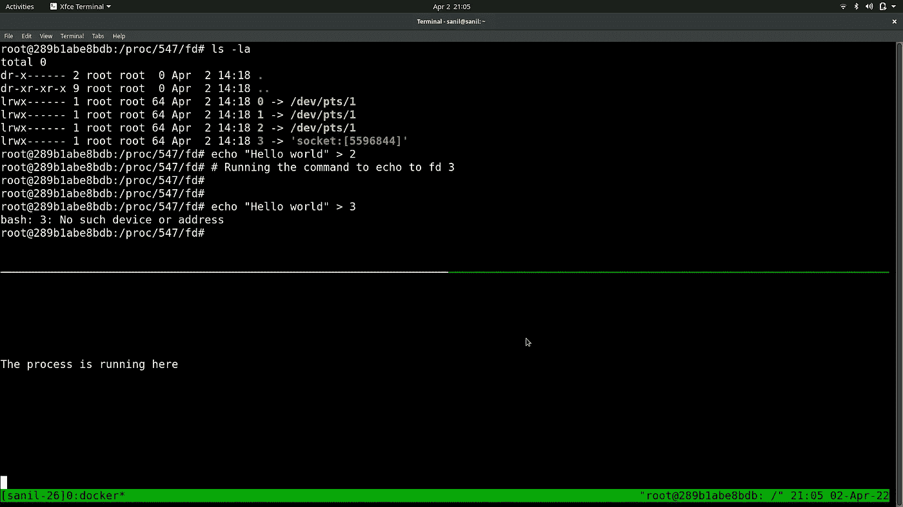

可以理解的是，shell 会给我们一个路径或地址无效的错误。

因此，符号链接并不是完全有效的，但是由于内核是唯一使用链接的一方，并且内核也是创建这些无效链接的一方，所以它已经知道链接是无效的，并且不会尝试将目标作为文件路径来访问，而是将目标作为关于管道和套接字的元数据来读取。对我来说，这打破了“一切都是文件”的观念，因为正如我们刚刚看到的，套接字和管道并不是真正的文件。

# 结论

因此，到目前为止，您可能已经很好地理解了文件、文件描述符，并对您的服务器和机器如何运行有了一点了解。

如果你喜欢这篇文章，并希望我做更多，给我几个掌声，让我知道你是否有任何建议在下面的评论中。