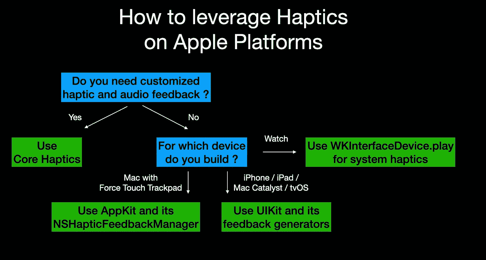

# 苹果平台上的触觉开发者指南

> 原文：<https://medium.com/geekculture/developer-guide-about-haptics-on-apple-platforms-e0f6b68938d?source=collection_archive---------11----------------------->

触觉通过向用户施加力、振动或运动来创建触摸体验。苹果提供各种 API，根据平台向应用开发者公开触觉。这篇博客文章介绍了这些不同的技术。



> *触觉可以激发人们的触觉，增强与屏幕界面互动的体验。例如，除了视觉和听觉反馈之外，系统还会播放触觉，以强调 Apple Pay 交易的确认。触觉还可以增强触摸手势和交互，如滚动选择器或切换开关。*

从苹果的[人机界面指南](https://developer.apple.com/design/human-interface-guidelines/ios/user-interaction/haptics/)中，我们了解到标准 UI 元素，例如开关、滑块或选择器，在默认情况下会播放苹果设计的系统触觉。HIG 是了解更多系统定义触觉的绝佳场所。

您可以扩展并使用反馈发生器来播放三类预定义的触觉模式之一:通知、影响和选择。

最后，您可以将`CoreHaptics`框架用于更复杂的场景。它允许您通过结合瞬时和连续事件、不同的清晰度和强度以及可选的音频内容来创建各种不同的触觉体验。

# 反馈发生器

`UIKit`为您提供反馈生成器，通过播放几个预定义的触觉模式之一，将您自己的反馈添加到自定义视图和控件中。

抽象类 [UIFeedbackGenerator](https://developer.apple.com/documentation/uikit/uifeedbackgenerator) 是所有反馈生成器的超类。**别费心了**。

而是看一看并使用它的三个子类之一:

*   `[UIImpactFeedbackGenerator](https://developer.apple.com/documentation/uikit/uiimpactfeedbackgenerator)`
*   `[UISelectionFeedbackGenerator](https://developer.apple.com/documentation/uikit/uiselectionfeedbackgenerator)`
*   `[UINotificationFeedbackGenerator](https://developer.apple.com/documentation/uikit/uinotificationfeedbackgenerator)`

下面是一个在 SwiftUI 中使用`UINotificationFeedbackGenerator`的例子。

```
import SwiftUI
import UIKitstruct ContentView: View {
    var body: some View {
        VStack {
            Text("Hello, World!")
                .onTapGesture {
                    let generator = UINotificationFeedbackGenerator()
                    generator.notificationOccurred(.success)
                }
        }
    }
}
```

有关更多详情，请阅读[文档](https://developer.apple.com/documentation/uikit/uifeedbackgenerator)。

# 核心触觉

撰写和播放触觉模式，以定制您的应用程序的触觉反馈。

> *Core Haptics 允许您向应用程序添加定制的触觉和音频反馈。使用触觉来吸引用户，通过触觉和听觉反馈来吸引注意力并强化行动。一些系统提供的界面元素——如选择器、开关和滑块——在用户与它们交互时自动提供触觉反馈。使用核心触觉，您可以通过在默认模式之外组合和组合触觉来扩展这种功能。*

`CoreHaptics`是它自己的框架，不是`UIKit`的一部分。`CoreHaptics`奔流不息

*   iOS 13.0 以上
*   iPadOS 13.0 以上
*   Mac 催化剂 13.0 以上
*   tvOS 14.0 以上

我强烈推荐来自[raywenderlich.com](http://raywenderlich.com)的[核心触觉学入门](https://www.raywenderlich.com/10608020-getting-started-with-core-haptics)教程，然后看看苹果的[文档](https://developer.apple.com/documentation/corehaptics)。

然而，我想给你一个在 SwiftUI 应用程序中使用核心触觉的例子。我将`CoreHaptics`的使用封装在一个符合`ObservableObject`的引用类型中。

```
import CoreHapticsclass HapticManager: ObservableObject {
    private var hapticEngine: CHHapticEngine? = nilinit() {
        let hapticCapability = CHHapticEngine.capabilitiesForHardware()
        guard hapticCapability.supportsHaptics else {
            print("Device does not support Haptics")
            return
        }do {
            hapticEngine = try CHHapticEngine()
        } catch let error {
            print("Haptic engine not created: \(error)")
        }
    }
}
```

我通过扩展创建了一个自定义的触觉。

```
extension HapticManager {
    func intenseSharpTap() {
        var events = [CHHapticEvent]() // create one intense, sharp tap
        let intensity = CHHapticEventParameter(parameterID: .hapticIntensity, value: 1)
        let sharpness = CHHapticEventParameter(parameterID: .hapticSharpness, value: 1)
        let event = CHHapticEvent(eventType: .hapticTransient, parameters: [intensity, sharpness], relativeTime: 0)
        events.append(event) // convert those events into a pattern and play it immediately
        do {
            let pattern = try CHHapticPattern(events: events, parameters: [])
            let player = try hapticEngine?.makePlayer(with: pattern)
            try player?.start(atTime: 0)
        } catch {
            print("Failed to play pattern: \(error.localizedDescription).")
        }
    }
}
```

最后，我可以在我的视图中使用引用类型作为`@StateObject`，并通过`onTapGesture`视图修改器分配触觉。

```
import SwiftUIstruct ContentView: View {
    [@StateObject](http://twitter.com/StateObject) var hapticManager = HapticManager() var body: some View {
        VStack {
            Text("Hello, World!")
                .onTapGesture(perform:hapticManager.intenseSharpTap)
        }
    }
}
```

# 马科斯

`UIKit`和`CoreHaptics`可用于带有 Mac Catalyst 的 macOS 应用。但如果你想使用与 Mac 的 Force Touch 触控板相关的触觉，你必须使用`AppKit`框架。

`AppKit`为您提供`[NSHapticFeedbackManager](https://developer.apple.com/documentation/appkit/nshapticfeedbackmanager)`来访问带有 Force Touch 触控板的系统上的触觉反馈管理属性。

然后，您可以为 enum[NSHapticFeedbackManager 中指定的三个类别创建触觉反馈。反馈模式](https://developer.apple.com/documentation/appkit/nshapticfeedbackmanager/feedbackpattern):

*   对齐:用于响应用户拖动的对象的对齐
*   级别:当用户在不同的压力级别之间移动时使用
*   一般:当没有其他反馈模式适用时，使用此选项。

# watchOS

[苹果的 watchOS 人机界面指南](https://developer.apple.com/design/human-interface-guidelines/watchos/interaction/haptics)解释了 watchOS 中的系统触觉。

通过`[WKHapticType](https://developer.apple.com/documentation/watchkit/wkhaptictype)`预定义了以下反馈方式

*   通知
*   方向图
*   向下方向
*   成功
*   失败
*   重试
*   开始
*   停止
*   点击
*   导航通用策略
*   导航左转
*   导航右转

在 Swift 中非常容易使用`[WKInterfaceDevice](https://developer.apple.com/documentation/watchkit/wkinterfacedevice)`。

```
WKInterfaceDevice.currentDevice().playHaptic(.Success)
```

*最初发布于*[*https://blog . eidinger . info*](https://blog.eidinger.info/haptics-on-apple-platforms)*。*