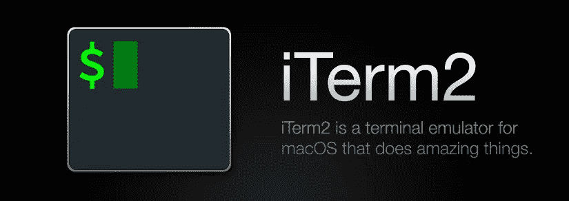
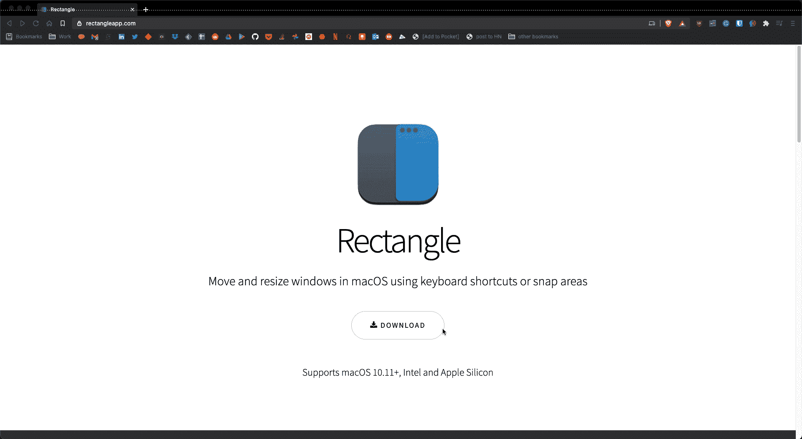
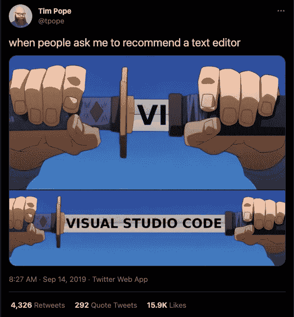

# 开发者故事:作为 Windows 的长期用户，逐渐习惯 macOS

> 原文：<https://medium.com/geekculture/developer-story-getting-used-to-macos-as-long-time-windowss-user-a67af024d8ab?source=collection_archive---------34----------------------->

Photo by [Jordan Sanchez](https://unsplash.com/@jordaneil?utm_source=medium&utm_medium=referral) on [Unsplash](https://unsplash.com?utm_source=medium&utm_medium=referral)

## 这就像从头开始学骑自行车一样

从我回忆起和电脑的关系开始，我就一直在用 Windows。我把一切都定制得尽善尽美，以满足我的需求。无论是键盘快捷键、帮助我工作的特定应用程序(比如这个 [one](https://dvirsegal.medium.com/its-all-about-everything-95043d1b0aa) )、脚本等等。如果它能被改造或自动化——我已经做到了。

最近一切都变了。😱😱😱

我决定采取新的立场。我面临的事实是，我的日常使用将依赖于 macOS，这对我来说是一个陌生的领域。怎么办？我将如何习惯它？我还能像使用 Windows 时那样高效工作吗？

嗯，我像工程师一样处理这个问题。研究出它的地狱；逐个需求地解决它。

like an engineer — [src](https://1.bp.blogspot.com/-elgq8JTN02A/UOjOnOPqATI/AAAAAAAAAWc/DAbHj8jiQ_Q/s1600/197125_429131937141818_620085953_n.jpg)

## **自制啤酒拯救⛑️**

依我看，[家酿](https://brew.sh/)应该是你 Mac 上安装的第一个应用程序。基本上，它是一个包管理器，让你从命令行安装软件工具和开发者框架(类似于 Windows 上的 [chocolatey](https://chocolatey.org/) )。作为 cmd(或者准确的说是 [Windows 终端](https://github.com/Microsoft/Terminal))的替代者，我决定用系统自带的终端来玩。但是，过了一段时间，我就用家酿安装了 iTerm2。

iTerm2 — [src](https://iterm2.com/)

这种高度可定制的终端提供了一套全面的功能，具有分割窗格窗口、简单的文本选择、自动完成、无鼠标复制、粘贴历史和即时回放(倒带)。iTerm 在 [Oh My Zsh](https://github.com/ohmyzsh/ohmyzsh/wiki) 插件中有完美匹配，定制终端的主题和配置。

如果你想要更多的预配置定制(@adirc84🙏🏻)，您可以从这里运行安装 iTerm2、Oh My Zsh 等的一体化脚本:

 [## jldeen/点文件

### 运行以下命令从头开始配置 macOS...bash

github.com](https://github.com/jldeen/dotfiles/tree/mac) 

## Manage your copypasta 🍝

On Windows, I heavily relied on ditto (even [写了关于它的博客](https://dvirsegal.medium.com/ditto-the-clipboard-manager-that-saved-me-967c6dd7651a)，它在 Mac 上不受支持，我正在寻找一个合适的替代品。我觉得 CopyQ 很舒服，它有类似的功能(比如存储文本、HTML、图像或任何其他自定义格式):

 [## CopyQ

### CopyQ 是高级剪贴板管理器，具有编辑和脚本功能。CopyQ 监控系统剪贴板并保存其…

hluk.github.io](https://hluk.github.io/CopyQ/) 

或者你可以通过@shivam1:

 [## 使用 ZSH shell 和 PowerLevel10K，让您的终端变得美观快捷

### 你的终端看起来无聊、难看、慢吗？

medium.com](/@shivam1/make-your-terminal-beautiful-and-fast-with-zsh-shell-and-powerlevel10k-6484461c6efb) 

他甚至为此制作了一个视频:

## 基于窗口的多任务处理

众所周知，尽量减少鼠标或触控板的使用，让你的手放在键盘上来提高工作效率。使用鼠标调整不同窗口的大小时，切换到全屏或并排对齐窗口来执行多任务可能会很痛苦。[矩形](https://rectangleapp.com/)正是这样做的。这个免费的开源工具以一种轻松的方式管理你的屏幕和应用程序的窗口。

Using Rectangle is as simple as a keystroke

# 如果一张图片值 1000 字，那么一个视频值多少？

我发现分享截图、视频和 gif 在不同的情况下非常有帮助，比如当你需要帮助解决不能正常工作的问题或展示你的工作时。要在你的 Mac 上截屏，你有[原生](https://support.apple.com/en-us/HT201361)选项，我非常依赖它:

只需点击上面的组合并拖动十字准线选择要捕捉的区域。虽然截图是一个内置选项，但拍摄视频\ gifs 不是。我发现 [Kap](https://getkap.co/) ，这让我想起了 [SnagIt](https://www.techsmith.com/screen-capture.html) 的功能，是一个免费的开源屏幕记录器，它干净、简单，并能准确地完成你对屏幕捕获应用程序的期望，只是捕获😀。

## 操作系统定制

我认为这个视频真正让我从 Windows 转向 Mac。用卢卡斯自己的话说:

> 它有一切从右键单击到文件资源管理器到卸载程序等等…以最有效的方式。

Lucas’s MacLifeHacks #28

## 不[记事本++不要慌——vs code](https://notepad-plus-plus.org/)

开发人员常用， [Visual Studio 代码](https://code.visualstudio.com/)是 notepad++的绝佳替代品；有了扩展和一堆其他独特的功能，这肯定是一个生产力的提升。

[source](https://twitter.com/tpope/status/1172743697315835904)

## **总结**

总的来说，我感觉我在 PC 和 Mac 上的体验差不多。在定制了我需要的东西并习惯了新的键盘方案后，我可以说我已经越来越适应 Mac 了。此外，我现在明白为什么人们喜欢它了——干净、简单的设计和强烈的规范。

最后一点，最终，你选择的应用程序将完全取决于你的工作，你需要学习如何定制你的工具集来成为一个超级用户。