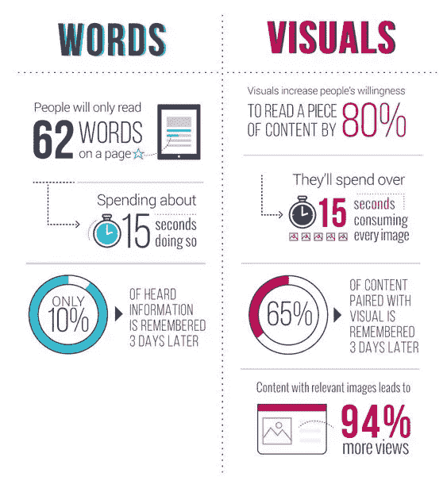

# 开发者，这样做是为了巧妙地传达你的想法。

> 原文：<https://medium.com/geekculture/developers-do-this-to-cleverly-convey-your-ideas-a3d198dd134d?source=collection_archive---------4----------------------->

> 你会不会觉得读一段解释比读一张图更累？

研究发现，视觉传达信息比纯文本更有效，因为我们的大脑处理图像比文本更彻底。

[https://hub.uberflip.com/content-marketing/why-marketers-need-a-visual-influence-strategy](https://hub.uberflip.com/content-marketing/why-marketers-need-a-visual-influence-strategy)