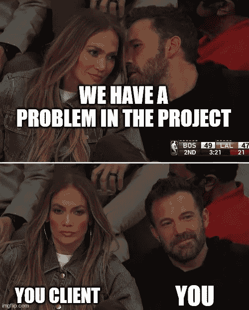

# 开发者，你不应该对你的客户说这些

> 原文：<https://medium.com/geekculture/developers-you-should-not-be-saying-this-to-your-clients-43991840fcb7?source=collection_archive---------13----------------------->

## 4 个短语，如果你忽略它们，会导致你失去一个项目

Image created using [MemeGenerator](https://imgflip.com/memegenerator)

你有没有遇到过这样的情况:在与潜在客户开会时，他们提出要求，而你团队中的某个人却没有与团队的其他人商量就回答说“不，我们不能这么做，那样不行”。尴尬的沉默了几秒钟后…