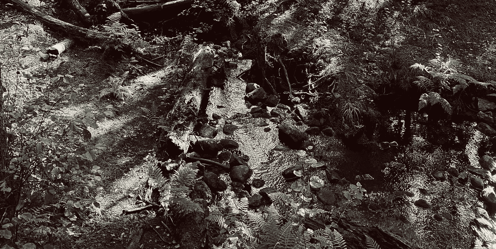

# 我最喜欢的提高你工作效率的“生活窍门”

> 原文：<https://medium.com/geekculture/developing-a-beautiful-iot-product-to-boost-your-productivity-part-1-a634d6a9d14b?source=collection_archive---------11----------------------->

## 开发漂亮的物联网产品以提高您的工作效率，第 1 部分

帮助你不费吹灰之力就能变得更有效率的生活窍门。

The unrelated picture was taken in [Tyresta National Park](https://sverigesnationalparker.se/park/tyresta-nationalpark/) (Stockholm, Sweden) by the author.

在这个系列中，我们将开发一个漂亮的产品来提高我们的生产力。作为一名读者，你将跟随从设计到创作的发展过程…