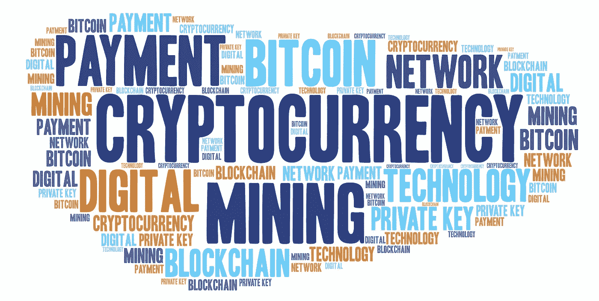
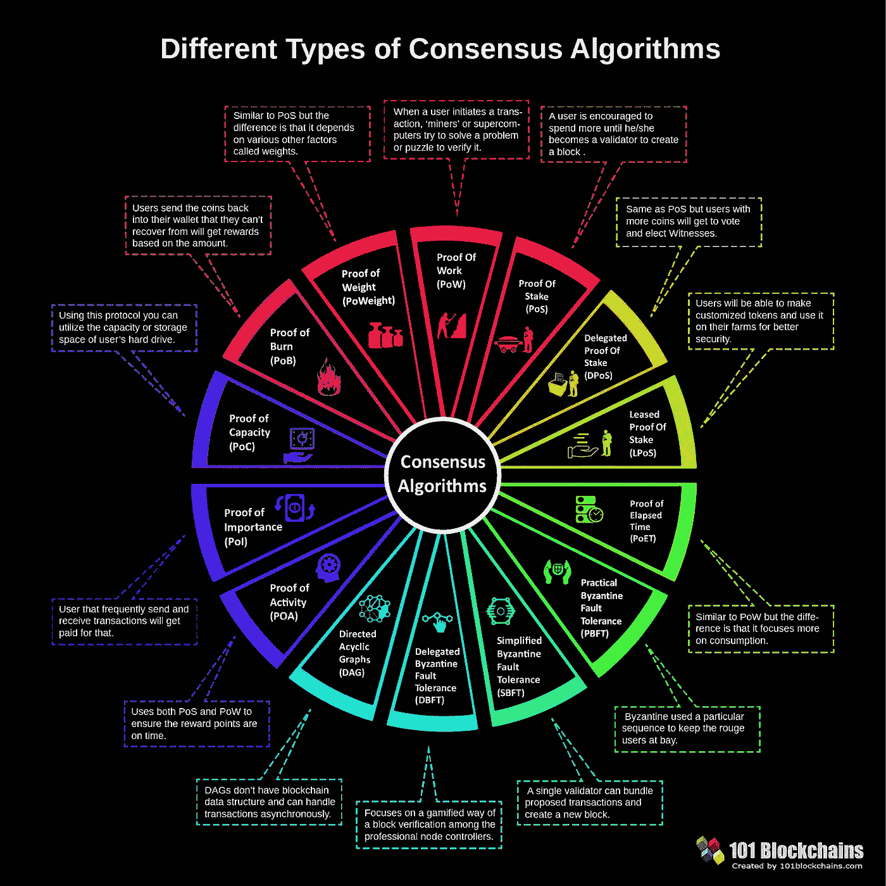

# 开发一种技术来识别有价值的加密货币

> 原文：<https://medium.com/geekculture/developing-a-technique-to-identify-valuable-cryptocurrencies-d1cf555795bf?source=collection_archive---------32----------------------->

> 越来越多的人对这个主题感兴趣，新的投资者不断到来。加密货币通常使用分散控制，而不是中央银行数字货币。当实施分散控制时，每个都通过分布式账本技术工作，通常是区块链，充当公共金融交易数据库。虽然它可能对许多人来说是一项整体技术，但不同区块链网络的工作方式存在很大差异。我们的目标是展示这些项目的关键方面，以识别有价值的加密货币。

Credit: [BeatingBetting](http://BeatingBetting.co.uk)

[加密货币](https://en.wikipedia.org/wiki/Cryptocurrency)不仅仅是一种市场趋势，而是我们日常生活中的现实。人们对这个主题越来越感兴趣，新的投资者不断涌现。[雅虎财经](https://finance.yahoo.com/news/number-cryptocurrencies-exploding-learn-different-124923879.html)声称“有超过 1 亿人拥有加密货币，有超过 1 万种不同类型的数字货币”。对于新投资者来说，数字资产市场中有几种货币并不总是很清楚。

加密货币是一种数字资产，被设计为作为一种交换机制工作，其中各个硬币所有权记录被存储在以计算机化数据库的形式存在的分类账中。他们使用强大的加密技术来保护交易记录，控制额外硬币的创建，并验证硬币所有权的转移。它通常不以物理形式存在，并且不是由中央机构发布的。每种加密货币都通过分布式账本技术工作，通常是区块链，充当公共金融交易数据库。

区块链是一个网络，它通过一个哈希来连接各个区块，从而保证信息的安全性和不变性。区块链系统的设计差异很大，特别是在用于执行验证网络数据这一基本任务的共识机制方面。虽然在许多人看来这是一种一致的技术，但不同网络之间的工作方式有很大差异。我们的目标是提出一种技术，通过分析这些项目的关键方面来识别有价值的加密货币。

# 目标是什么？

每一个区块链都是有人出于某种原因编写的代码。了解这个原因应该是选择投资加密货币的第一步。在大多数情况下，当一个新的区块链被创建时，开发者通常会编写文档。[白皮书](https://en.wikipedia.org/wiki/White_paper)是帮助解决问题的研究报告或指南。这些是用来教育读者带来一个新的或不同的观点。

在区块链行业，白皮书定义了您企业的独特销售主张。它将讲述您的企业如何解决客户问题的故事。白皮书由 crypto 的创建者和/或开发者创建，以帮助销售 crypto。他们为感兴趣的买家提供事实、图表、统计数据和报价。它有助于定义是什么让一家公司脱颖而出。

Credit: [EpicTop10](https://www.flickr.com/photos/182229932@N07/)

# 它有活跃的社区吗？

大多数区块链都是社区贡献的[开源项目](https://github.com/open-source)。并非所有开源项目都是平等创建的。有很多开源项目已经很多年没碰过了。如果你打算依赖区块链，你会希望确保社区在你项目的整个生命周期中继续支持它。大多数加密货币爱好者不是开发人员，甚至不知道如何阅读程序代码。健康的开源项目有几个简单的、与语言无关的指标:

*   **更新频率**:你不想继承一个旧的代码库。对于每一个新的区块链，你都应该找到源代码或发布网站来检查它最后一次更新是什么时候。最后一次更新并不是你唯一应该关注的。更新频率也很重要。例如，如果犯罪发生在周末，这表明这是一种爱好。在 GitHub 上，这些指标大多显示在[图](https://github.com/bitcoin/bitcoin/pulse)中。
*   **问题**:一个活跃的支持社区，有着热烈的讨论和路线图中无穷无尽的建议功能列表，这意味着有很多人在审查代码并推动其开发。开放式问题很好，封闭式问题更好。
*   **Forks、stars、downloads** —每个分发平台都提供了描述受欢迎程度的指标。在 GitHub 上，watchers、stars 和 forks 是一个项目受欢迎程度和使用情况的最强指标。这些指标显示项目的使用量。
*   **文档:**像如何安装、需求和依赖关系这样的技术假设通常表示更随意开发的软件。
*   **组织或用户**:开源项目有组织鼓励是很常见的。一家大公司的支持证明了该项目的价值。
*   **贡献者的数量:**贡献者的长尾最小化了[总线因素](https://en.wikipedia.org/wiki/Bus_factor)并且表明有一个依赖并关心改进软件的用户社区。

# 共识机制是如何运作的？

区块链由连接在网络中并共享共同历史的机器组成。这种数据是以分散的方式构建的，因此数字分类账可以在全世界的计算机网络上共享，而不需要中央机构。这个数字账本的中心是一个[共识机制](https://www.investopedia.com/terms/c/consensus-mechanism-cryptocurrency.asp)，确保没有任何一方篡改记录，每个人都保持诚实。我们有几种机制可以做到这一点。每一个都有它的优点和缺点。

以比特币为例，这种活动包括让超级计算机一天 24 小时开机，解决复杂的数学问题，以创建一个包含最近交易的区块。这个机制被称为[工作证明(PoW)](https://ethereum.org/en/developers/docs/consensus-mechanisms/pow/) 。除了为那些为网络的安全性和可靠性做出贡献的人产生新的单元之外，它还验证区块链上进行的所有交易，以防止欺诈。动力需要大量能量消耗。

在过去的几年里，比特币价值的上升推动了对 GPU 的需求。一些芯片公司专门为采矿制造定制芯片。与 PoW 不同，基于参与者的硬币赌注。赌注者拥有的硬币越多，赌注者就越有可能向区块链添加新的交易块。PoS 中没有块奖励。赌注者的回报只是交易费。由于与工作证明相比能耗较低，利害关系证明系统适用于具有静态硬币供应的平台。大多数众筹平台利用这种方法根据投资来分配代币。

这些是最著名的共识机制。了解网络使用的机制对于分析项目的长期可行性非常重要。它还会影响运营的财务参数和安全性。此外，评估所使用的机制是否符合区块链的目标，可以帮助您区分假网络。区块链操作的关键是维护网络内区块链上记录的信息的一致性。你可以在下图中看到不同类型的共识机制。

# 哈希速率

如前所述，挖掘是加密货币交易在区块链中被验证和记录的过程。矿工完成的工作对于维护网络的完整性以及通过解决复杂的顺序计算将新比特币引入系统至关重要。[散列率](https://bitcoin.org/en/vocabulary#hash-rate)是挖掘过程中使用的计算能力的指标。机器的哈希率越高，挖掘一个区块并获得比特币作为奖励的几率就越大。

这是矿工聚集在矿池中的主要原因，以集中他们机器的计算能力。哈希速率指标衡量工作证明网络中的计算能力。这是以哈希/秒为单位来衡量的，这意味着机器在区块链网络上每秒可以处理的计算次数。这很重要，因为它对网络的安全性和可持续性有很大的影响。由于挖掘者的收益与哈希速率相关，哈希速率越高，挖掘的块就越多。

# 结论

加密货币是我们日常生活中的现实。对于新投资者来说，数字资产市场中有几种货币并不总是很清楚。我们的目标是展示这些项目的关键方面，以识别有价值的加密货币。我们已经介绍了 4 个重要的特性，但是还有更多。始终研究加密货币世界的新特征和变化非常重要。