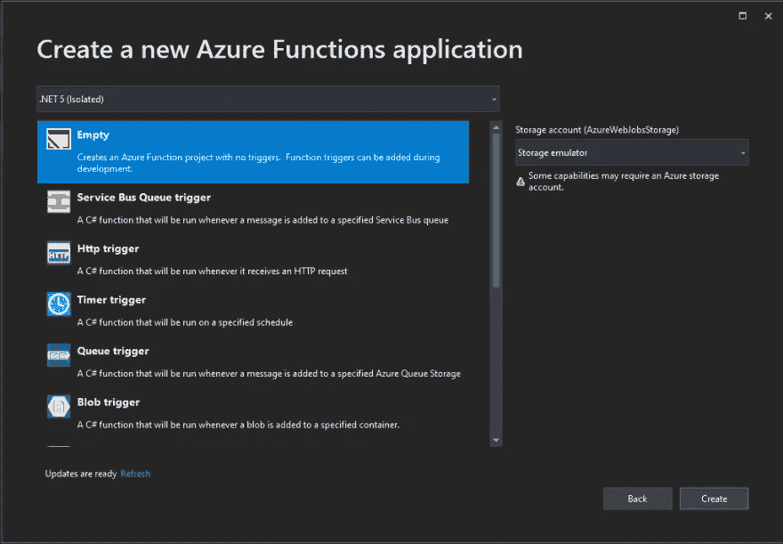
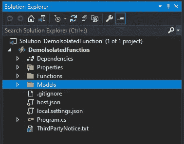
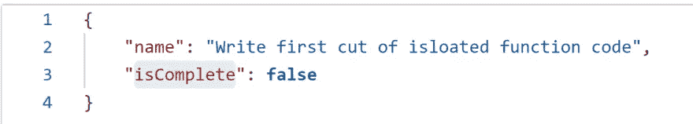

# 发展中。NET 隔离进程 Azure 函数

> 原文：<https://medium.com/geekculture/developing-net-isolated-process-azure-functions-5a1ff4acee46?source=collection_archive---------6----------------------->

使用。NET 隔离的进程函数，我们可以将。我们希望从 Azure Functions 运行时使用的. NET 版本。


我们可以在一个独立的进程中运行我们的 C# Azure 函数，将。NET，我们在函数中使用的运行时版本是在⚡上开发的

在此之前，我们必须开发具有彼此紧密集成的类库和宿主的函数。这意味着我们必须运行我们的。与 Azure Functions 运行时版本相同的. NET 进程内。Azure Functions Runtime v3 上的 NET Core 3.x)。通过进程外函数，我们能够使用。NET 5 和 Azure Functions runtime 的 v3。

有了在进程外运行函数的能力，我们可以在以下方面受益。

*   我们可以完全控制整个过程，从如何启动应用程序，到控制我们的功能配置。
*   使用这个控件，我们可以使用电流。DI 和中间件的. NET 行为。
*   我们还将受益于更少的冲突，因此我们的程序集不会与宿主进程使用的不同版本的程序集冲突。

# 创建我们的功能

为了从函数运行时创建一个进程外运行的函数，我们需要以下内容:

*   。安装了. NET 5.0
*   安装了 Visual Studio 2019 版本 16.10 或更高版本(确保您安装了 Azure 开发或 ASP.NET 和 web 开发工作负载)

一旦你安装了这些，在 Visual Studio 中创建一个新的 Azure Function 项目。创建项目时，请确保选择。NET 5(独立的),就像这样:



对于这个演示，我将创建一个简单的函数，它触发 HTTP POST 请求，并将一个项目插入 Azure Cosmos DB 容器。不完全改变我所知道的世界，但这里的目的是向你展示与 Azure 函数相比，隔离函数是如何工作的，Azure 函数是作为一个 [C#类库函数](https://docs.microsoft.com/en-us/azure/azure-functions/functions-create-your-first-function-visual-studio)构建的。

# 盒子里出来的是什么？

本质上，一个. NET 独立功能项目是一个控制台应用程序。NET 5.0。您的解决方案资源管理器应该如下所示:



我在这里添加了几个文件，但是这些文件是为您生成的:

*   **。csproj 文件**。该文件将定义项目及其依赖项。
*   **local.settings.json** 。这将存储应用程序设置、连接字符串和用于本地开发的设置。
*   **host.json 文件**。该文件包含函数应用程序中所有函数的全局配置选项。
*   **Program.cs 文件**。这将是我们应用程序的入口点。

# 启动和配置

通过 Program.cs 文件，我们可以启动我们的函数应用程序。我们现在可以直接访问主机实例，从而能够直接在主机上设置任何配置和依赖项，而不必创建单独的启动类来完成这项工作。

这里有一个例子:

```
using Microsoft.Azure.Cosmos;
using Microsoft.Extensions.Configuration;
using Microsoft.Extensions.DependencyInjection;
using Microsoft.Extensions.Hosting;
using System.IO;

namespace DemoIsolatedFunction
{
    public class Program
    {
        public static void Main()
        {
            var host = new HostBuilder()
                .ConfigureFunctionsWorkerDefaults()
                .ConfigureAppConfiguration(config => config
                    .SetBasePath(Directory.GetCurrentDirectory())
                    .AddJsonFile("local.settings.json")
                    .AddEnvironmentVariables())
                .ConfigureServices(services =>
                {
                    services.AddSingleton(sp =>
                    {
                        IConfiguration configuration = sp.GetService<IConfiguration>();
                        return new CosmosClient(configuration["CosmosDBConnectionString"]);
                    });
                })
                .Build();

            host.Run();
        }
    }
}
```

这里，我们使用一个新的 HostBuilder 对象来创建我们的主机实例，该对象将返回一个 IHost 实例，该实例异步运行以启动我们的函数。

[**ConfigureFunctionsWorkerDefaults**](https://docs.microsoft.com/en-us/dotnet/api/microsoft.extensions.hosting.workerhostbuilderextensions.configurefunctionsworkerdefaults?view=azure-dotnet&preserve-view=true#Microsoft_Extensions_Hosting_WorkerHostBuilderExtensions_ConfigureFunctionsWorkerDefaults_Microsoft_Extensions_Hosting_IHostBuilder_)方法用于添加在进程外运行我们的函数应用程序所需的设置。这做了几件事，比如提供与 Azure 函数日志的集成，以及提供默认的 gRPC 支持。

这里使用了[**ConfigureAppConfiguration**](https://docs.microsoft.com/en-us/dotnet/api/microsoft.extensions.hosting.hostbuilder.configureappconfiguration?view=dotnet-plat-ext-5.0&preserve-view=true)方法来添加我们的函数应用程序所需的配置。在这里，我用它来使用我的 **local.settings.json** 文件进行本地调试。

[**configure services**](https://docs.microsoft.com/en-us/dotnet/api/microsoft.extensions.hosting.hostbuilder.configureservices?view=dotnet-plat-ext-5.0&preserve-view=true)方法允许我们在应用程序中注入我们需要的服务。在这里，我用它来注入我的 Cosmos 客户机的一个单体实例。

# 我们的函数应用程序

我们现在准备开始编写函数代码。这里，我只是在我的函数和 POST 请求中注入了我需要的服务，将 Todo 项插入到我的 Cosmos DB 容器中:

```
using DemoIsolatedFunction.Models;
using Microsoft.Azure.Cosmos;
using Microsoft.Azure.Functions.Worker;
using Microsoft.Azure.Functions.Worker.Http;
using Microsoft.Extensions.Configuration;
using Microsoft.Extensions.Logging;
using Newtonsoft.Json;
using System;
using System.IO;
using System.Net;
using System.Threading.Tasks;

namespace DemoIsolatedFunction.Functions
{
    public class InsertTodo
    {
        private readonly IConfiguration _configuration;
        private readonly CosmosClient _cosmosClient;
        private readonly Container _todoContainer;

        public InsertTodo(
            IConfiguration configuration,
            CosmosClient cosmosClient)
        {
            _configuration = configuration;
            _cosmosClient = cosmosClient;
            _todoContainer = _cosmosClient.GetContainer(_configuration["DatabaseName"], _configuration["ContainerName"]);
        }

        [Function("InsertTodo")]
        public async Task<HttpResponseData> Run([HttpTrigger(AuthorizationLevel.Anonymous, "post", Route = "Todo")] HttpRequestData req,
            FunctionContext executionContext)
        {
            HttpResponseData response;
            var logger = executionContext.GetLogger("InsertTodo");
            logger.LogInformation("C# HTTP trigger function processed a request.");

            try
            {
                var request = await new StreamReader(req.Body).ReadToEndAsync();

                var todo = JsonConvert.DeserializeObject<TodoItem>(request);
                todo.Id = Guid.NewGuid().ToString();

                await _todoContainer.CreateItemAsync(
                    todo,
                    new PartitionKey(todo.Id));

                response = req.CreateResponse(HttpStatusCode.OK);
            }
            catch (Exception ex)
            {
                logger.LogError($"Exception thrown: {ex.Message}");
                response = req.CreateResponse(HttpStatusCode.InternalServerError);
            }

            return response;
        }
    }
}
```

这个函数使用 HTTP 触发器向 Cosmos DB 写入记录。独立函数中的 HTTP 触发器不同于旧版本的运行时，因为我们必须使用 [HttpRequestData](https://docs.microsoft.com/en-us/dotnet/api/microsoft.azure.functions.worker.http.httprequestdata?view=azure-dotnet&preserve-view=true) 和 [HttpResponseData](https://docs.microsoft.com/en-us/dotnet/api/microsoft.azure.functions.worker.http.httpresponsedata?view=azure-dotnet&preserve-view=true) 来访问请求和响应数据。

在进程外函数中，我们不能访问原始的 HTTP 请求和响应对象。进程外函数中发生的事情是，传入的 HTTP 请求消息被转换为 HttpRequestData 对象。从这里开始，数据由请求提供。

这是我们的帖子请求:



这个请求向 HttpRequestData 对象中的 Body 属性提供数据。

# 日志记录和执行上下文

我们可以写入日志。NET 独立函数。独立函数通过 FunctionContext 对象传递，该对象提供有关函数执行的信息。这里，我们可以调用 GetLogger()方法，像这样传递函数名:

```
var logger = executionContext.GetLogger("InsertTodo");
logger.LogInformation("C# HTTP trigger function processed a request.");
```

# 想了解更多？

还有一些工作要做。NET 隔离函数。与。NET 6 将在 11 月的某个时候发布，那个版本可能是 LTS 版本，你可以开始使用了。NET 6 与 Azure Functions v4 (它处于早期预览，所以预计会有 bug)。

就我个人而言，我对。NET 隔离函数！🙌随着……的增加。NET 版本的 cadence，具有。NET 版本与 Azure 运行时版本将提供的功能相分离。网络发展👩‍💻👨‍💻更灵活地使用中的最新功能。NET，而不是被运行库强加的限制所约束。

如果您想了解更多关于。NET 隔离进程作品，查看本文:[https://docs . Microsoft . com/en-us/azure/azure-functions/dot NET-isolated-process-guide # logging](https://docs.microsoft.com/en-us/azure/azure-functions/dotnet-isolated-process-guide#logging)

如果你更喜欢亲自动手做代码，就按照这个教程:[https://docs . Microsoft . com/en-us/azure/azure-functions/dot net-isolated-process-developer-how tos？tabs =浏览器&pivots =开发-环境-vs](https://docs.microsoft.com/en-us/azure/azure-functions/dotnet-isolated-process-developer-howtos?tabs=browser&pivots=development-environment-vs)

编码快乐！💻☕