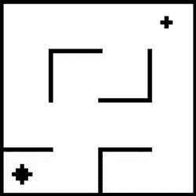
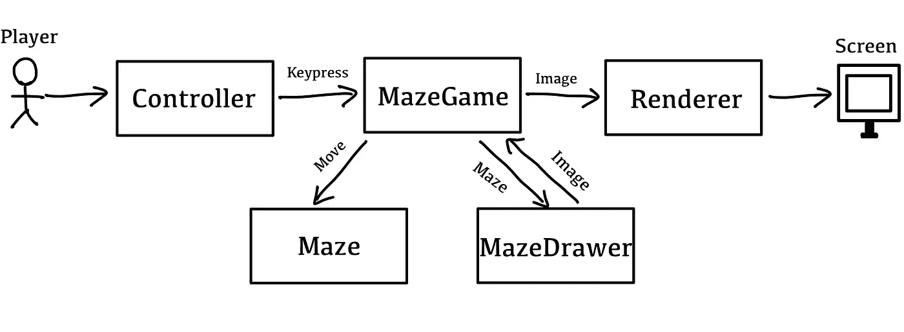
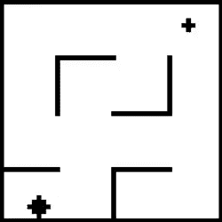

# 利用 OpenAI Gym 开发强化学习环境

> 原文：<https://medium.com/geekculture/developing-reinforcement-learning-environment-using-openai-gym-f510b0393eb7?source=collection_archive---------1----------------------->

# 介绍

强化学习问题由主体和环境组成。该环境向代理提供反馈，以便它可以学习哪个动作适合于特定的状态。在本帖中，我们将使用 OpenAI Gym 构建一个强化学习环境，用于训练代理。

本教程分为两部分。在第一部分中，我们将使用 Python 和 PyGLET 构建一个简单的游戏。然后，我们将调整 OpenAI Gym 接口，以标准化我们的环境，以便当我们开发学习算法时，我们不必了解它在内部是如何工作的。

# 游戏

我们要建立一个迷宫游戏，它有两个简单的规则:

*   代理可以在 4 个方向上一次移动 1 步:上、下、左、右。
*   当代理人到达目标时，游戏结束。

下图展示了游戏的样子。



The maze game. (Image by author)

# 游戏开发

本节简要说明项目的游戏开发部分。因为游戏开发不是这篇文章的主要焦点，我们不打算深究它的细节。然而，如果你感兴趣，这个项目的代码可以在[这个 GitHub 库](https://github.com/thanakorn/gym-image-maze)中找到。

## 业务逻辑

首先，我们将创建一个`Maze`类，它代表一个迷宫并封装了上述规则。迷宫的状态由三样东西表示:代理人的位置、目标的位置和墙壁的位置。这些将成为这个类的属性。

迷宫中唯一可以改变的是代理人的位置。因此，该类将拥有将方向作为参数的`move_robot`方法。此外，我们将有一些 getter 方法来检查迷宫的状态，如代理到目标之间的距离。当我们稍后构建奖励函数时，这些方法会派上用场。

## 表示层

一旦游戏逻辑完成，下一步就是开发表示层。我们将为这一层使用的库是一个名为 [PyGLET](http://pyglet.org/) 的 Python 游戏开发库。

首先，我们将创建一个`MazeDrawer`类，负责制作一个代表迷宫当前状态的图像。然后，该图像被传递到`Renderer`以将其呈现给图形用户界面。最后，所有组件都组装在`MazeGame`类中，该类控制主循环并将按键映射到动作。

下图显示了所有组件是如何组合在一起的。



The architecture of the game. (Image by author)

# 整合开放式健身房

虽然游戏已经准备好了，但是有一个小问题需要首先解决。为了开发一个模型，用户仍然必须理解我们游戏的机制，这样他们才能让学习算法与它互动。这是有问题的，因为我们希望我们的用户专注于解决问题，而不是学习系统如何工作。此外，如果在某个时候，我们对我们的游戏进行了更改，这可能会毁掉他们所有的作品。听起来很糟糕，对吧？

为了防止这一点，我们将标准化我们游戏的界面，以便无论它在内部如何工作，它对用户来说看起来都是一样的，我们将应用的标准是由 OpenAI Gym 设计的。

## 什么是 OpenAI 健身房？

OpenAI Gym 是一个用于强化学习算法开发的工具包。该库提供了一组众所周知的强化学习问题的环境，如 CartPole 和 MountainCar。有了这些现成的东西，开发人员就可以专注于学习算法和模型。

除了内置环境之外，OpenAI Gym 还允许通过简单地扩展提供的`Env`类的抽象来创建用户定义的环境。

## OpenAI 健身房界面

要构建一个定制的 OpenAI Gym 环境，您必须扩展库提供的`Env`类，如下所示:

```
import gymclass ImageMazeEnv(gym.Env):
     def __init__(self):
         ... def step(self, action):
         ... def reset(self):
         ... def render(self):
         ... def close(self):
         ...
```

然后，您需要覆盖 2 个属性和 4 个方法，它们的作用如下:

*   属性
    - `action_space`:代理可以执行的所有可用动作。
    - `observation_space`:观察的结构。
*   方法
    - `step`:对环境执行一个动作，然后返回环境的状态，动作的奖励，以及剧集是否结束。
    - `reset`:重置环境状态，然后返回初始状态。
    - `render`(可选):渲染环境进行可视化。
    - `close`(可选):执行清理。

请注意，与此相关的所有代码必须位于项目目录下的`envs`文件夹中。

## 行动和观察空间

动作空间很简单。有 4 种可用的动作:向左、向右、向上和向下。我们可以使用为离散空间提供的`Discrete`类来定义它。

观察空间定义了我们希望代理如何感知环境。因为我们已经实现了用于生成迷宫图像的`MazeDrawer`,我们将使用该图像作为对我们环境的观察。为了定义这一点，我们可以使用`Box`类，它允许您指定观察的形状及其取值范围。

动作和观察空间定义如下:

```
import gym
from gym.spaces import Discrete, Box**class** ImageMazeEnv(gym.Env):
     **def** __init__(self):
        self.maze = .... # Create a maze object
        ....
        self.action_space = Discrete(4)
        self.observation_space = Box(low=0,high=255,shape=[500,500])
```

## 阶跃函数

在我们定义了动作和观察空间之后，接下来是实现 step 函数。这个功能有 3 个职责:执行一个动作，提供对新状态的观察，以及提供一个奖励。

前两个是微不足道的，因为我们已经做到了。`Maze`类已经有了`move_robot`方法，所以我们只需将动作传递给它。为了便于观察，我们实现了`MazeDrawer`,它可以生成一个代表迷宫对象当前状态的图像。剩下的工作是设计和实现奖励函数，这是开发学习算法的关键部分。

奖励机制应该与我们想要实现的目标相关联。在迷宫问题中，任务是到达智能体不知道在哪里的目标。我们将使用奖励函数作为一个信号，每当代理向目标靠近时提供一个积极的奖励，反之亦然。此外，代理人应该避免撞到墙上，因为这是无用的，所以我们也要加上惩罚。迷宫问题的奖励函数具有以下条件:

*   如果代理人移动得更接近目标(与前一回合相比)，它将获得奖励+1。
*   如果代理人远离目标，它得到一个惩罚-1。
*   如果代理撞上了墙，它会得到一个惩罚-10。
*   如果代理达到目标，则获得奖励+100。
*   代理和目标之间的距离使用欧几里德距离计算，不考虑墙壁。
*   如果代理人在特定的回合数内没有达到目标，游戏就结束了。

下面是阶跃函数的样子:

```
**def** step(self, action):
   self.timestep += 1 current_dist_to_goal = self.maze.dist_to_goal()
   self.maze.move_robot(action)
   new_dist_to_goal = self.maze.dist_to_goal()
   is_collide = current_dist_to_goal == new_dist_to_goal self.done = self.maze.is_robot_reach_goal() or self.timestep ==     self.time_limit reward = 0.
   if self.maze.is_robot_reach_goal():
      reward = 100
   elif is_collide:
      reward = -10
   elif new_dist_to_goal < current_dist_to_goal:
      reward = 1
   else:
      reward = -1 **return** MazeDrawer.draw_maze(self.maze, 500, 500), reward.value, self.done, {}
```

## 重置、渲染和关闭

`reset`函数要将游戏重新初始化到开始状态，并返回观察结果。为了简单起见，我们将初始状态存储在一个 JSON 文件中，并从中创建一个新的迷宫实例。类似于阶跃函数，MazeDrawer 用于生成观测值。

`render`函数渲染环境，这样我们就可以将它可视化。我们将使用`MazeDrawer`和`Renderer`类来做到这一点。`close`方法用于清理。这里我们唯一要做的就是摧毁`Renderer`物体。

这三种方法的实现如下:

```
**def** reset(self):
   self.maze = Maze.from_config(self.config_file)
   self.done = False
   self.timestep = 0

   if self.visualize:
     self.renderer.render(MazeDrawer.draw_maze(self.maze, 500, 500)) **return** MazeDrawer.draw_maze(self.maze, 500, 500)**def** render(self, mode='human'):
   self.renderer.render(MazeDrawer.draw_maze(self.maze, 500, 500))**def** close(self):
   if self.visualize:
      self.renderer.close()
```

# 注册并使用环境

现在我们的环境已经准备好了，最后要做的就是将它注册到 OpenAI Gym 环境注册表中。以下是如何做到这一点:

首先，创建一个代表您的环境的特定版本的类。

```
**class** ImageMazeV0(ImageMazeEnv):
     **def** __init__(self):
         super().__init__(time_limit=200)
```

然后，通过将下面的代码放到项目目录的`__init__.py`中，将它注册到 gym `register`中。

```
from gym.envs.registration import registerregister(
   id='ImageMaze-v0',
   entry_point='gym_image_maze.envs:ImageMazeV0'
)
```

最后，向您的`envs`目录中的`__init__.py`添加一个导入语句。

```
from gym_image_maze.envs.image_maze_env import ImageMazeV0
```

新环境准备好了！！！让我们用下面的代码测试一下:

```
import gymif __name__=='__main__':
   env = gym.make('ImageMaze-v0')
   env.reset()
   for i in range(500):
       env.render()
       observation, reward, done, _ = env.step(env.action_space.sample())
       print('Observation : ' + str(observation.shape))
       print('Reward      : ' + str(reward))
       print('Done        : ' + str(done))
       print('---------------------')
env.close()
```

您应该会在屏幕和终端上看到类似这样的内容。



```
---------------------
Observation : (500, 500)
Reward      : -10
Done        : False
---------------------
Observation : (500, 500)
Reward      : 1
Done        : False
---------------------
Observation : (500, 500)
Reward      : 1
Done        : False
---------------------
```

就是这样。我们完了。现在我们的环境已经可以使用了。
如果你想看这个项目的代码，这里有[。](https://github.com/thanakorn/gym-image-maze)

# 结论

在本文中，我们学习了如何使用 OpenAI Gym 构建一个定制的强化学习算法。这允许您创建针对您的特定用例定制的强化学习问题，这些用例不在 OpenAI Gym 提供的标准环境中。

感谢阅读。如果你喜欢这篇文章，你可以[关注我](/subscribe/@thanakornpanyapiang)了解更多。下一篇文章再见。