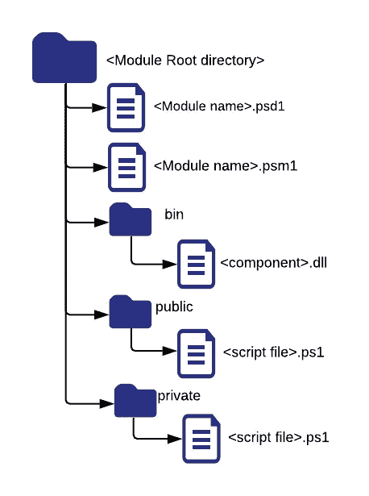

# 使用 PowerShell 开发

> 原文：<https://medium.com/geekculture/developing-using-powershell-283a0ae7b6eb?source=collection_archive---------16----------------------->

Photo by [Caspar Camille Rubin](https://unsplash.com/@casparrubin?utm_source=medium&utm_medium=referral) on [Unsplash](https://unsplash.com?utm_source=medium&utm_medium=referral)

## 基于大型 powershell 的开发经验

Powershell 仍然是微软生态系统的重要组成部分。这些学习大部分是基于微软文档，少数博客和谷歌和栈溢出搜索。请注意，本文的重点是构建复杂的包和工具，而不是单一的文件脚本。

# 模块

模块是 PowerShell 中打包的基本块之一。大多数团队可能最终会创建一个模块来收集一组常用的实用函数，或者通过 [PowerShell Gallery](https://www.powershellgallery.com/) 与更大的团队共享完成的组件。或者，模块也可以本地导入(见下面的引导程序)并作为脚本的一部分使用。

Powershell 模块通常应该遵循标准的结构和配置，以确保一致的结果并减少潜在的问题。下面的目录结构可以确保每个相关组件都有合适的位置。

Module directory structure

推荐的模块目录结构与编写模块的标准指南[一致。应该命名根目录以唯一地标识模块并匹配模块名。PSD1 文件是非常标准的文件，生成后会根据特定的模块进行更新。PSD1 文件中的“RootModule”和“ModuleList”指向包含基本模块引用的“<模块名> .psm1”文件。](https://docs.microsoft.com/en-us/powershell/scripting/developer/module/how-to-write-a-powershell-module-manifest?view=powershell-7.1)

public 文件夹包含脚本文件，这些文件包含应该导出的函数和类。私有文件夹应该用于存储助手功能。bin 文件夹可用于存储模块使用的 dll 或其他组件。

下面的 psm1 文件包含一些参考可用的补充[这里](http://ramblingcookiemonster.github.io/Building-A-PowerShell-Module/)。

> 尽可能在模块而不是类中导出函数，以避免与类相关的重载问题。

脚本中定义的所有函数都应该包含基本的文档标记，如。剧情简介，。描述，。参数。以下示例可用作创建函数的指南。

注意 [CmdletBinding()](https://docs.microsoft.com/en-us/powershell/module/microsoft.powershell.core/about/about_functions_cmdletbindingattribute?view=powershell-7.1) 的使用，它提供了一些高级的[功能](https://docs.microsoft.com/en-us/powershell/module/microsoft.powershell.core/about/about_functions_advanced_methods?view=powershell-7.1#long-description)，比如将预定义的参数绑定到函数。除了定义好的[参数](https://docs.microsoft.com/en-us/powershell/module/microsoft.powershell.core/about/about_functions_advanced_parameters?view=powershell-7.1#attributes-of-parameters)和[输出](https://docs.microsoft.com/en-us/powershell/module/microsoft.powershell.core/about/about_functions_outputtypeattribute?view=powershell-7.1)可以减少锅炉板块验证码。使用[输入处理方法](https://docs.microsoft.com/en-us/powershell/module/microsoft.powershell.core/about/about_functions_advanced_methods?view=powershell-7.1#input-processing-methods) (Begin，Process，End)确保您的函数为[管道](https://docs.microsoft.com/en-us/powershell/module/microsoft.powershell.core/about/about_pipelines?view=powershell-7.1#short-description)做好准备。建议使用 try…catch 和 return 退出代码，但应根据内部编码准则进行评估。

# 公共设施

大多数大型开发都应该评估以下组件的使用和需求。

## 记录

可以使用 log4net 和/或 Write-Host 函数创建一个简单的基于级别的日志记录机制，该函数具有类似 Write-LogDebug ($Text)、Write-LogInfo ($Text)的函数签名，以确保可以通过一个通用机制启用和/或禁用不同级别的日志记录(参见下面的引导)。

## 配置

开发一个 JSON 或等效的配置模型，能够使用等效的以下命令从文件中加载配置

> $ config data = New-Object-TypeName PSCustomObject-argument list(Get-Content-Raw-Path $ config file | convert from-Json)

在设计配置文件时有一个标准的命名约定可能会有所帮助，以确保您拥有通用配置(“config.common”)以及组件特定的配置(“config.component”)。除了可以返回与以点分隔格式指定的键名相关联的配置的开发人员助手功能之外，开发人员助手功能可以确保每个组件可以具有其自己的配置格式，且知道如何处理它，而不用担心配置结构的其余部分。有关如何执行配置加载，请参见下面的引导部分。

## 凭证/安全性

重要的是在项目开始时开发助手安全功能，并在代码中一致地使用它，以确保随着时间的推移，代码可以使用从安全角度进行的更新。此类帮助器函数应该创建使用配置读取密码(通过从配置解密或通过简单的配置更改从 vault 检索)并返回要使用的 PSCredential 对象。另一个重要的辅助功能可以是一个通用的身份验证机制，当可以执行多个身份验证时(例如 Azure 可以支持多种身份验证机制，如 id/密码、服务主体/密码、证书)，拥有一个基于配置选择实际身份验证过程的单一身份验证功能可能会有所帮助。

# 剧本

在大型开发中，通常会开发跨不同用例的多个脚本。这种发展如果遵循标准结构，可以大大简化整个过程。

最基本的建议是，开发标准的目录结构来打包这些开发组件。根目录应该包含 Readme.md，其中包含有关打包过程的具体细节、各种可用的脚本以及运行脚本的具体示例。bin 目录包含各种脚本以及一个公共的 bootStrap.ps1，它提供了一个标准机制来处理配置、加载公共模块、初始化日志记录、处理公共参数(详见下文)。config 目录包含带有默认值的配置文件，data 文件夹包含运行脚本所需的各种模板和其他文件。作为执行过程的一部分，脚本可以根据需要创建额外的目录，如日志、tmp。

## 引导程序

bootstrap.ps1 可以包含由于依赖于特定参数而无法在模块中处理的典型操作。建议引导程序应该有一个类似下面的函数，可以被任何脚本调用。

> 函数 BootStrap {
> [cmdlet binding()]
> [output type([PSCustomObject])]
> Param([string[]]$ ModulesToLoad，[string] $ConfigFile，[string] $ConfigToLoad，[string] $LogLevel，[string] $LogType)

该功能应执行以下功能
1。确定部署的根位置(上面显示的<根目录>的父目录)
2。将根位置添加到＄env:PSModulePath(如果还没有设置的话),以确保可以导入包的所有模块部分，而不依赖于外部存储库，如 PSGallery。
3。导入提供的基本模块

> 如果(！(获取-模块样本。Common-Utils)) {
> 导入模块示例。公用程序强制错误操作停止

4.初始化记录器和任何其他需要的公共系统。
5。检查模块是否可用后，加载作为$ModulesToLoad 传递的所有模块。如果没有，那么它会尝试使用 Install-Module $ ModuleName-allow clobber-Force-error action Stop-Scope CurrentUser
6 进行安装。尝试定位配置文件，方法是按原样解析它，然后尝试在 bin 目录中定位它，然后使用$SCRIPT_PATH 变量在 config 目录中定位它(参见上述要点)。
7。加载配置数据并返回。

所有脚本都应该使用定义良好的参数列表进行定义，并运行引导程序，如下所示

> $ LASTEXITCODE = 1
> $ SCRIPT _ PATH = Split-PATH(Resolve-PATH $ my invocation。MyCommand.Path)
> 。/$ SCRIPT _ PATH \ bootstrap . PS1
> #该行允许将所有命令行参数传递给引导函数
> $ bootstrap parameters = $ PSBoundParameters
> $ loadModuleList = " Sample。常用工具"，"示例。az-Utils "
> $ bootstrapper 参数。Add('ModulesToLoad '，$ loadModuleList)
> $ config data = BootStrap @ BootStrap parameters
> #脚本的后续代码

Powershell 将继续在微软生态系统中扮演自动化的重要角色。利用上述建议可以显著改善开发人员的体验，并减少大型项目的总体开发时间。