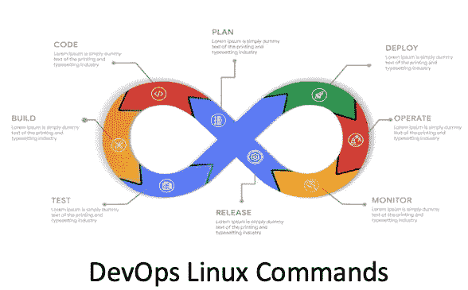

# DevOps —高级 Linux 命令

> 原文：<https://medium.com/geekculture/devops-advanced-linux-commands-197c0609508b?source=collection_archive---------0----------------------->

## 实用的 Linux DevOps 命令

作为一名 DevOps 工程师，我每天都在使用 Linux。在本文中，我想介绍一些我日常使用的 Linux 命令，帮助我更有效地工作或排除故障。

有些命令你可能已经知道并正在使用，但是为了他人和我自己的利益，我可以回去看看它们…