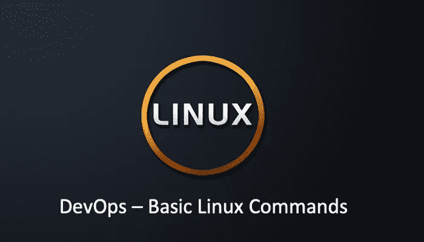

# DevOps —基本 Linux 命令第 2 部分

> 原文：<https://medium.com/geekculture/devops-basic-linux-commands-part-2-f608d081b5f7?source=collection_archive---------3----------------------->

## 文件内容管理

在 DevOps Linux 命令系列的第一部分中，我介绍了 DevOps 故障诊断中使用的基本 Linux 命令。在今天的文章中，我们来谈谈 Linux 文件系统管理命令。

# 更少/更多

`less/more`:分页查看长文件。