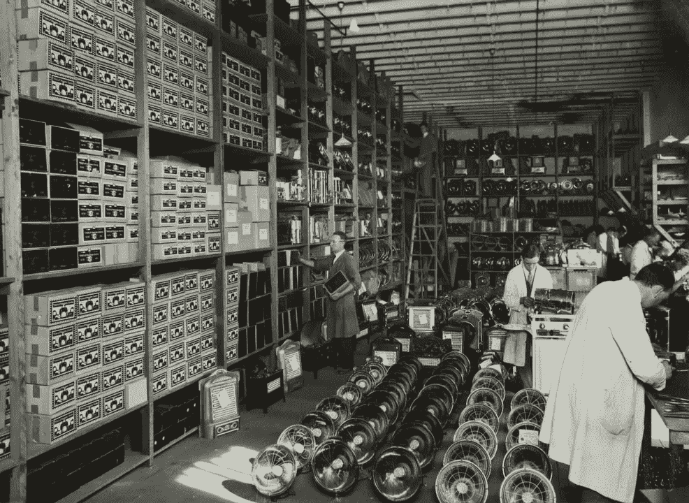

# 面向工业物联网的 DevOps 如何实现？

> 原文：<https://medium.com/geekculture/devops-for-industrial-iot-how-to-do-it-e7661d32f1e9?source=collection_archive---------16----------------------->

Photo by [Museums Victoria](https://unsplash.com/@museumsvictoria)

物联网已经成为推动制造业发展的最新兴技术之一。它定义了**与传感器、**和**其他技术**集成的物理对象网络，以便通过互联网与其他系统进行通信和共享数据。

工业物联网(IIoT)代表物联网在工业行业和应用中的使用。通过利用机器对机器(M2M)连接、大数据和机器学习， **IIoT 允许各行业在其生产流程中实现更高的性能和质量。**

制造商正在转向 IIoT，因为它是他们试图更有效地扩大规模的有力武器。这种转变的动机是公司需要使用新兴技术来战略性地产生积极的结果。

最初，IIoT 提供了许多方法来改进简单生产流程的功能。然而，远不止如此。IIoT 的优势包括**在供应链中产生效率**到**设计有助于销售增长的技术和模式**。这种发展潜力来自于识别实际产品使用中的活动并在生产过程中利用它们来增加更多价值的能力。

例如，数字产品可以收集数据，制造商可以使用这些数据来进一步优化产品。更重要的是，他们可以利用这些见解来发现新的商业机会。

# 工业物联网的挑战

DevOps 处于市场混乱的中心。借助 DevOps，**企业能够创建必要的灵活且自动化的基础设施**，该基础设施能够处理大量操作并推动数据洞察。

构建软件产品与构建硬件产品需要不同的过程。挑战也各不相同:

*   创建一个嵌入式软件来管理您的设备
*   增加利润以减少健壮产品昂贵的错误修复
*   用新功能更快地丰富现有产品，或推出新的革命性产品
*   通过自动化部署实现软件扩展
*   同步固件和软件更新
*   实施安全和报警标准，防止数据泄露
*   为从所有设备实时收集的数据提供存储

面向工业物联网的 DevOps 专注于开发应用程序，以使数据变得有用。此外，它使开发人员能够快速移动和迭代，实时交付变更。

# 为什么要开发面向工业物联网的 DevOps？

DevOps 把开发和运营结合起来，可以给厂商带来很多好处，优化很多流程。这得到了 DevOps 文化的支持，devo PS 文化是一套提高生产效率和可伸缩性的方法。

# DevOps 对于工业物联网有哪些优势？

*   增加部署频率
*   提高代码和应用质量
*   加快新功能的上市时间
*   最小化发布失败的机会
*   故障后更快恢复

例如，当几个支持物联网的设备被放置在不同的制造场所来跟踪能源数据时，这些设备必须跟踪包括能源支出在内的每个事件。这包括打开机器，提高他们的水平等。为了在工作日期间捕捉这些活动，**支持 DevOps 的基础架构将自动扩展**，然后在工作日结束后**缩减，以最大限度地降低运营成本**。

IBM 研究员迈克尔·罗[为 TechBeacon](https://techbeacon.com/enterprise-it/devops-challenges-internet-things) 写了一篇文章，其中他提到汽车共享服务 [car2go](https://www.car2go.com/en/austin/) 和航空发动机供应商[Power by hour](http://www.ajw-group.com/aviation/our-services/power-by-the-hour/)作为行业范例，创造了它们所包含的软件所支持的价值。据他说，客户不再最看重物理工程和钣金设计。相反，用户体验可以通过监控燃料混合物或操控特性的软件得到显著改善。当观察车辆时，决定体验的算法和嵌入代码都不明显。

# DevOps 如何增强物联网？

为了在 DevOps 中取得成功，公司需要采取系统的方法。这意味着整个组织需要进行转型。运营和开发团队，质量保证测试，以及参与制作应用程序的所有其他部门，包括经理和企业所有者。以下是面向工业物联网的 DevOps 提升整个公司绩效的一些方式:

# 更好的沟通和协作

DevOps 的最大好处之一是增强了整个组织的团队合作和互动。**质量保证、运营和生产团队之间更紧密的合作**遵循这样一种策略，即所有团队都与客户合作，创建满足其期望和需求的定制解决方案。

# 更有效的测试

生产环境的作用可以通过应用程序测试来验证。然后，DevOps 团队将找到依赖关系，深入了解应用程序的功能，并做出相应的更改。随着自动化和实施，**这些程序成为常规**，允许进一步的展示、测试和发展。

# 衡量分析和绩效

通过在过程中推进研究，分析和成功跟踪在生命周期的早期实现。DevOps 没有等待收集后期制作输出数据来分析哪里出了问题，而是实施了特定的分析模型，可以在推出之前预测质量和组织问题。

这些数据可以帮助您设置 KPI 并更轻松地对其进行衡量。当输出参数更接近关键性能指标时，您可以提高整体性能并改善客户体验。

# 自动化

通过流程自动化，制造商**获得了扩展解决方案的能力，同时降低了复杂性和成本**。DevOps 应通过考虑操作方面来照顾物联网软件，并通过正确定位设备来确保设备的最大效率。

*下面是 DevOps 自动化流程的方式:*

# CI/CD

持续集成和持续开发提供了一个流线型的自动化开发过程。这个**通过构建、测试、集成、部署和其他自动化生产管道来加速部署**。持续集成也有助于更好的灵活性和沟通。

# 容器

不依赖无服务器架构的 IIoT 解决方案将虚拟化层与容器架构和编排管理器结合在一起。这个模型基于一个或多个运行在虚拟机上的容器，[用微服务](https://microtica.com/everything-about-microservices/)开发。这是团队在计划添加许多新特性和规模时应该使用的策略。

通常，容器有几个微服务，它们聚合在一起构成整个软件的功能。它们包括所有必需的东西，比如使软件能够在各种平台上运行所需的库。随着应用程序的扩展，这种**降低了在不同平台上部署的复杂性**。

# 容器编排

随着应用程序的扩展，容器架构也在扩展。这使得容器管理变得困难。 **Kubernetes** 是最流行的容器编排工具，它定义了系统的期望状态，并通过**编排控制功能**来支持它。Kubernetes 支持从故障中自动恢复，降低了扩展复杂性，并提高了安全性。(对于一些 Kubernetes 用户来说，其他进一步支持编排的工具包括 OpenShift、DockerSwarm 或亚马逊的 EKS。

# 拥抱 DevOps 文化

DevOps 不仅与工具链有关。首先要解决的障碍之一是公司文化，无论 DevOps 是作为一个新的实体产生的，还是从当前的开发和运营流程中合并而来的。改变后的文化必须依靠机会来提供更快、更有效的解决方案，并且能够跟上市场的需求。

DevOps 文化的核心是**敏捷方法论**，它依赖于自主性和速度。然而，并不是所有的团队都具备支持这种自主性所需的专业知识。这就是为什么文化并不总是局限于只包括工程师。真正的 DevOps 战略需要开发、运营、公司所有者、客户和合作伙伴之间的**协作。**总之，他们需要帮助公司开发和发布快速、高质量的解决方案来实现业务目标。

[特别是在工业物联网领域](https://microtica.com/case-studies/devops-for-industrial-artificial-intelligence/)，DevOps 可以提供**更快的反馈，**允许团队提高绩效。基于收集的设备使用数据，生产团队可以提出优化设备使用的**活动**。这些活动可以包括**通过识别基于实际使用的痛点来改进维护**，**优化能耗的自动化参数**，以及**所有连接设备行为的全面改进**。

这种文化转变应该会提高客户参与度，因为互联设备将根据每个客户的需求进行优化。

# 结论

如今，客户驱动的“随需应变”思想允许公司遵循敏捷方法，这是 DevOps 持续开发和交付的核心原则。此外，随着公司继续将技术与客户的战略数字优先事项相结合，工业物联网将成为增长的关键组成部分。该行业将开始将 DevOps 视为 IIoT 的一个关键支柱，从而更好地理解如何构建和实施应用程序以简化物联网设备。