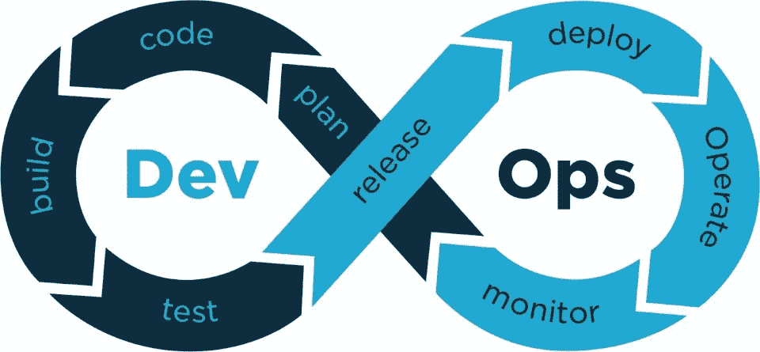

# DevOps 是什么？初学者入门

> 原文：<https://medium.com/geekculture/devops-in-a-nutshell-e258984cc359?source=collection_archive---------17----------------------->

The workflow start with coding and proceed in loop all the time for a faster and robust software implementation.

# 什么是 DevOps:术语和历史

“DevOps”这个词是由帕特里克·德博伊斯于 2009 年创建的，他是该组织的领导人之一。术语“开发”和“操作”是一起形成的。这为理解人们说“DevOps”时通常是什么意思提供了一个起点。特别是没有 DevOps 流程，没有技能，没有标准。许多…