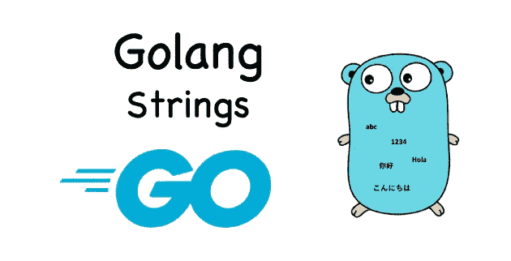

# Go-String 中的 DevOps

> 原文：<https://medium.com/geekculture/devops-in-go-string-a2154f6de1a6?source=collection_archive---------3----------------------->

## Go bootcamp 系列中的 DevOps



Go 提供了对`string`类型的原生支持。在围棋中，`string`型是**串**。Go 通过字符串类型统一了“字符串”的抽象。这样，无论是字符串常量、字符串变量还是字符串文字值，它们的类型都统一设置为`string`。

例如:

```
const (
  GO_SLOGAN = "less is more" //…
```