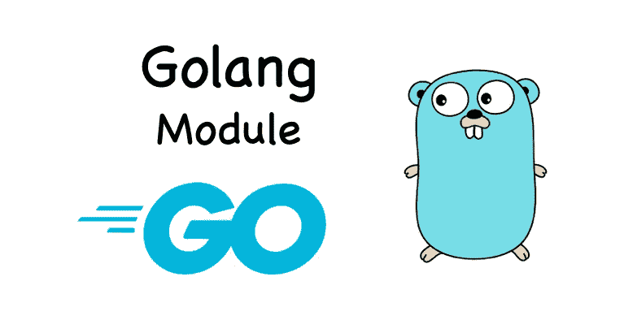

# Go 中的 DevOps 您的第一个 Go 模块

> 原文：<https://medium.com/geekculture/devops-in-go-your-first-go-module-71a02ebb5c3a?source=collection_archive---------0----------------------->

## Go bootcamp 系列中的 DevOps

在我的上一篇 Go 文章中，我们学习了如何编写你的第一个 Go“Hello World”程序。在本文中，让我们开始了解 Go 应用程序的构造，这些都是我们继续学习 Go 语言的先决条件。

# 什么是 Go 模块