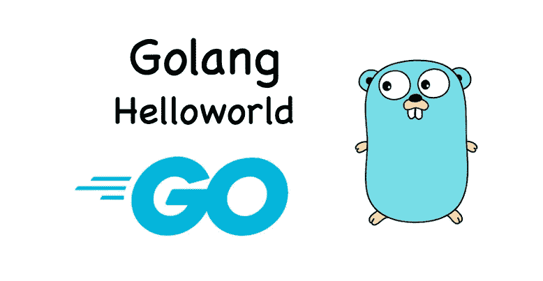

# 围棋中的 DevOps 你的第一个围棋程序

> 原文：<https://medium.com/geekculture/devops-in-go-your-first-go-program-14185d8892a1?source=collection_archive---------1----------------------->

## Go bootcamp 系列中的 DevOps

# 围棋为什么要 DevOps？

目前，大多数 DevOps 工程师使用`Python`作为他们的 DevOps 编程语言。但是`Python`带来了一些编译时和服务扩展的问题。

例如，简单地升级到 Python 的新版本(`Python2`到`Python3`，`Python3.7`到`Python3.11`)可能会导致您的…