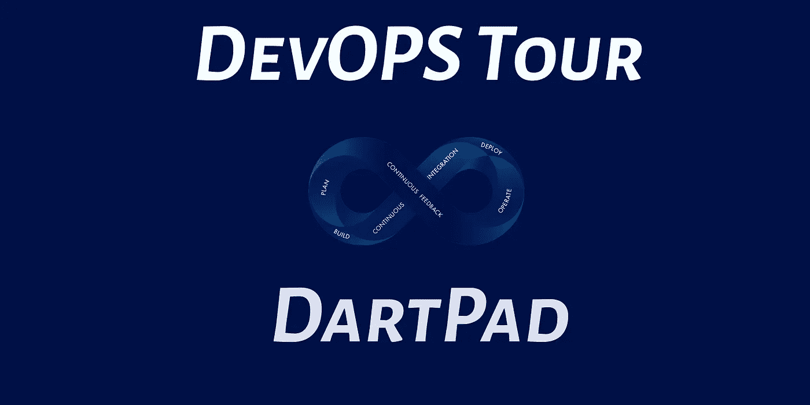

# DevOPS 旅游，镖靶

> 原文：<https://medium.com/geekculture/devops-tour-dartpad-ec86eaf29290?source=collection_archive---------23----------------------->

为什么 Dartpad 应该成为您的 DevOps 工具的一部分？为了展示和教导，很明显！通过使用运行代码的工具来报告前端 SDK 中的框架 SDK 问题更容易一些，这样开发团队就可以看到捕获的错误行为。

另一组原因与我们如何学习有关。让我陈述一些背景，然后进入为什么我们需要在紧耦合反馈和松耦合反馈之间来回循环…