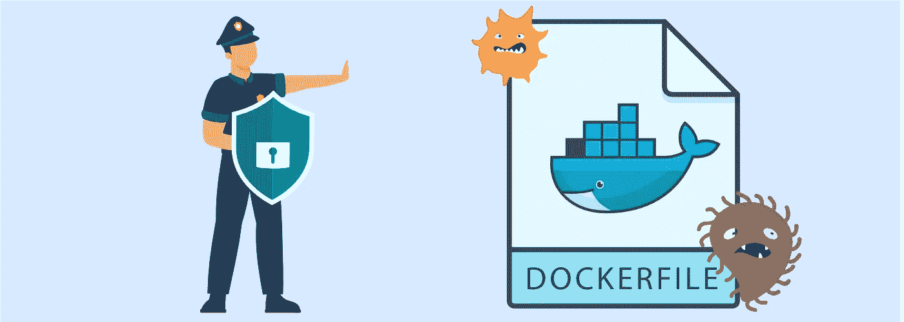
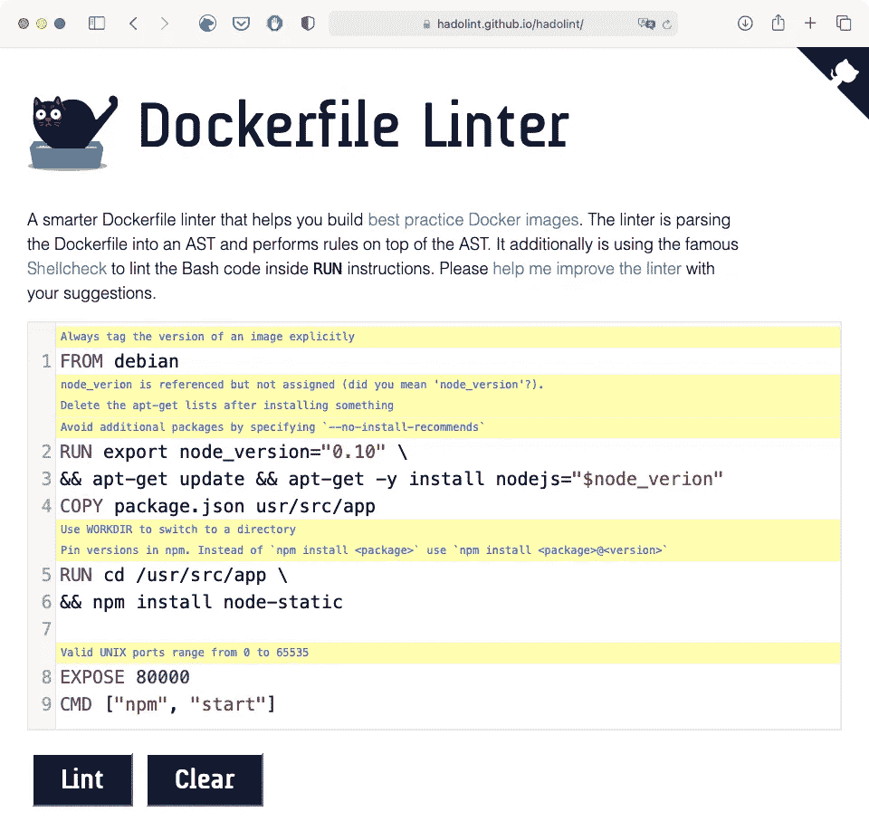
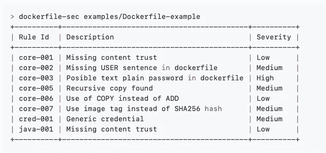

# DevSecOps 系列 2 —自动检查 docker 文件的安全性

> 原文：<https://medium.com/geekculture/devsecops-series-no-2-automatic-checking-dockerfiles-for-security-8709249c2367?source=collection_archive---------30----------------------->

关于 Docker 安全性以及如何创建安全的 Docker 文件已经写了很多。你可以在谷歌上找到安全提示和最佳实践。

这很好，但仍有一个大问题需要解决:如何自动化安全检查。

# 构建 Docker 映像的步骤

创建 docker 映像有两个步骤:

*   写文档。
*   从这个 Docker 文件构建 Docker 映像。

在这种情况下，我们将关注问题的第一部分:**docker file**的内容(在接下来的帖子中，我将介绍构建图像的安全检查)。

# 自动对文档进行安全检查

通常安全团队的资源有限。因此，将安全性包含在开发管道中的唯一方法是自动化该过程。

不管你用的是什么管道系统(Jenkins，Bamboo，Github actions，Gitlab pipelines，Bitbucket pipelines…)概念必须是相同的:当在 docker 文件中发现关键问题时，停止构建过程。

在这一点上，你可能会去 Github 寻找一些自动工具来检查 Dockerfiles 上的安全问题。别担心。我为你做的。

我发现最有趣的工具有两个:

*   哈多林特:[https://github.com/hadolint/hadolint](https://github.com/hadolint/hadolint)
*   docker file-security:[https://github.com/cr0hn/dockerfile-security](https://github.com/cr0hn/dockerfile-security)(剧透，我是它的作者)

让我们分析两者。

# 哈多林特

Hadolint 是非常好的工具。它是基于规则的，有很多内置的规则，不仅仅是为了安全。

这是一个单一的二进制工具。非常快而且是用 Haskell 写的。此外，有许多选项来定制分析。

该项目提供了该工具的在线版本，您无需在计算机中安装任何东西即可使用:

# docker file-安全性

Dockerfile-security it 是一个没有 Hadolint 那么雄心勃勃的工具。它更简单，被设计用于 C.I .(持续集成)系统。

这个工具专注于安全性。它是基于规则的，就像 Hadolint 一样。它也很快，是用 Python 写的，可以用 Python 包管理器`pip`安装。

它提供了一些内置的通用规则(称为**核心规则**)和一些针对特定场景的规则(例如，Java 特定规则)。

# Hadolint vs Dockerfile-security

两者各有优缺点。

## Hadolint 优点

*   大量的内置规则，不仅仅是为了安全。
*   独立二进制。
*   非常快。
*   对发现的问题的友好反馈。
*   在线版本

## Hadolint 缺点

*   Hadolint 是用 Haskell os 编写的，如果你需要包含一个新的规则，你必须用 Haskell 编写你的规则，然后重新编译这个工具。
*   Hadolint 没有以可解析格式导出结果的选项，比如 JSON o XML。

## docker file-安全专业人员

*   关注安全。
*   DevSecOps 聚焦。
*   非常快。
*   对发现的问题的友好反馈。
*   添加新规则非常简单。规则是基于纯 YAML 文本的。
*   可以从远程站点获取规则，提供完整的 URL。
*   结果可以导出为 JSON 文件。

## docker file-安全骗局

*   规则比 Hadolint 简单。
*   不是独立的二进制。

# 使用 Hadolint 还是 Dockefile-security

没有正确的答案。这取决于您的需求:

*   如果您不仅需要安全规则，Hadolint 可能是一个不错的选择。
*   如果您需要自己的自定义规则，Dockerfile-security 是最佳选择。

还有第三种选择:为什么只使用一种呢？为什么不两个都用？两者都非常快，很容易集成。所以…为什么不呢？

# 更多关于 DevSecOps 系列的帖子

前一篇文章: **DevSecOps 系列第 1 期——通过使用邪恶的 Git 库破解 CI/CD**

 [## DevSecOps 系列 1 —通过使用邪恶的 Git 库破坏 CI/CD

### 编辑描述

cr0hn.medium.com](https://cr0hn.medium.com/devsecops-series-1-breaking-the-ci-cd-by-using-evil-git-repositories-2eaa460f5d5b) 

下一篇: **DevSecOps 系列第三期 DevOps 中的旧时尚问题:拉链炸弹**

 [## DevSecOps 系列第 3 期 DevOps 的老问题:拉链炸弹。

### 今天我将谈论一种会影响您的生产系统的新旧攻击:Zip 炸弹。

cr0hn.medium.com](https://cr0hn.medium.com/devsecops-series-no-3-old-fashion-issues-in-devops-zip-bombs-d0045ffd57bd)