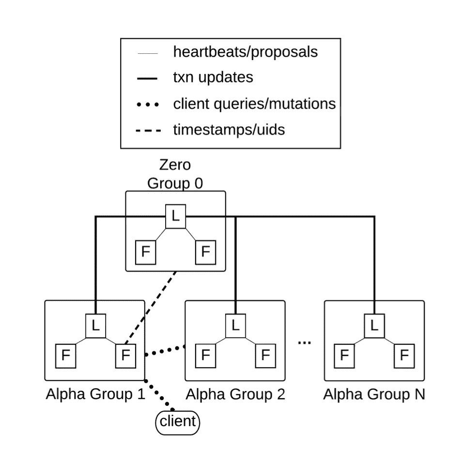
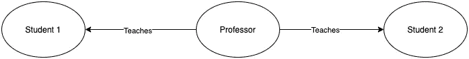
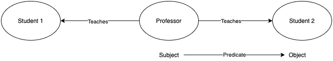
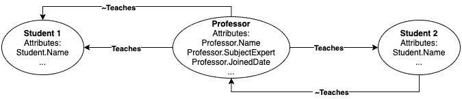
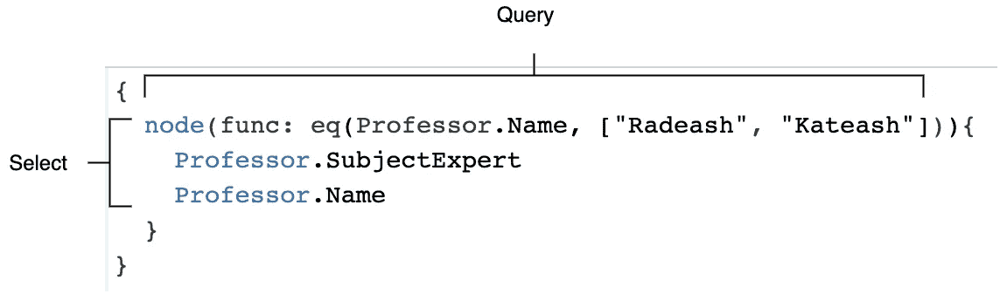
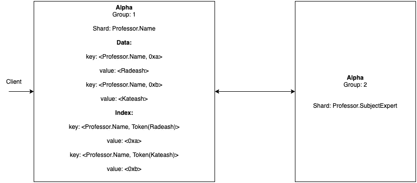

# d graph I:d graph 简介

> 原文：<https://medium.com/geekculture/dgraph-i-introduction-to-dgraph-2fcf00466f3f?source=collection_archive---------20----------------------->

你好，这是关于 Dgraph 的介绍帖。在这篇文章中，我将简单介绍一下在 it 中突变和查询是如何工作的。

Dgraph 代表 **D** 分布的**图。它是由 Dgraph 实验室开发的。目前，开源和完全是用 Golang 编写的。**

# 设计



Dgraph High-Level Overview of Different Components, credit: Dgraph White Paper

有两种类型的组件。

**零**，以 Raft 组号命名的管理服务器，是零组的一部分。在其他组中，运行一种不同类型的服务器，称为 **Alpha** 。在典型的设置中，应该只有一个零组和至少一个 alpha 组。

根据高可用性要求，每个组应该有一个领导者，其余的零个或多个副本/追随者。图中， **L** 表示领导者， **F** 表示跟随者。根据可伸缩性要求，可以在单个机器/节点或多个机器/节点中设置每个组及其关联的领导者、追随者。

每组使用 Raft 协议与另一组通信。每个领导者、跟随者也使用 Raft 协议相互通信，用于复制、故障转移等。

应用程序**客户端**将查询/变异到仅一个阿尔法组领导者以获得应用程序数据。

> 组的总数限制为 2 -1。

让我们详细讨论一下这些组件

## 零

如前所述，Zero 是一个管理服务器，其职责如下:

*   跟踪所有 Alpha 组的数据。
*   负责 Alpha 组之间的数据移动。
*   负责分发 node**u**nique**id**s。
*   维护[逻辑时间戳](https://en.wikipedia.org/wiki/Lamport_timestamp)并将它们交给 Alphas。分布式事务所需的。

## **阿尔法**

Alpha group 管理应用程序数据，是任何应用程序客户的联系点。无论哪个阿尔法小组管理哪个应用程序数据，客户都可以与任何阿尔法小组负责人交谈。

*   使用键值存储来存储应用程序数据。
*   借助 Zero 跟踪交易。
*   客户端与其中一个 Alpha 组就突变或查询进行对话。

让我们以一所大学为例，我们需要显示教授和学生之间的关系，并讨论 alpha 如何处理突变和查询。

## 教授-学生网络



Professor-Student Relationship

在我们的例子中，教授-学生网络由学生和教授之间的关系组成。在这个例子中，一位教授教学生 1 和学生 2。

**数据表示**



Professor-Student Relationship Dgraph Triples Presentation

在 Dgraph 中，数据呈现为**主谓宾**。在这个图像中，主语是教授，谓语是教师，宾语是学生。这里有一些关于这些的事实

*   **主题**总是由 **u** nique **id 唯一标识的节点。**
*   **谓词**总是表示一个关系，因此属于类型**字符串。**
*   **对象**可以是另一个节点(即 **u** nique **id** )或另一个原始数据类型的**属性**(通常是 golang 原始数据类型，因为 Dgraph 是用 GoLang 编写的)

**关系数据库类比**

对于 Postgres 订单表

```
+-----------+--------------------+---------------+
| prof_id   | subject_expert     |  student      |
+-----------+--------------------+---------------+
| prof_id_1 | Maths              | student_123   |
| prof_id_2 | Computer Science   | student_124   |
+-----------+--------------------+---------------+
```

现在，对于每一列**主题专家，**每行将有以下三元组。

**教授(uid)——>学科专家——>数学**

> 这里，uid 将从 prof_id 派生，但由 Dgraph 生成。

如果引用外键**付款人**的列，每行将有以下三元组。

**教授(uid)——>教师——>学生(uid)**

> 这里，Professor(uid)，Student(uid)将分别从 prof_id 和 student_id 派生，但由 Dgraph 生成。

## 突变

任何客户端都可以使用 Dgraph 查询语言(GraphQL 的修改版本)与 Dgraph 进行通信。在 DQL，客户端可以将数据以 JSON 格式或 RDF Nquad 格式发送给 alpha。在收到一个 DQL 请求后，Dgraph 将该请求分成三部分。

一个教授的 JSON 表示应该是这样的

```
{ "uid": "0xab1e89c", "Professor.Name": "Radeash", "Professor.SubjectExpert": "Maths", "Professor.JoinedDate": "2021-03-24T10:33:06Z", "Professor.Student": [{"uid": "0x71de296"...}...], "Professor.Student": [{"uid": "0x71ac27e"...}...]}
```

同样可以用 RDF 格式表示为

```
<0xab1e89c> <Professor.Name> "Radeash" .<0xab1e89c> <Professor.SubjectExpert> "Maths" .<0xab1e89c> <Professor.JoinedDate> "2021-03-24T10:33:06Z" .<0xab1e89c> <Professor.Student> <0x71de296> .<0xab1e89c> <Professor.Student> <0x71ac27e> .
```

> uid 是 golang 无符号整数(uint64)类型。



Professor-Student Relationship Dgraph Presentation

边缘是有方向的。要创建双向边，请使用反向边。客户不需要在图中创建每个单独的反向边，它只需要通知图。

**模式**

Dgraph 提供了对模式的支持，但这并不是获取数据的必要条件。在编写优化的查询时，模式很有帮助。

```
type <Student> {
  Student.Name
  <~Professor.Teaches>
}
type <Professor> {
  Professor.Name
  Professor.SubjectExpert
  Professor.JoinedDate
  Professor.Teaches
}
```

**存储引擎**

一旦 DQL 查询到达 Alpha，Alpha 会将查询分解成三元组，并将其转换为协议缓冲区数据。

如前所述，数据存储在一个名为 Badger 的嵌入式键值数据库中，用于磁盘上的数据输入输出。

为了简单起见，让我们看看 Alpha 如何使用三元组高效地存储数据。

让我们假设一位教授是多个学科的专家，因此 RDF 格式的相应三元组如下所示:

```
<0x01> <Professor.SubjectExpert> "Maths" .<0x01> <Professor.SubjectExpert> "Computer Science" .<0x01> <Professor.SubjectExpert> "Biology" .
```

现在，Dgraph 将这些数据以键值格式压缩为

**关键** : <谓语，主语>

**值**:排序压缩列表(<对象>)

所以，上面一组特定教授的三元组看起来会像

```
key = <Professor.SubjectExpert, 0x01>value = <"Maths", "Computer Science", "Biology", ...>
```

同样地，陶教授也教育多个学生。RDF 三元组看起来像

```
<0x02> <Professor.Teaches> <0xab> .<0x02> <Professor.Teaches> <0xbc> .<0x02> <Professor.Teaches> <0xcd> .
```

相应的存储键值将如下所示

```
key = <Professor.Teaches, 0x02>value = <0xab, 0xbc, 0xcd, ...>
```

> 该键值仅用于表示目的，如果对象是另一个节点/主题(排序整数编码)，Dgraph 会进一步压缩数据。

**数据分片**

没有分片就谈不上分布式数据库。Dgraph 智能分片数据，减少不同 Alpha 组之间的网络跳数。

*   基于谓词对数据进行分片。
*   每个碎片都属于一个阿尔法小组。
*   如果一个分片在一个组中变得太大，Zero 会基于不同的策略(比如分片大小、查询频率等)在可用的 Alpha 组中开始分片移动。

> 默认情况下，zero 配置了分片大小策略。虽然我自己没有验证过。

在上面的例子中，所有的数据都与谓词**顺序有关。付款人**将位于单个 Alpha 组中。

**关系数据库类比:**一个列由一个分片表示。

## 问题

一个典型的 Dgraph 查询可以找到许多 Alphas，这取决于谓词的位置。每个查询被细分为任务，每个任务负责一个谓词。

要编写任何查询，您应该熟悉以下内容:

**函数**:当全局 uid 空间需要限制在一个小集合(甚至单个 uid)时，提供一种简单的方法来查询 Dgraph。例如:eq、has、ge、gt 等。

**过滤器/交叉点**:组合多个函数来检索特定数据的方法。例如:AND、OR、NOT 等。

**索引**

为了提供更好的查询性能，Dgraph 提供了原始数据类型(string、DateTime、bool 等)的索引。).

> 索引仅适用于原始数据类型，因此仅适用于三元组的**对象**。

函数使用索引来查找使用值的节点。不同的类型支持不同类型的索引。例如，支持字符串类型的子字符串索引，而对于整数类型，只支持全整数搜索。(查看更多示例[此处](https://dgraph.io/docs/query-language/schema/#indexing))

索引的存储方式类似于数据的存储方式:

**键** : <谓词，令牌(数据)>

**值** : uids

这里的令牌是从数据中导出的。例如，在散列的情况下，index token(data)返回数据的散列。

**示例:prof-id 上的散列索引**

对于给定的教授姓名

```
<0x01> <Professor.Name> "Radeash" .<0x02> <Professor.Name> "Kateash" .<0x03> <Professor.Name> "Laceash" .
```

如果我们想使用 order-id 有效地找到一个节点/uid，下面的索引应该存在。

```
key = <Professor.Name, hash(Radeash)>
value = <0x01>

key = <Professor.Name, hash(Kateash)>
value = <0x02>

key = <Professor.Name, hash(Laceash)>
value = <0x03>
```

**查询执行**


Professor-Student Relationship Dgraph Presentation

假设我们想要在给定的图中找到给定的教授是否存在，并找到像 SubjectExpert 这样的节点的其他属性。

类似于基本 SQL 语法(选择和查询)的查询如下所示:



A sample DQL statement with SELECT and QUERY similarity with SQL statement

```
{
  node(func: eq(Professor.Name, ["Radeash", "Kateash"])){
    Professor.SubjectExpert
    Professor.Name
  }
}
```

它是如何在阿尔法小组中运行的？专家和教授。名字碎片出现在两个不同的阿尔法群体中？



Query Exection Across Different Alpha Groups

**查询执行步骤**

> 对于给定的教授姓名(“Radeash”、“Kateash”)
> 
> →从教授姓名中找出相应的标记
> 
> →从这些令牌中找到相应的 uid(本例中为 hash)
> 
> →对于每个请求的谓词，并行运行每个 uid
> 
> →教授。名字
> 
> →找到它的碎片
> 
> →找到该碎片所属的阿尔法组
> 
> →将该特定任务发送到那里。
> 
> →组合每个 uid 的所有谓词的结果

# 参考

*   [Dgraph 白皮书](https://github.com/dgraph-io/dgraph/blob/master/paper/dgraph.pdf)
*   [图形文件](https://dgraph.io/docs/)