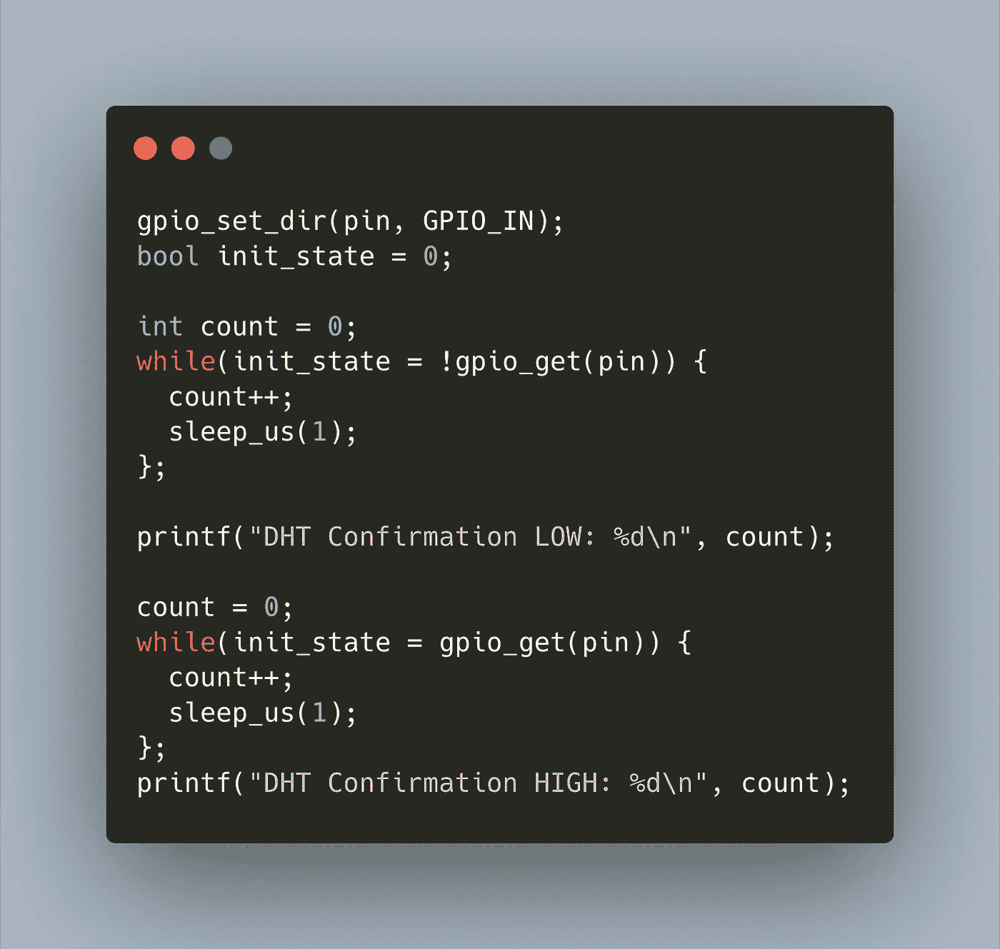

# 树莓 Pico 的 DHT1 温度传感器库

> 原文：<https://medium.com/geekculture/dht1-temperature-sensor-library-for-the-raspberry-pico-796122e83fe7?source=collection_archive---------44----------------------->



Raspberry Pico，简称 Pico，是 Raspberry Pi 基金会的一款新型微控制器。它提供了双核 ARM 处理器、2MB 闪存和 26 个 GPIO 引脚。您可以使用 C/C++ SDK 或 MicroPython 对 Pico 进行编程。我被这个设备迷住了，并开始开发一个用于控制移位寄存器的库，特别是 HC595N 移位寄存器。为了更好地掌握 Pico C SDK，我寻找了另一个可以开发库的传感器，并找到了 DHT11 温度传感器。

DHT11 传感器仅通过一个数据引脚连接。它还有一个交换数据的专有协议:发送低电压和高电压脉冲来激活传感器，然后读取代表编码温度读数的位模式的脉冲。

本文解释了我的开发旅程的第一部分:理解 DHT11 协议，创建库文件夹结构，然后尝试读取温度数据。

*本文原载于* [*我的博客*](https://admantium.com/blog/pico08_temperature_sensor_library/) 。

# 数据表

任何传感器的第一个接触点都是获取数据手册并了解其一般工作原理。我对 DHT11 传感器的参考是关于 mouser.com 的[文档。您阅读数据手册的次数越多，从中获得的信息就越多。以下列表总结了我对的主要关注:](https://www.mouser.com/datasheet/2/758/DHT11-Technical-Data-Sheet-Translated-Version-1143054.pdf)

*   引脚布局:传感器以三引脚或四引脚版本出售。四引脚版本实际上也是三引脚——他们只是焊接了(为了方便)另一个引脚。反正管脚就是 v-in，地，数据。
*   输入电压:支持 3–5.5V，因此可以直接连接到 Pico。
*   通信协议:数据引脚用作输入和输出。MCU 发送特征信号以在 DHT11 上执行“唤醒”呼叫。传感器确认此唤醒，然后发送 40 位数据
*   其他操作限制:传感器不应在通电后 1 秒内被请求，且查询频率不应超过每 2 秒一次。

有了这些事实，我们就可以开始实施了。

# 库设置

该库从[移位寄存器库](https://github.com/admantium-sg/rp2040-shift-register-74HC595)中分离到我的可信结构中:

*   `./`包含三种不同构建类型的中央`CMakeLists.txt`文件:仅库、测试和示例。
*   `./include`包含头文件
*   `./src`库源文件及其附带的 cmake 配置
*   使用 CMocka 框架，测试验证库对象和函数是正确的
*   `./examples`如何使用图书馆的简单食谱

# 核心对象和功能

该库使用以下签名公开结构对象`DHT11`:

```
typedef struct DHT11
{
  uint8_t DATA_PIN; double last_temp;
  double last_humidity; double temp_measurements[30];
  double humidity_measurements[30];} DHT11;
```

传感器对象是用`dht11_new`创建的，然后提供这些功能:

*   `dht11_probe()` -从传感器获取新的测量值，但仅在上次尝试后至少两秒钟时
*   `dht11_process()` -一种辅助方法，接收有序的 40 位数据，计算校验和，并在探测有效时更新内部值。
*   `dht11_get_last_temperature_measurement()` -返回最近的温度测量值
*   `dht11_get_last_humidity_measurement()` -返回最近的湿度测量值
*   `dht11_get_historic_temperature_measurement()` -从最后 30 个探头中检索温度测量值
*   `dht11_get_historic_humidity_measurement()` -从最后 30 个探头中检索湿度测量值

每个函数都有一个测试套件——参见 github 库中的 [test.c。我不会在本文中详述测试，而是将重点放在让传感器工作上。如果你对我的测试方法感兴趣，请阅读我之前的文章，关于用 CMocka 进行单元测试的](https://github.com/admantium-sg/pico-dht11-lib/blob/main/test/test.c)[和测试移位寄存器库的](https://admantium.com/blog/pico04_unit_tests_cmocka/)[。](https://pico06_shift_register_library_part2.md)

# 命令式协议验证

该程序的第一个版本可以概括为带有显式协议验证的命令性语句。

总体思路是定义处理传感器启动、传感器确认和传感器数据三个阶段的代码块。然后，每个阶段将使用一个计数器和一个`sleep_us`调用来明确等待数据手册中指定的时间。然后，我会在每个阶段之后输出一条调试语句，以确认传感器的行为符合预期。

# 启动和确认

启动信号很简单:

*   将数据引脚设置为输出
*   发送低电平 18 毫秒
*   为 20us 发送 HIGH

```
// I Activate DHT
{
  gpio_put(pin, 0);              // LOW
  sleep_ms(18);              // 18us gpio_put(pin, 1);              // HIGH
  sleep_us(20);              // 20us
}
```

要测试传感器确认阶段，具体步骤是:

*   将数据引脚设置为输入
*   等待 80 微秒后，读取一个低值
*   打印调试语句
*   等待 80us，读取高值

特别是代码:

```
// II Read DHT Confirmation
{
  gpio_set_dir(pin, GPIO_IN);
  bool init_state = 0; int count = 0;
  while(init_state = !gpio_get(pin)) {          // EXPECT LOW 80us
    count++;
    sleep_us(1);
  }; printf("DHT Confirmation LOW: %d\n", count); count = 0;
  while(init_state = gpio_get(pin)) {
    count++;
    sleep_us(1);
  };
  printf("DHT Confirmation HIGH: %d\n", count);  // EXPECT HIGH 80us
}
```

有了这个初始代码，我开始测试传感器。

# 小心硬件

在花了大约 4 个小时尝试显式等待，然后甚至不断地通过 GPIO 引脚写入/读取数据后，我无法从传感器获得任何响应。

要么是我的方法完全错误，要么是我把协议搞混了，但这与我在其他博客文章中看到的一致。所以我用 Arduino 连接了传感器，上传了可信的 [Adafruit DHT Lib exmaple](https://github.com/adafruit/DHT-sensor-library/blob/master/examples/DHTtester/DHTtester.ino) 草图..代码失败！只看到了错误信息`Failed to read from DHT sensor!`。传感器坏了，所有的时间都浪费了。

因此，我订购了一个新的传感器，上传了 Arduino 草图，并可以在串行终端上获得这些结果:

```
Humidity: 46.00%  Temperature: 24.30°C 75.74°F  Heat index: 23.99°C 75.18°F
```

传感器坏了！当问题出在硬件上的时候，我浪费了大量的时间和精力去修复代码。嵌入式软件开发中的重要一课。

# 把握好时机

即使有一个工作传感器，我也没有成功地得到正确的时间。无论是阅读数据手册，还是用另一个数据手册仔细检查，或者查看官方的 Pico 示例，或者查看同一类型传感器的 Arduino 库，都于事无补。两个库都在传感器指定的时间内显式调用`sleep`,但是我无法完成。投入更多的项目时间来研究我的代码中各种语句的时间效应——比如计数器的影响是什么，printf 的影响是什么——也不起作用。

我花了一些时间研究其他项目，发现 MicroPython 可以实现这种传感器。这些图书馆使用的是 Pico PIO 系统，这是 Pico 上的一个特殊的硬件系统，你用类似汇编的语言编程。我放弃了纯 C，决定考察一下 Pico 的利用率。下一篇博客文章将详细介绍如何使用 Pico。

# 结论

我第一次尝试从 DHT 传感器读取温度数据失败了。我想了很久这个过程，以及我是否应该写一个失败的尝试。我当然应该，因为我想分享这些重要的知识。首先，始终检查您正在使用的硬件是否正常工作。我浪费了 4 个小时来修复一个坏了的传感器上不工作的代码。第二，据我所知，仅用 C SDK 很难获得非常精确的计时——如果你在这个方向上取得了更好的进展，请告诉我。

下一篇文章将间接继续传感器的开发:我们将学习 PIO 系统的基础知识，并看看如何将它包含在 C 程序中。