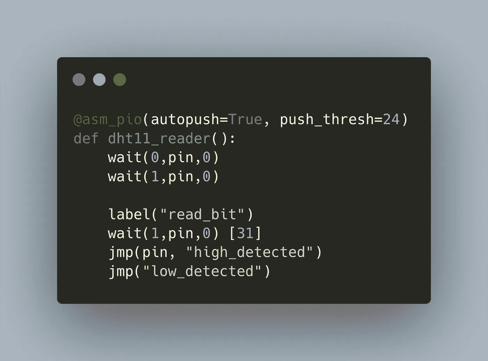

# 用于 Raspberry Pico: Python 原型的 DHT11 温度传感器库

> 原文：<https://medium.com/geekculture/dht11-temperature-sensor-library-for-the-raspberry-pico-python-prototype-5ba9f246c9e?source=collection_archive---------22----------------------->



Raspberry Pico，简称 Pico，是 Raspberry Pi 基金会的一款新型微控制器。它提供了双核 ARM 处理器、2MB 闪存和 26 个 GPIO 引脚。您可以使用 C/C++ SDK 或 MicroPython 对 Pico 进行编程。我被这个设备迷住了，并开始开发一个用于读取 DHT11 温度传感器的库。然而，为了获得专有 1 线要求的准确时序要求，我们需要使用 PIO 子系统。

上一篇文章解释了 Pio 系统和语言。在本文中，我将设计并实现一个连接 DHT11 传感器的 PIO 原型程序。原型负责向传感器发送所需的启动信号，然后记录其响应，即 26–70 us 范围内的电脉冲，即编码的传感器数据。使用 MicroPython 进行开发:交互式 REPL 环境和脚本语言的特性提供了一个灵活的环境。

*本文原载于* [*我的博客*](https://admantium.com/blog/pico11_temperature_sensor_python_prototype/) 。

# DHT11 协议概述

DHT11 协议在单线连接上工作。此线路为高电平有效。要启用 DHT 11 传感器

*   发送低电平至少 18 毫秒
*   释放低电平
*   预计 80us 价格较低
*   对 80us 的期望很高

然后，传感器通过电线发送不同类型的脉冲，传输总量为 40 位的数据:

*   第 0 位:高电平代表 26-28 微秒，低电平代表 50 微秒
*   第 1 位:高电平 50us，随后高电平 70us

40 位数据分为 2x8 位温度数据、2x 8 位湿度数据和 8 位校验和数据。

# PIO 程序设计

让我们考虑一下 PIO 计划的要点:

*   可以拥有灵活的引脚映射来读写数据
*   133MHZ 的频率可以用一个 8 位分频器值来调整
*   可以有 32 条指令
*   可以写入 32 位寄存器(或 64 位寄存器，如果状态机的两个 FIFOs 合并)

这些约束以下列方式塑造了程序方法:

*   该程序需要以足够精细的频率工作，以捕捉 28us 和 70us 之间的差异，并且还包括启动期间的 18ms
*   我们需要将同一个引脚定义为输入和输出引脚
*   引脚为高电平有效，在 DHT11 启动阶段后，它将其角色从输出切换到输入，以使用正确的 PIO 语句
*   我们需要记录 32 位有效载荷和 8 位校验和数据

经过一些实验后，我想到了一种设计，它可以用纯粹的 MicroPython 命令激活 DHT11 传感器，然后启动一个状态机，该状态机运行缓慢，足以检测 DHT 信号中的 26–28 us 脉冲。

# 程序原型

我们将一步一步地实现这个程序，一次解决一个约束。

# MicroPython PIO 计划要点

带有嵌入式 PIO 程序的 MicroPython 程序的一般设置如下。此示例显示了如何使单个 LED 闪烁。

```
from rp2 import PIO, StateMachine, asm_pio
from machine import Pin
import time@asm_pio(set_init=PIO.OUT_LOW)
def pio_program():
    set(pins, 1) [31]
    nop()        [31]
    set(pins, 0) [31]state_machine = StateMachine(0, pio_program, freq = 2000, set_base=Pin(25))state_machine.active(1)
```

在该程序中，发生以下步骤:

*   第 1–3 行:`import`语句定义了程序所需的对象
*   第五行。:装饰器`@asm_pio`将下一个方法标识为 PIO 程序。装饰器接受定制状态机的所有参数，比如引脚的初始方向、ISR/OSR 的移位方向以及 push 和 pull 方法的自动或阈值
*   第 7–9 行:官方文档[中记录的 Pio 汇编程序命令](https://datasheets.raspberrypi.org/pico/raspberry-pi-pico-c-sdk.pdf)。在 MicroPython 中，命名约定有细微的差别，所以请务必阅读[社区文档](https://dernulleffekt.de/doku.php?id=raspberrypipico:pico_pio)以及[浏览示例](https://github.com/raspberrypi/pico-micropython-examples/blob/master/pio/pio_spi.py)
*   第 11 行:PIO 程序用于构建一个状态机。该对象接收两个强制参数——状态机 id 和包含 PIO 程序的函数名。其他参数是频率和各种引脚设置(on、out、side、set 和 jmp 引脚)
*   第 13 行:实例化的状态机被激活

# 频率计算

您可以将 PIO 节目频率设置为 2Khz 到 133Mhz 之间的任何频率。使用[在线工具](https://www.sensorsone.com/period-to-frequency-calculator/)，我们可以看到频率如何转化为秒:`2000 Hz = 500us`、`5000 Hz = 200us`和`10000 Hz = 100us`。然而，频率决定了程序中所有指令的运行速度。因此，我们首先计算所有指令的周期为`cycle = target_frequency * (number of statements + wait cycles)`，状态机的频率为`state_machine_frequency = cycle * * (number of statements + wait cycles)`

对于启动程序，我们需要运行大约 26us。如果我们的目标是总共 20 条指令，这就转化为`2000Hz / 20 = 100Hz = 10ms = 10000us`——发送 40us 信号太快了。反过来`25000 / 20 = 25000 Hz = 0.04ms = 40us`——这将迫使 use 等待 500 条指令。

因此，启动器 PIO 程序将只发送初始脉冲，所有其他计算将由另一个状态机运行。

读取器状态机有 16 条指令，1 条指令将被停止 31 个周期。所以状态机的周期需要为`1us * (16+31)= 21277Hz`，总频率为`21277Hz * (16 + 31) = 1000019Hz`。

频率配置如下:

```
dht_reader = StateMachine(1,dht11_reader, freq = 1000019)
```

# 引脚设置和配置

如前所述，DHT11 启动序列被 MicroPython 部分覆盖，然后 PIO 程序将被启动。

启动序列包括用上拉电阻将引脚设置为输出模式，然后发送初始高电压 250ms，然后发送低脉冲 40ms。

```
dht_pin = Pin(15, Pin.OUT, Pin.PULL_DOWN)
dht_pin.value(1)
utime.sleep_ms(250)
dht_pin.value(0)
utime.sleep_ms(20)
```

然后，我们将引脚更改为上拉输入，并启动状态机。该引脚将同时用作输入引脚(因为我们将从中读取一个值)和跳转引脚(因为我们将使用其状态进行分支语句)。

```
dht_pin = Pin(15, Pin.IN, Pin.PULL_UP)
dht_reader = StateMachine(1,dht11_reader, freq = 1000019, in_base=dht_pin, jmp_pin=dht_pin
```

# 读取和推送数据

最后一个要求是实现检测 DHT11 脉冲的核心逻辑，并将其转换为数据。经过几次尝试，我采用了一种受这个论坛启发的方法。本质上，PIO 计划执行以下步骤:

*   等待引脚变为低电平，然后等待引脚变为高电平，捕捉 DHT11 响应信号
*   开始`read_bit`循环，它将再次等待引脚变低
*   然后，当 pin 变高时，等待 32us 并读取 pin 值:如果它仍然为高，则 DHT 发送位`0b1`，否则它的`0b0`
*   调用相应的`high_detected`和`low_detected`代码块向 ISR 写入 3 位数据
*   读取下一位

每当写入 24 位时，结果将自动推送到状态机。

完整的 PIO 程序如下。

```
@asm_pio(autopush=True, push_thresh=24)
def dht11_reader():
    # ínitial LOW-HIGH confirmation pulse
    wait(0,pin,0)
    wait(1,pin,0) # Main loop
    # General idea: if pin changes from high to low within 32 cycles, its logic 1, otherwise logic 0
    label("read_bit")
    wait(1,pin,0) [31]
    jmp(pin, "high_detected")
    jmp("low_detected") # Write 0b111 = (7), return to pattern loop
    label("high_detected")
    set(y,0b111)
    in_(y,3)
    wait(0,pin,0)
    jmp("read_bit") # Write 0b100 =(4), return to pattern loop
    label("low_detected")
    set(y,0b100)
    in_(y,3)
    wait(0,pin,0)
    jmp("read_bit")
```

# 主程序

主程序开始一个无限循环。等待 DHT11 传感器通电 2.5ms 后，程序向传感器发送启动信号，启动状态机，并读取 5 次 24 位数据。数据将作为字符串存储在数组中。一旦完成，捕获的数据将作为二进制数打印到屏幕上，然后转换成湿度和温度值。

```
print("Starting DHT11 Program ...")i = 0
while True:
    sleep(2.0) i +=1
    print("Cycle {} - Running state machine ...".format(i)) dht_pin = Pin(15, Pin.OUT, Pin.PULL_DOWN)
    dht_pin.value(1)
    utime.sleep_ms(250)
    dht_pin.value(0)
    utime.sleep_ms(30)
    dht_pin = Pin(15, Pin.IN, Pin.PULL_UP)
    dht_reader = StateMachine(1,dht11_reader, freq = 1000019, in_base=dht_pin, jmp_pin=dht_pin) dht_reader.active(1)
    data = []
    for _ in range(5):
        data.append(bin(dht_reader.get())) dht_reader.active(0)
    sleep(0.5) for d in data:
        print(d)
```

# 输出示例

2021 年 7 月 3 日 10:27 在我房间进行的测量得出以下数据:

```
Starting DHT11 Program ...
Cycle 1 - Running state machine ...
0b100111111100100100111111
0b111111100111111111111100
0b111111100100100111100100
0b111111111100100111100100
0b100100100100111100100111Temperature: 24.2 Degree Celcius
Humidity: 48.1 %Temperature: 24.3 Degree Celcius
Humidity: 48.2 %
```

# 结论

本文详细介绍了使用 MicroPython 读取 DHT11 温度传感器的 PIO 程序的实现。我们了解了 PIOs 的基本特性——频率选择、灵活的引脚映射、使用 32 位寄存器——以及 DHT11 的限制——80 毫秒到 24 微秒之间的读/写操作、将单引脚角色从输出切换到输入、写入 8 位数据块。由此，我们一步一步地设计了一个程序。最后，这个项目成功了，但是开发时间和努力是巨大的。使用 PIO 的最初目标是获得精确的时间控制，然而我发现这只是在花费时间的高代价下实现的。最后，我还发现了一个用于 DHT11 的纯粹的 MicroPython 库，它可以完美地工作，并且考虑到最近对 Arduino 框架的支持，这种传感器的 C 库可以与 Pico 兼容。由于这些原因，我不会继续开发 Pico C-SDK DHT11 库。