# 使用机器学习 Python 进行糖尿病预测

> 原文：<https://medium.com/geekculture/diabetes-prediction-using-machine-learning-python-23fc98125d8?source=collection_archive---------3----------------------->

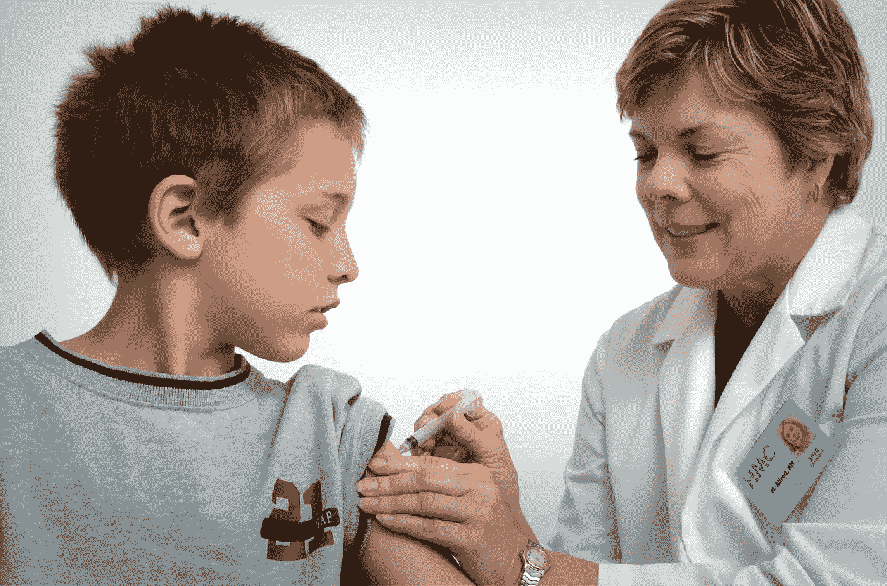

Photo by [CDC](https://unsplash.com/@cdc?utm_source=unsplash&utm_medium=referral&utm_content=creditCopyText) on [Unsplash](https://unsplash.com/s/photos/doctor-with-patient?utm_source=unsplash&utm_medium=referral&utm_content=creditCopyText)

# **表格内容**

1.  介绍
2.  安装库
3.  导入数据
4.  缺失值分析
5.  探索性数据分析
6.  特征工程
7.  建模
8.  预言；预测；预告
9.  结论

# **简介**

糖尿病是一种影响身体将食物转化为能量的健康状况。你吃的大部分食物被分解成糖(也称为葡萄糖)并释放到你的血液中。当你的血糖升高时，它会向你的胰腺发出释放胰岛素的信号。

如果没有持续、仔细的管理，糖尿病会导致血液中糖分的积累，从而增加危险并发症的风险，包括中风和心脏病。所以我决定用 Python 来预测机器学习。

## **目标**

1.  预测该人是否是糖尿病患者
2.  找到糖尿病最有代表性的特征
3.  尝试不同的分类方法，找到最高的准确性

# 安装库

在第一步中，我已经导入了 python 中用于机器学习的最常见的库，如 Pandas、Seaborn、Matplitlib 等。

我使用 Python 是因为它是我用过的非常灵活和有效的编程语言。我也在软件开发领域使用 Python。

```
# Import libraries
import numpy as np *# linear algebra*
import pandas as pd *# data processing, CSV file I/O (e.g. pd.read_csv)*
import seaborn as sns *# for data visualization*
import matplotlib.pyplot as plt *# to plot charts*
from collections import Counter
import os

*# Modeling Libraries*
from sklearn.preprocessing import QuantileTransformer
from sklearn.metrics import confusion_matrix, accuracy_score, precision_score
from sklearn.ensemble import RandomForestClassifier, AdaBoostClassifier, GradientBoostingClassifier, VotingClassifier
from sklearn.linear_model import LogisticRegression
from sklearn.neighbors import KNeighborsClassifier
from sklearn.tree import DecisionTreeClassifier
from sklearn.svm import SVC
from sklearn.model_selection import GridSearchCV, cross_val_score, StratifiedKFold, learning_curve, train_test_split
```

sklearn 库非常通用和方便，并且服务于真实世界的目的。它提供了广泛的 ML 算法和模型。

> [阅读完整笔记本**糖尿病预测使用 Python** 上 Kaggle](https://www.kaggle.com/gopalj/diabetes-prediction-using-python)

# 导入数据

在这个项目中，我使用了来自 [Kaggle](https://www.kaggle.com/) 的[皮马印第安人糖尿病数据库](https://www.kaggle.com/gopalj/diabetes-prediction-using-python/data)。这个数据集最初来自国家糖尿病、消化和肾脏疾病研究所。

```
# Import dataset
df = pd.read_csv("../input/pima-indians-diabetes-database/diabetes.csv")*# Get familier with dataset structure*
df.info()
```

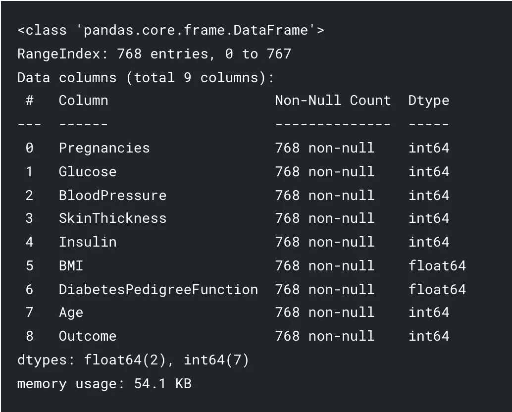

除身体质量指数和糖尿病外，所有列都是整数。结果是包含 1 和 0 值的标签。1 表示该人患有糖尿病，0 表示该人没有糖尿病。

```
*# Show top 5 rows*
df.head()
```

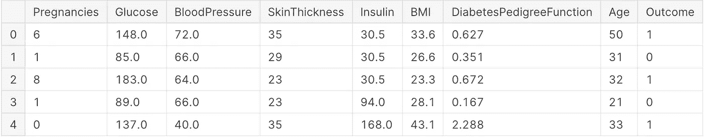

# 缺失值分析

接下来，我将清理数据集，这是数据科学的重要组成部分。在建模和预测过程中，缺失数据会导致错误的统计数据。

```
*# Explore missing values*df.isnull().sum()
```

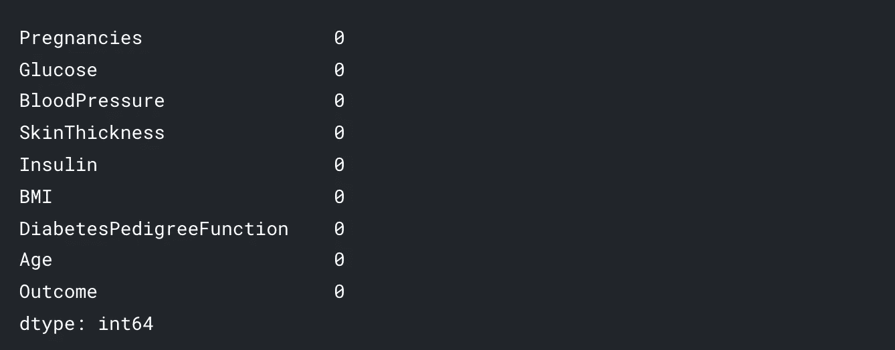

Missing Value Analysis

我观察到数据集中没有缺失值，但是葡萄糖、血压、胰岛素、皮肤厚度等特征的值为 0，这是不可能的。我们必须用特定列的平均值或中值替换 0 值。

```
df['Glucose'] = df['Glucose'].replace(0, df['Glucose'].mean())*# Correcting missing values in blood pressure*
df['BloodPressure'] = df['BloodPressure'].replace(0, df['BloodPressure'].mean()) # There are 35 records with 0 BloodPressure in dataset*# Correcting missing values in BMI*
df['BMI'] = df['BMI'].replace(0, df['BMI'].median())*# Correct missing values in Insulin and SkinThickness*

df['SkinThickness'] = df['SkinThickness'].replace(0, df['SkinThickness'].median())
df['Insulin'] = df['Insulin'].replace(0, df['Insulin'].median())
```

现在，让我们回顾一下数据集统计数据

```
*# Review dataset statistics*
df.describe()
```

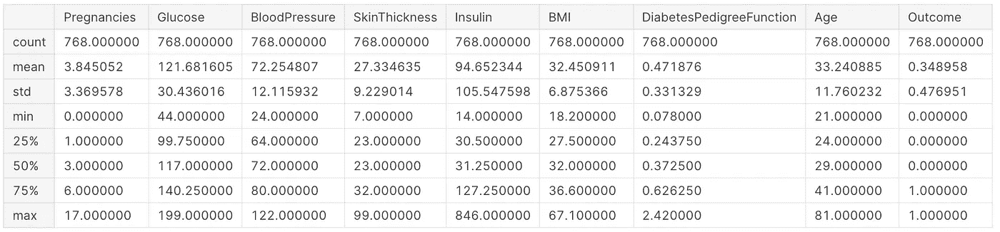

现在我有了一个干净的数据集，特征中没有丢失值，这很好。

# 探索性数据分析

在这一步，我使用 GUI 展示了使用 [Seaborn](https://seaborn.pydata.org/) 的分析。

**相关性**

相关性是**一个或多个变量彼此相关**。这也有助于在我开始建模之前发现特征的重要性并清理数据集

```
plt.figure(figsize=(13,10))
sns.heatmap(df.corr(),annot=True, fmt = ".2f", cmap = "coolwarm")
```

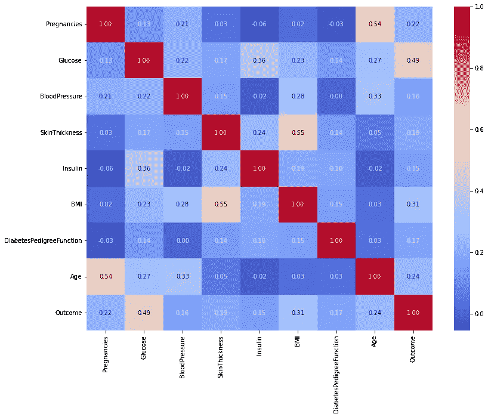

根据观察，怀孕、血糖、身体质量指数和年龄等特征与结果更相关。在接下来的步骤中，我展示了这些特性的细节表现。

**怀孕**

患有糖尿病的女性能够并且确实拥有健康的妊娠和健康的婴儿。管理糖尿病有助于降低并发症的风险。未经治疗的糖尿病会增加妊娠并发症的风险，如高血压、抑郁症、早产、出生缺陷和流产。

> [https://www . marchofdimes . org/complications/pre existing-diabetes . aspx](https://www.marchofdimes.org/complications/preexisting-diabetes.aspx)

```
*# Explore* Pregnancies *vs Outcome*plt.figure(figsize=(13,6))
g = sns.kdeplot(df["Pregnancies"][df["Outcome"] == 1], 
     color="Red", shade = True)
g = sns.kdeplot(df["Pregnancies"][df["Outcome"] == 0], 
     ax =g, color="Green", shade= True)g.set_xlabel("Pregnancies")
g.set_ylabel("Frequency")
g.legend(["Positive","Negative"])
```


**结果**

结果有 1 和 0 值，其中 1 表示此人有糖尿病，0 表示此人没有糖尿病。这是我在数据集中的标签列。

```
sns.countplot('Outcome', data = df)
```


这表明，在数据集中有更多的人没有患糖尿病，大约是 65%，而 35%的人患有糖尿病。

**葡萄糖**

```
# Explore Gluecose vs Outcomeplt.figure(figsize=(10,6))
sns.violinplot(data=df, x="Outcome", y="Glucose",
               split=True, inner="quart", linewidth=1)
```

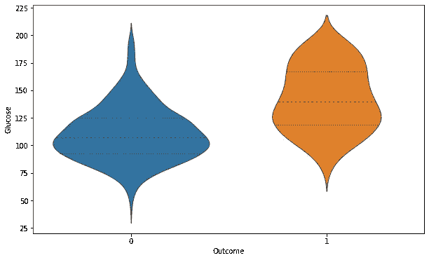

随着血糖水平的升高，患糖尿病的几率逐渐增加。

```
*# Explore Glucose vs Outcome*

plt.figure(figsize=(13,6))
g = sns.kdeplot(df["Glucose"][df["Outcome"] == 1], color="Red", shade = True)
g = sns.kdeplot(df["Glucose"][df["Outcome"] == 0], ax =g, color="Green", shade= True)
g.set_xlabel("Glucose")
g.set_ylabel("Frequency")
g.legend(["Positive","Negative"])
```

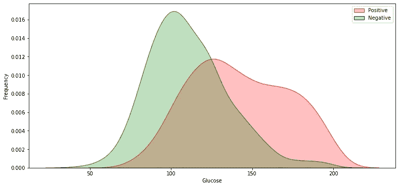

**探索葡萄糖 vs 身体质量指数 vs 年龄**

```
*# Glucose vs BMI vs Age*

plt.figure(figsize=(20,10))
sns.scatterplot(data=df, x="Glucose", y="BMI", hue="Age", size="Age")
```

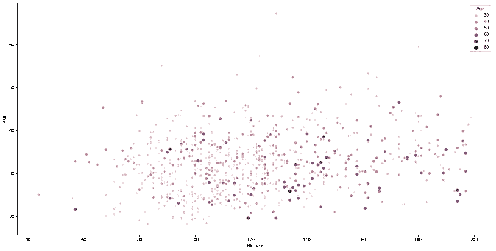

根据观察，特征中有一些异常值。我们需要去除特征工程中的异常值。

# 特征工程

到目前为止，我研究了数据集，做了缺失值校正和数据可视化。接下来，我开始了特征工程。特征工程对于提高机器学习算法的性能是有用的，并且通常被认为是应用机器学习。

选择重要的特征并减少特征集的大小使得机器学习和数据分析算法中的计算更加可行。

**异常值检测**

在这一部分中，我删除了 dataset 中列出的所有记录。离群值会影响模型的准确性。我使用 *Tukey 方法*用于异常值检测。

```
def detect_outliers(df,n,features):
    outlier_indices = []
    *"""*
 *Detect outliers from given list of features. It returns a list of the indices*
 *according to the observations containing more than n outliers according*
 *to the Tukey method*
 *"""*
    *# iterate over features(columns)*
    for col **in** features:
        Q1 = np.percentile(df[col], 25)
        Q3 = np.percentile(df[col],75)
        IQR = Q3 - Q1

        *# outlier step*
        outlier_step = 1.5 * IQR

        *# Determine a list of indices of outliers for feature col*
        outlier_list_col = df[(df[col] < Q1 - outlier_step) | (df[col] > Q3 + outlier_step )].index

        *# append the found outlier indices for col to the list of outlier indices* 
        outlier_indices.extend(outlier_list_col)

    *# select observations containing more than 2 outliers*
    outlier_indices = Counter(outlier_indices)
    multiple_outliers = list( k for k, v **in** outlier_indices.items() if v > n )

    return multiple_outliers   

*# detect outliers from numeric features*
outliers_to_drop = detect_outliers(df, 2 ,["Pregnancies", 'Glucose', 'BloodPressure', 'BMI', 'DiabetesPedigreeFunction', 'SkinThickness', 'Insulin', 'Age'])
```

在这里，我发现了所有特征的异常值，如怀孕、血糖、血压、身体质量指数、糖尿病、胰岛素、皮肤厚度和年龄。

```
df.drop(df.loc[outliers_to_drop].index, inplace=True)
```

我现在已经成功地从数据集中移除了所有异常值。下一步是在训练和测试中分割数据集，并进行建模。

# 建模

在这一部分中，我尝试了不同的模型，并比较了每个模型的准确性。然后，我对具有高精度的模型执行超参数调整。

在分割数据集之前，我需要使用`sklearn.preprocessing`将数据转换成分位数。

```
# Data Transformation
q  = QuantileTransformer()
X = q.fit_transform(df)
transformedDF = q.transform(X)
transformedDF = pd.DataFrame(X)
transformedDF.columns =['Pregnancies', 'Glucose', 'BloodPressure', 'SkinThickness', 'Insulin', 'BMI', 'DiabetesPedigreeFunction', 'Age', 'Outcome']# Show top 5 rows
transformedDF.head()
```

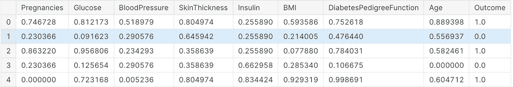

Data Transformation

**数据拆分**

接下来，我在测试和训练数据集中拆分数据。训练数据集将用于模型训练和评估，测试数据集将用于预测。在预测测试数据之前，我对各种模型进行了交叉验证。

```
features = df.drop(["Outcome"], axis=1)
labels = df["Outcome"]x_train, x_test, y_train, y_test = train_test_split(features, labels, test_size=0.30, random_state=7)
```

上面的代码将数据集分为训练(70%)和测试(30%)数据集。

**交叉验证模型**

```
def evaluate_model(models):
    *"""*
 *Takes a list of models and returns chart of cross validation scores using mean accuracy*
 *"""*

    *# Cross validate model with Kfold stratified cross val*
    kfold = StratifiedKFold(n_splits = 10)

    result = []
    for model **in** models :
        result.append(cross_val_score(estimator = model, X = x_train, y = y_train, scoring = "accuracy", cv = kfold, n_jobs=4))

    cv_means = []
    cv_std = []
    for cv_result **in** result:
        cv_means.append(cv_result.mean())
        cv_std.append(cv_result.std())

    result_df = pd.DataFrame({
        "CrossValMeans":cv_means,
        "CrossValerrors": cv_std,
        "Models":[
            "LogisticRegression",
            "DecisionTreeClassifier",
            "AdaBoostClassifier",
            "SVC",
            "RandomForestClassifier",
            "GradientBoostingClassifier",
            "KNeighborsClassifier"
        ]
    })

    *# Generate chart*
    bar = sns.barplot(x = "CrossValMeans", y = "Models", data = result_df, orient = "h")
    bar.set_xlabel("Mean Accuracy")
    bar.set_title("Cross validation scores")
    return result_df
```

*方法“evaluate_model”采用模型列表，并使用平均准确度返回交叉验证分数图表。*

```
*# Modeling step Test differents algorithms* 
random_state = 30
models = [
    LogisticRegression(random_state = random_state, solver='liblinear'),
    DecisionTreeClassifier(random_state = random_state),
    AdaBoostClassifier(DecisionTreeClassifier(random_state = random_state), random_state = random_state, learning_rate = 0.2),
    SVC(random_state = random_state),
    RandomForestClassifier(random_state = random_state),
    GradientBoostingClassifier(random_state = random_state),
    KNeighborsClassifier(),
]
evaluate_model(models)
```

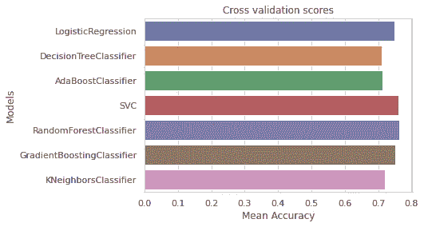

Cross Validate Models

根据以上观察，我发现 SVC、RandomForestClassifier 和 LogisticRegression 模型更准确。接下来，我将对三个模型进行超参数调整。

**超参数调谐**

超参数调整是为学习算法选择一组最佳超参数。超参数是一个模型参数，其值在学习过程开始之前就已设定。机器学习算法的关键是超参数调整。

我对 SVC、RandomForestClassifier 和 LogisticRegression 模型逐一进行了调优。

```
# Import libraries
from sklearn.model_selection import GridSearchCV
from sklearn.metrics import classification_reportdef analyze_grid_result(grid_result):
    '''
    Analysis of GridCV result and predicting with test dataset
    Show classification report at last
    ''' # Best parameters and accuracy
    print("Tuned hyperparameters: (best parameters) ", grid_result.best_params_)
    print("Accuracy :", grid_result.best_score_)

    means = grid_result.cv_results_["mean_test_score"]
    stds = grid_result.cv_results_["std_test_score"]
    for mean, std, params in zip(means, stds, grid_result.cv_results_["params"]):
        print("%0.3f (+/-%0.03f) for %r" % (mean, std * 2, params))
    print() print("Detailed classification report:")
    y_true, y_pred = y_test, grid_result.predict(x_test)
    print(classification_report(y_true, y_pred))
    print()
```

首先我已经从 sklearn 库导入了 GridSearchCV 和 classification_report。然后，我定义了显示预测结果的“analyze_grid_result”方法。我为 SearchCV 中使用的每个模型调用了这个方法。在下一步中，我将对每个模型进行调优。

**物流回归**

```
# Define models and parameters for LogisticRegression
model = LogisticRegression(solver='liblinear')
solvers = ['newton-cg', 'liblinear']
penalty = ['l2']
c_values = [100, 10, 1.0, 0.1, 0.01]# Define grid search
grid = dict(solver = solvers, penalty = penalty, C = c_values)
cv = StratifiedKFold(n_splits = 50, random_state = 1, shuffle = True)
grid_search = GridSearchCV(estimator = model, param_grid = grid, cv = cv, scoring = 'accuracy', error_score = 0)
logi_result = grid_search.fit(x_train, y_train)# Logistic Regression Hyperparameter Result
analyze_grid_result(logi_result)
```

输出:

```
Tuned hyperparameters: (best parameters)  {'C': 10, 'penalty': 'l2', 'solver': 'liblinear'}
Accuracy : 0.7883636363636363
Detailed classification report:

              precision    recall  f1-score   support

           0       0.78      0.84      0.81       147
           1       0.68      0.58      0.62        83

    accuracy                           0.75       230
   macro avg       0.73      0.71      0.72       230
weighted avg       0.74      0.75      0.74       230
```

根据我的观察，在 LogisticRegression 中，它使用` *{'C': 10，' penalty': 'l2 '，' solver ':' liblinear ' }【T10]`参数返回了最佳得分 0.78。接下来，我将对其他模型进行调优。*

**SVC**

```
# Define models and parameters for LogisticRegression
model = SVC()# Define grid search
tuned_parameters = [
    {"kernel": ["rbf"], "gamma": [1e-3, 1e-4], "C": [1, 10, 100, 1000]},
    {"kernel": ["linear"], "C": [1, 10, 100, 1000]},
]
cv = StratifiedKFold(n_splits = 2, random_state = 1, shuffle = True)
grid_search = GridSearchCV(estimator = model, param_grid = tuned_parameters, cv = cv, scoring = 'accuracy', error_score = 0)
scv_result = grid_search.fit(x_train, y_train)# SVC Hyperparameter Result
analyze_grid_result(scv_result)
```

输出:

```
Tuned hyperparameters: (best parameters)  {'C': 10, 'kernel': 'linear'}
Accuracy : 0.7775797976410084
Detailed classification report:

              precision    recall  f1-score   support

           0       0.78      0.84      0.81       147
           1       0.67      0.57      0.61        83

    accuracy                           0.74       230
   macro avg       0.72      0.70      0.71       230
weighted avg       0.74      0.74      0.74       230
```

SVC 模型给出的最大精度为 0.77，略低于逻辑回归。我不会再用这个型号了。

**RandomForestClassifier**

```
# Define models and parameters for LogisticRegression
model = RandomForestClassifier(random_state=42)# Define grid search
tuned_parameters = { 
    'n_estimators': [200, 500],
    'max_features': ['auto', 'sqrt', 'log2'],
    'max_depth' : [4,5,6,7,8],
    'criterion' :['gini', 'entropy']
}
cv = StratifiedKFold(n_splits = 2, random_state = 1, shuffle = True)
grid_search = GridSearchCV(estimator = model, param_grid = tuned_parameters, cv = cv, scoring = 'accuracy', error_score = 0)
grid_result = grid_search.fit(x_train, y_train)# SVC Hyperparameter Result
analyze_grid_result(grid_result)
```

输出:

```
Tuned hyperparameters: (best parameters)  {'criterion': 'entropy', 'max_depth': 5, 'max_features': 'log2', 'n_estimators': 200}
Accuracy : 0.7663648051875454
Detailed classification report:

              precision    recall  f1-score   support

           0       0.78      0.83      0.80       147
           1       0.66      0.58      0.62        83

    accuracy                           0.74       230
   macro avg       0.72      0.70      0.71       230
weighted avg       0.73      0.74      0.74       230
```

Randomforest 模型给出了最大 0.76%的精确度，与其他模型相比不是最好的。所以我决定用 LogisticRegression 模型进行预测。

# 预言；预测；预告

到目前为止，我致力于 EDA、特征工程、模型交叉验证和超参数调整，并为我的数据集找到最佳工作模型。接下来，我从测试数据集进行预测，并将结果存储在 CSV 中。

```
# Test predictions
y_pred = logi_result.predict(x_test)
print(classification_report(y_test, y_pred)) # output
              precision    recall  f1-score   support

           0       0.78      0.84      0.81       147
           1       0.68      0.58      0.62        83

    accuracy                           0.75       230
   macro avg       0.73      0.71      0.72       230
weighted avg       0.74      0.75      0.74       230
```

最后，在名为`Prediction`的测试数据集中追加新的特性列，并打印数据集。

```
x_test['pred'] = y_pred
print(x_test)
```

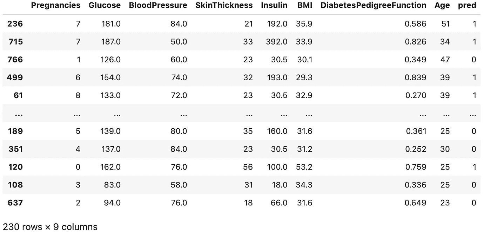

Diabetes Predictions

为了更好地理解特性在建模后的影响，我将在另一篇文章中阐述特性的重要性。

> [阅读完整笔记本**在 Kaggle 上使用 Python** 进行糖尿病预测](https://www.kaggle.com/gopalj/diabetes-prediction-using-python)

# 结论

1.  糖尿病是怀孕期间的症状之一。必须进行治疗以避免并发症。
2.  身体质量指数指数可以帮助避免糖尿病并发症的前一种方式
3.  糖尿病在 35-40 岁开始出现，并随着年龄的增长而增加。

# 感谢阅读！

如果你喜欢我的工作并想支持我，我会非常感谢你在我的社交媒体频道上关注我:

1.  支持我的最好方式就是在**媒体**T21【这里上关注我。
2.  在**推特**T2【这里关注我。
3.  在 **LinkedIn** [这里](https://www.linkedin.com/in/gopal-joshi-971b9865/)关注我。
4.  跟着我上**Kaggle**这里。