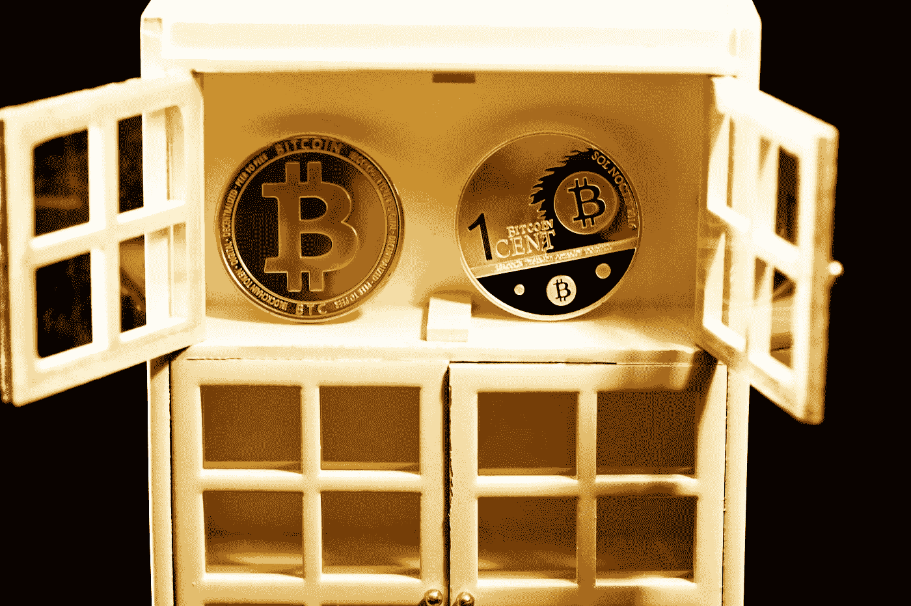

# 量子黑客从沉睡的比特币钱包里提取了 2500 万美元吗？

> 原文：<https://medium.com/geekculture/did-a-quantum-hacker-withdraw-25-million-from-a-sleeping-bitcoin-wallet-73b69be82d8b?source=collection_archive---------28----------------------->

## 当网络犯罪突飞猛进时

Photo by [Executium](https://unsplash.com/@executium?utm_source=medium&utm_medium=referral) on [Unsplash](https://unsplash.com?utm_source=medium&utm_medium=referral)

我经常想到犯罪，这很令人惊讶。

大约十年前，一群职业罪犯穿越全国去抢劫我当地的银行。他们已经注意到这家银行的一些分支机构存在设计缺陷，这使得他们可以进入一个…