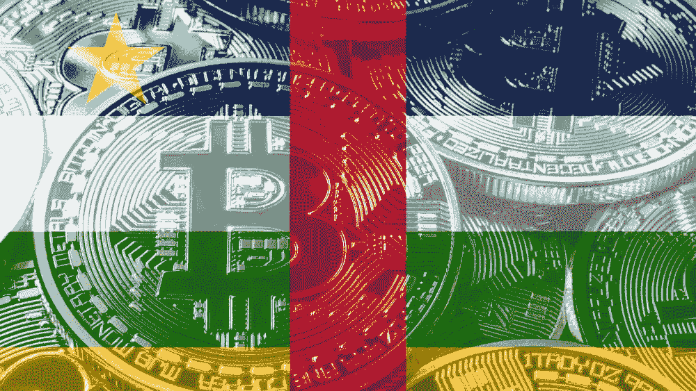

# 中非共和国到底有没有让比特币成为法定货币？

> 原文：<https://medium.com/geekculture/did-the-central-african-republic-make-bitcoin-legal-tender-or-not-135ef1c01f98?source=collection_archive---------4----------------------->

Image courtesy of thelatestblock.com

是的，他们确实做到了。

这一重大新闻最初被一些关于其真假的相互矛盾的报道所掩盖。

当这个故事首次披露时，引起了一些混乱。这似乎是因为:

1.  报道此事的当地文章是用法语写的。