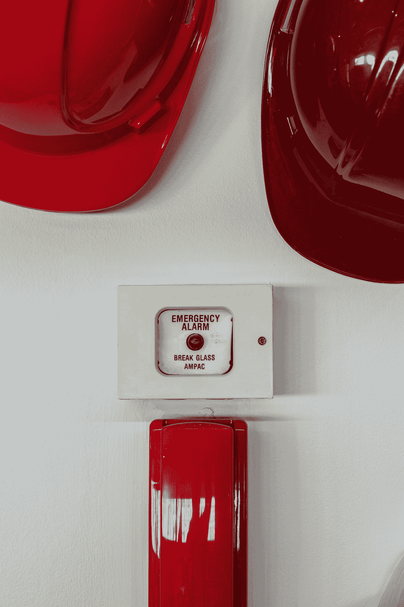

# 你把封面放在你的 TPS 报告上了吗？

> 原文：<https://medium.com/geekculture/did-you-put-a-cover-sheet-on-your-tps-report-95c68121309f?source=collection_archive---------26----------------------->

Photo by [Mike Meyers](https://unsplash.com/@mike_meyers?utm_source=medium&utm_medium=referral) on [Unsplash](https://unsplash.com?utm_source=medium&utm_medium=referral)

最近每个人都对“过程”这个词皱眉头。软件工程师不想被过程所束缚。经理们回避这个问题，因为他们不想影响工程师的感受。许多人都有与老/僵化的公司打交道的第一手经验，在那里，你不能在不被提醒 TPS 报告至少七次的情况下喝早餐咖啡。所以，当你开始谈论流程时，很多人都会说“不，谢谢”。

旁注:我祈祷没有人在读这篇文章时会问，“TPS 记录到底是什么东西”？万一你看了，你**就得**看[的电影](https://www.imdb.com/title/tt0151804/)。对于从事软件工作的人来说，这几乎是强制性的。

回到主题。随着公司的成长，它需要建立某种程度的可重复性。您真的不想每次都凭直觉部署到生产环境中。你需要一个定义良好的过程。你不希望组织的某个部门雇佣拥有“架构师”头衔的人(以及随之而来的所有福利)，而在另一个部门雇佣拥有“高级工程师”头衔的类似人员(第二个人知道了第一个人的情况后突然辞职)。在一个小公司里，见机行事是可以的，但是一旦你有了一个管弦乐队(相对于一个小的爵士乐队)，你就必须把一些结构放进去。

最近听到的一句话(不知出处):"**和任何帝国一样，它的成功建设依赖的不是士兵的力量，而是基础设施的质量。**”

这让我很有共鸣。随着公司的成长，它被挤压在[人才密度](https://www.shortform.com/blog/talent-density/)的下降和流程成熟度与成长曲线之间不断扩大的差距之间。所以，你有越来越多的优秀员工，而这些员工没有足够的结构可以依靠。你俩都必须弄清楚如何更好地招聘员工，并让公司的结构能够协调一致地运作。

那些不想被一些需要可重复性的过程和业务所拖累的人之间存在着真正的紧张关系。

像往常一样，这是一个平衡的行为。最重要的是，并非所有的过程都是平等的。

# **减少认知负荷**

Photo by [Luis Villasmil](https://unsplash.com/@villxsmil?utm_source=medium&utm_medium=referral) on [Unsplash](https://unsplash.com?utm_source=medium&utm_medium=referral)

先说最关键的一点。

这些过程应该减少(而不是增加认知负荷)。不幸的是，建立一些结构得到了如此糟糕的评价，因为它通常是以一种非常侵入性的方式完成的。

例如(技术方面的)，假设我们希望所有的拉请求(PR)都得到审查。我知道 PR 是需要审核的，也是很好的做法，但是我是人，深夜的时候，可以不小心点了合并按钮(又忘了要先审核)。好的流程是配置 GitHub 在 PR 被批准前不允许点击合并。这样我就不用再记一件事了。如果我忘记了，GitHub 会自动提醒我。然而，假设我们没有通过 GitHub 强制执行，而是决定敲打每个人的头，不要忘记做评论。此外，我们要求有人追溯检查是否所有合并的公关有每周一次的审查。现在，每个人都多了一件需要记住的事情(如果不记住，就会被责骂)。

同样，好的过程降低了风险，减少了负荷。一个坏的—在显著增加负载的同时也降低了风险。

# 增值

Photo by [Damir Spanic](https://unsplash.com/@spanic?utm_source=medium&utm_medium=referral) on [Unsplash](https://unsplash.com?utm_source=medium&utm_medium=referral)

在我的一份工作中，我们需要在将系统转移到另一个环境后对其进行测试。体制没怎么变，环境变了。公司要求任何这样的系统都有一个测试计划(一个描述我们将要测试的所有东西的文档)。一位高级 QA 工程师整理了这样一份文档并与团队分享。我看了看里面，这是一个十页的大模板，里面大概有十几个字段(系统名称、QA 名称、日期等等。)，唯一有价值的信息是指向一个工具的链接，这个工具保存了这个系统的所有测试用例。

这个文件的价值是不存在的。实际值存在于所有的测试用例中(保存在测试用例跟踪工具中)。这个文档只是一个十页的模板，没有添加任何东西。然而，不知何故这个文档花了一个星期才写完，几个人(包括我)花时间通读了一遍(发现唯一有用的就是那个链接)。

为什么会产生这份文件？之所以写这份文件，是因为某个地方的某个人有一份清单，上面列有新的生产系统投入使用前需要的所有文件。

制作生产准备清单是个好主意。(它通过确保您不会忘记一些重要的东西来增加价值)。我可能会说，集中需求和统一的清单可能是多余的，但这是另一个故事的主题。

制定测试计划是个好主意。仔细想想，讨论一下需要考什么就好了。它也增加了价值。

然而，把它变成一种货物崇拜，并通过填写一个模板文档来颠覆这些项目并没有增加价值。

如果只是一个文档，可能没什么大不了的。然而，一个组织可以很容易地积累数百个这样的活动，其中大量的努力只是为了加热空气。

# **明确目标**

Photo by [Annie Spratt](https://unsplash.com/@anniespratt?utm_source=medium&utm_medium=referral) on [Unsplash](https://unsplash.com?utm_source=medium&utm_medium=referral)

你能告诉我为什么你们公司要做单口相声吗？哦，因为 Scrum 这么说？引用标准的家长用语:“如果他们让你跳出窗外，你也会跳吗？”

更高级的人会说，这样做是为了确保人们不会被阻止。或者可能是为了确保人们同步他们正在做的事情？也许这是经理检查进度的工具，或者是增加团队凝聚力的方法？谁知道呢？然而，让我们每天花 20 分钟*一个团队 8 个人*每周 5 天=每周 13 个工作小时。(BTW。这几乎是工作时间的 5%)

我完全理解，并非一切都是黑白分明的，活动可以有一个主要目标，同时推进次要目标。但是，你确实需要知道首要目标(否则，你甚至无法推理它是否为所花的时间带来了足够的价值)。

对于组织来说，做自己认为正确的事情而不考虑它是否真的好是很常见的。

# **为明天构建流程**

Photo by [Brian McGowan](https://unsplash.com/@sushioutlaw?utm_source=medium&utm_medium=referral) on [Unsplash](https://unsplash.com?utm_source=medium&utm_medium=referral)

流程应该是你所在公司的第一步。一旦他们开始落后，想要赶上几乎是不可能的。

在缺乏一些结构的情况下，你将在太多的战线上战斗(人们试图证明结构是不需要的)，火灾(由缺乏结构引起)，以及成熟度差距。进入这个地方非常容易，但要离开却非常困难。

**打碎玻璃**

Photo by [Mitchell Luo](https://unsplash.com/@mitchel3uo?utm_source=medium&utm_medium=referral) on [Unsplash](https://unsplash.com?utm_source=medium&utm_medium=referral)

每个过程都应该有一个碎玻璃程序。颁布它不应该是微不足道的，但它需要在那里。

例如，我在一家公司工作，该公司每年进行一次晋升和加薪。这是官方政策，没有例外。我认为这太死板了。你是愿意在中期提升某个非凡的人，还是迫使他们等待六个月(冒着被另一家公司挖走的风险)？

这又回到了添加值。这个过程应该是增加价值，而不是减少价值。当你发现打破玻璃程序在你的环境下会适得其反时，才是合理使用打破玻璃程序。

# **扔掉老臭的过程**

Photo by [Christian Roßwag](https://unsplash.com/@chrispic?utm_source=medium&utm_medium=referral) on [Unsplash](https://unsplash.com?utm_source=medium&utm_medium=referral)

一切都有积累的趋势。如果你从来不清理你桌子上的任何东西，逐渐地，它会被文件、书、食物盘所淹没。这同样适用于作品的结构。

一年前，你决定每周一次，每个人都应该聚在一起检查 bug。是的，对你有好处。一年过去了，你的团队增加了一倍。您注意到，当您试图检查过去九个月中尚未修复的一些 bug 时，大多数人都在打瞌睡。

好吧，那就该改了。扔掉这个或者至少修改一下。顺便说一句。这是发现其他潜在问题的绝佳时机——看起来你的团队太大了，也许是时候拆分了。你有 9 个月的 bug 没有修复。如果他们很关键，你就有一个大问题，需要解决它。如果它们很小——也许开始解决这些问题(而不是每周回顾它们)是有意义的。

**包装完毕**

在过去的十年里，重过程/轻过程的钟摆确实向轻过程侧摆了很远。在一个宏大的计划中，这是好的(这在过去太死板了)。然而，我更希望看到它从坏流程转向好流程。

我相信，实施良好的(非侵入性的和增值的)过程对于任何组织来说都是绝对重要的。对成长中的公司来说更是如此。

请在媒体上关注我，通过电子邮件订阅并分享这篇文章。