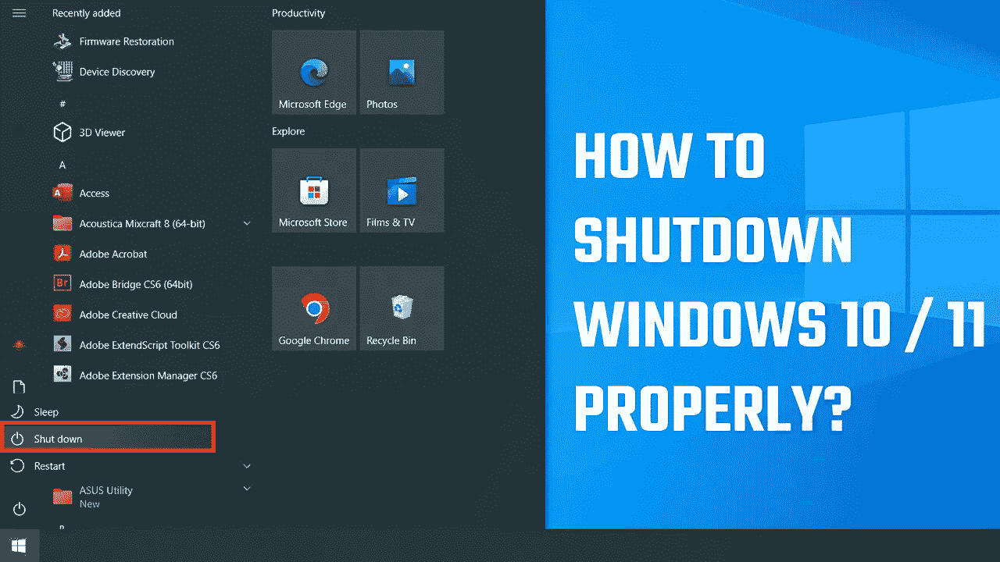

# 你正确地关闭了你的计算机吗？

> 原文：<https://medium.com/geekculture/did-you-shut-down-your-computer-properly-a9363c49f06d?source=collection_archive---------9----------------------->

Windows“关机”实际上没有！

这听起来可能有点不寻常，但你实际上可能没有完全关闭运行 Windows 10 或 11 的计算机。默认情况下，Windows 会启用关机后更快启动电脑的选项。但这更有可能使你的电脑进入休眠状态，而不是完全关机。因此，要完全关闭您的笔记本电脑，您可以…